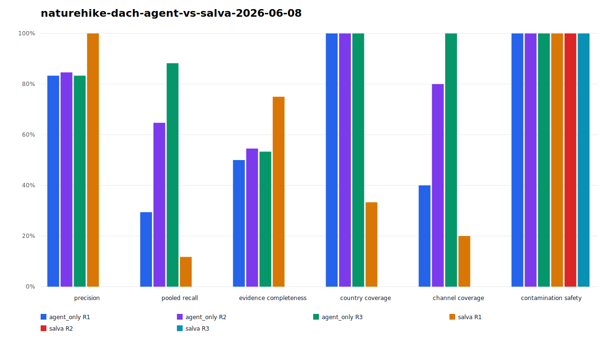

# Salva Runtime

Salva 是一個自架的 **Discovery Intelligence Runtime** — 面向 Agent、CLI 和 API 調用的結構化檢索服務。

> 它不是爬蟲，而是一個**事件驅動**的智慧 pipeline，每次運行後積累學習能力。

---

## 核心定位

- **Event-triggered**：由調用觸發，非定時輪詢
- **API-first**：REST API + MCP + CLI 三端整合
- **Agent-native**：MCP 是主要 agent 介面（Claude Code / Claude Desktop 直接接入）
- **Review-gated compounding**：content terms 可沉澱到隔離記憶，但預設不跨 run 讀取；只有同 campaign 已提升的記憶會再次注入

---

## Pipeline 運作機制

```
trigger (agent / CLI / API call)
  → Intent 解析 + domain 路由
  → KeywordGraph 擴展（依 ExecutionContext 決定是否注入 memory seeds）
  → Multi-round multi-provider 檢索
  → 提取 → BM25 去重 → 評分
  → content_terms 提取 → 沉澱進 memory
  → 輸出 entities + relations + telemetry
```

### 記憶與複利（B1+B2）

```
Round N 結果片段
  → _extract_content_terms()            [B1: controller.py]
  → telemetry.metadata["content_terms"]
  → content_nodes_json 持久化           [B2: persistence/runs.py]
  ↓
後續 run（僅 campaign_promoted / campaign_all / global_legacy）
  → seed_from_memory() 讀取允許範圍內的 content_nodes
  → 注入圖中，擴展查詢範圍
```

預設值是 `read_scope=none`、`write_mode=quarantine`。單次呼叫內的多輪
KeywordGraph 仍在記憶體中運作，不需要在專案根目錄建立 cache。

### 執行與資料隔離

```json
{
  "execution": {
    "campaign_id": "naturehike-dach-2026",
    "continuation_id": "channel-map-r1",
    "persistence": "audit",
    "memory": {
      "read_scope": "campaign_promoted",
      "write_mode": "quarantine"
    }
  }
}
```

- Agent 負責宣告 objective、campaign、continuation 與是否需要舊記憶。
- Salva 負責強制 campaign filter、quarantine/promote 與 no-write 模式。
- 部署平台負責 auth、tenant 權限、filesystem roots、secrets。

完整契約：[docs/spec/execution-context.md](docs/spec/execution-context.md)

---

## 調用方式

### 1. MCP（推薦 — Agent 首選）

配置 `apps/mcp/server.py` 為 Claude Code MCP extension：

```json
{
  "mcpServers": {
    "salva": {
      "command": "python3",
      "args": ["-m", "apps.mcp"]
    }
  }
}
```

可用工具（14 個，`apps/mcp/server.py`）：

| 工具 | 用途 |
|------|------|
| `salva_discover` | 同步 discovery（小任務，≤20 筆） |
| `salva_job_create` | 異步 job（大任務） |
| `salva_job_status` | 輪詢 job 狀態 |
| `salva_job_cancel` | 取消排隊中/執行中的 job |
| `salva_run_result` | 取完整 run 結果（entities + evidence） |
| `salva_audit` | 品質審計（評分拆解、來源分析、逐輪表現） |
| `salva_pilot` | 下一步搜尋建議 |
| `salva_research_report` | 產出結構化研究報告（摘要/coverage map/gap） |
| `salva_run_diff` | 比較兩次 run 的新增/移除/變動實體 |
| `salva_graph_export` | 匯出 run 的實體/關係圖（HIF JSON 或 DOT） |
| `salva_vocab` | 查詢 domain 詞彙 registry |
| `salva_topology` | 探測 query 拓撲並取得推薦路由 |
| `salva_plugins` | 列出可用 enrichment plugin |
| `salva_providers` | 列出可用檢索 provider |

`salva_discover`（以及 REST `/v1/discover`）支援選用參數 `enable_stability_gating`（MCP）/ `stability`（REST body，見下）——依 domain 歷史 query-family 記憶的 drift/volatility 微調評分，**預設關閉**，需要該 domain 已有足夠歷史記錄才會生效。詳見 `salva_core/stability.py` 與 `salva_core/schemas.py::StabilityPolicy`。

### 2. REST API（同步）

```bash
curl -X POST http://localhost:8000/v1/discover \
  -H "Content-Type: application/json" \
  -d '{
    "objective": "find_companies",
    "intent": {"market": "US", "industry": "AI hardware"},
    "max_results": 10
  }'
```

### 3. REST API（異步）

```bash
# 創建 job
curl -X POST http://localhost:8000/v1/jobs \
  -d '{"discovery": {...}, "wait_for_completion": false}'

# 查狀態
curl http://localhost:8000/v1/jobs/{job_id}
```

### 4. CLI

```bash
salva find --market US --industry "AI hardware"
salva job status <job_id>
salva audit <run_id>
```

---

## API 端點

| 端點 | 說明 |
|------|------|
| `POST /v1/discover` | 同步 discovery |
| `POST /v1/jobs` | 創建異步 job |
| `GET /v1/jobs/{job_id}` | Job 狀態 |
| `GET /v1/jobs/{job_id}/stream` | SSE 事件流 |
| `GET /v1/runs/{run_id}` | Run 結果 |
| `GET /v1/query-families` | 依 campaign / continuation / status 查詢記憶 |
| `POST /v1/query-families/{memory_id}/promote` | 提升已審核的 query-family memory |
| `GET /v1/routes` | 路由目錄 |
| `GET /v1/providers` | 供應商列表 |
| `POST /v1/pilot` | 下一步建議 |
| `POST /v1/audits/{run_id}` | 品質審計 |
| `GET /v1/hold/walk` | 超圖遍歷 |
| `GET /v1/usage` | 用量統計 |

---

## 專案結構

```
salva/
├── apps/
│   ├── api/           # REST API (FastAPI)
│   ├── cli/           # CLI (typer)
│   └── mcp/           # MCP Server（9 tools，agent 主要入口）
├── core/
│   ├── controller.py  # 協調器 + B1 content term 提取
│   ├── keyword_graph.py  # 查詢圖 + B2 memory seed 注入
│   └── domain_vocab.py   # 領域詞彙 registry
├── retrieval/         # 供應商適配器（SearXNG / Whoogle / DDG）
├── processing/
│   ├── dedup.py       # BM25-hybrid 去重
│   └── scorer.py      # 評分（injectable ScorerConfig）
├── enrichment/        # LLM/OSINT 富化（omlx bounded prompts）
├── hold/              # 超圖容器入口
├── experiments/       # 理論驗證實驗（E1–E9）
└── salva_core/
    ├── persistence/   # SQLite — 分模組
    │   ├── db.py          # Schema + migration
    │   ├── runs.py        # Run 記錄（含 content_nodes_json）
    │   ├── memory.py      # Query family memory + seed 查詢
    │   ├── hold.py        # n-ary 超邊、canonical entities、routing memory
    │   ├── jobs.py        # Job 記錄
    │   ├── evidence.py    # 證據鏈
    │   ├── telemetry.py   # 遙測
    │   └── usage.py       # 用量統計
    ├── relation_ontology.py  # FtM 對齊關係類型（7 canonical + multilingual surface forms）
    ├── vector_backends.py    # JinaOmlxVectorBackend（1024d）+ HybridHash fallback
    ├── schemas.py        # Canonical types
    ├── execution.py      # ExecutionContext 標準化與 metadata
    └── service.py        # 核心服務
```

---

## 快速啟動

```bash
# 1. 安裝
pip install -e ".[dev]"

# 2. 設置環境變數
cp .env.example .env  # 或直接編輯 .env
# 必填：
# OMLX_BASE_URL=http://localhost:8140   (本地 omlx，Jina embedding + LLM)
# SALVA_SQLITE_PATH=./data/salva.db
# SEARXNG_ENABLED=false                 (若無本地 SearXNG)

# 3. 啟動 API
python3 -m uvicorn apps.api.main:app --port 8000

# 4. 健康檢查
curl http://localhost:8000/health

# 5. 測試
pytest
```

---

## Embedding Backend

| Backend | 啟用方式 | 用途 |
|---------|---------|------|
| `jina_omlx` | `SALVA_SEMANTIC_VECTOR_BACKEND=jina_omlx` | 內容語義搜索（1024d Jina v5） |
| `hybrid_hash` | 預設 | 輕量 hash 備用（無 omlx 時自動降級） |

**注意：** Jina v5 小模型不適合跨字形實體名稱解析（台積電↔TSMC cosine≈0.04）。
跨語言實體合併依賴 `canonical_entities` + `entity_aliases` gazetteer（Hold C2）。

---

## n-ary 超圖（Hold）

Salva 使用 n-ary 超邊表示多方關係（如 §13(d)(3) 集體持股、多方控股協議）：

```python
# 一條 acting_in_concert 超邊包含多個參與者
hyperedge: acting_in_concert
  ├── BlueMountain Capital  [group_lead,  5.2%]
  ├── BM Fund A             [group_member, 2.1%]
  ├── BM Fund B             [group_member, 1.8%]
  └── Chatham Lodging Trust [target]
evidence: SEC EDGAR SC 13D/A 2013-05-15
```

支援：
- HIF（Hypergraph Interchange Format）lossless round-trip export/import
- Bipartite projection（entity ↔ hyperedge）
- Star projection（entity ↔ entity via shared hyperedge）

---

## 實驗驗證結果（E1–E9）

| VP | 主張 | 結論 |
|----|------|------|
| VP1 | n-ary 超圖忠實度 | ✅ E1 PASS |
| VP2 | 公開源可得性 | ✅ E2 PASS |
| VP3 | 真實 filing → n-ary 事實 | ✅ E3 PASS |
| VP4 | 路由表自我優化 | ✅ E4 PASS |
| VP5 | 跨語言實體解析 | ✅ gazetteer / ⚠️ Jina FAIL（跨字形 F1=0.31） |
| VP6 | 跨語義關係合併 | ✅ E6 PASS（7→3 canonical 超邊） |
| VP7 | 語義+二跳 > 關鍵詞 | ⚠️ E7 INCONCLUSIVE（2-hop recall=1.00；precision 下降） |
| VP8 | HIF round-trip + 投影 | ✅ E8 PASS（零 diff） |
| VP9 | 持久化複利可量測 | ✅ E9 PASS（seeds 0→46，nodes 34→61） |

詳細結果：`experiments/hg_penetration/E*_FINDINGS.md`

### Agent-only vs Salva Dogfood（E10）

Naturehike DACH 渠道檢索的 live dogfood 顯示：

| Condition | Round 1 | Round 2 | Round 3 | Best pooled recall |
|---|---:|---:|---:|---:|
| Agent-only | 5 verified | 11 cumulative | 15 cumulative | 88.2% |
| Salva | 2 verified | 0 snapshot | 0 snapshot | 11.8% |



Pooled recall 的分母是兩條路徑事後驗證候選的聯集，不是預先凍結的外部 ground
truth。這也不是等預算 benchmark：Agent raw SERP 未完整保存、耗時不可比、Salva
使用 DDG live provider 且 R2/R3 發生零結果。它是可重現的 dogfood 與失敗模式記錄，
不能被解讀為一般性模型排名。

詳見：[experiments/agent_vs_salva/README.md](experiments/agent_vs_salva/README.md)

---

## 文檔導航

| 文件 | 用途 |
|------|------|
| [CLAUDE.md](CLAUDE.md) | 開發者必讀：設計原則與架構邊界 |
| [DEVELOPMENT_PROGRESS.md](DEVELOPMENT_PROGRESS.md) | 本次開發進度報告 |
| [TODO.md](TODO.md) | 開發任務清單 |
| [docs/spec/](docs/spec/) | 行為契約（正式規範） |
| [docs/reports/execution-isolation-update-2026-06-08.md](docs/reports/execution-isolation-update-2026-06-08.md) | 隔離架構、風險與對抗審計 |
| [docs/dogfood/naturehike-dach-2026-06-08.md](docs/dogfood/naturehike-dach-2026-06-08.md) | Naturehike DACH 渠道與 dogfood 結果 |
| [experiments/EXPERIMENT_PLAN.md](experiments/EXPERIMENT_PLAN.md) | 實驗計畫與驗證狀態 |

---

## 錯誤處理

- `400` — 驗證失敗或輸入錯誤
- `403` — Tenant 權限不足
- `404` — 找不到資源
- `429` — Quota 超限
- `500` — 內部錯誤

---

## License

採用 [Apache License 2.0](LICENSE)。允許商用、修改與私有部署，並附帶專利授權；再散布時請保留版權與授權聲明。

Copyright © 2026 Ryan Lee.
