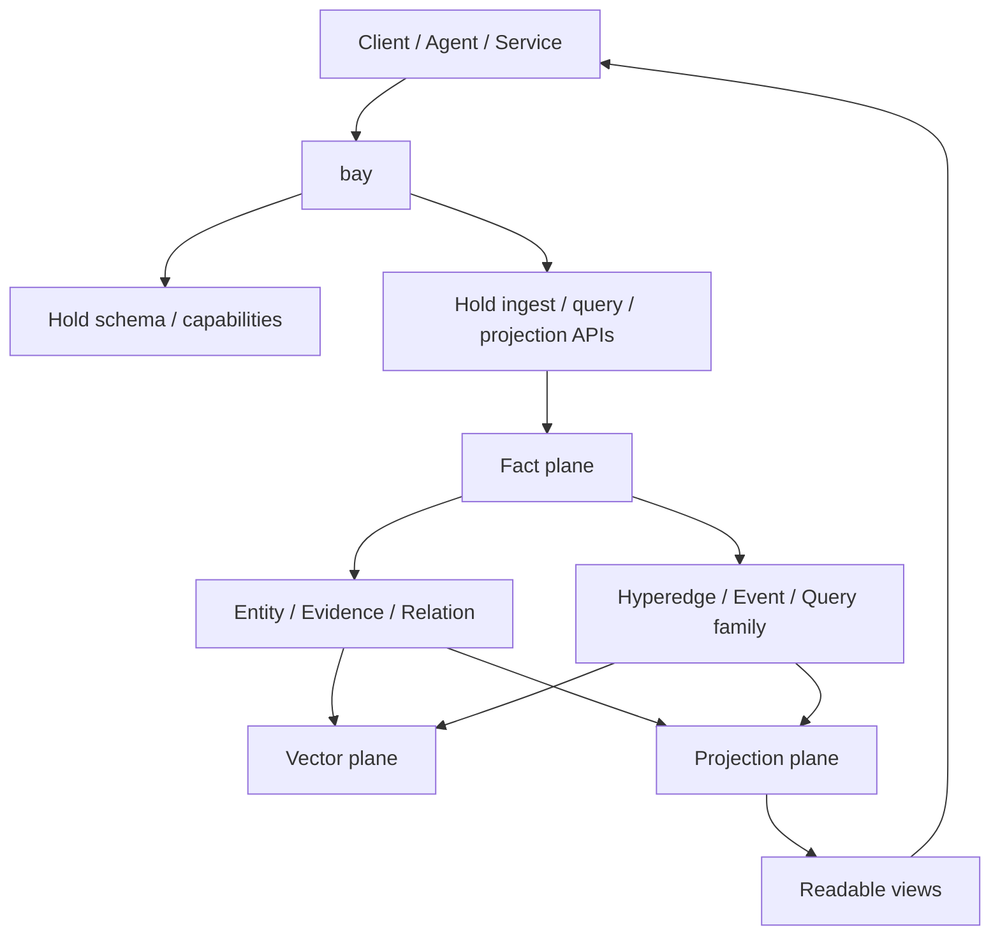

# Salva Hold / Bay 架構提案

## 1. 定義

`Hold` 是 Salva 的超圖容器邏輯層。

它負責保存：

- entity
- evidence
- relation
- hyperedge
- event
- query family
- run / telemetry / snapshot

`bay` 是 Hold 的自我暴露與調用入口。

它負責對外說明：

- 目前有哪些能力
- 可以用什麼 schema 呼叫
- 可以輸出哪些投影
- 哪些部分是穩定契約
- 哪些部分仍在演進

## 2. 設計原則

1. Hold 保存事實，不保存展示結果。
2. Bay 暴露能力，不介入事實寫入。
3. Projection 是 view，不是 source of truth。
4. Hyperedge 是第一級資料，不只是 relation 派生物。
5. Backend 可替換，邏輯契約不可替換。

## 3. 超圖容器的結構

## 4. 資料面

### Fact plane

保存 canonical facts：

- entity
- evidence
- relation
- run
- telemetry
- hold schema registry
- entity schema catalog
- relation schema catalog

### Hyperedge plane

保存多元關聯：

- event hyperedge
- signal hyperedge
- partnership hyperedge
- query family hyperedge

### Vector plane

保存檢索加速用的語義表示：

- evidence embeddings
- hyperedge summaries
- query-family signatures
- semantic vectors

### Projection plane

把容器投影成不同使用者可理解的視圖：

- entity view
- query view
- hyperedge view
- audit view

### Contract plane

暴露可先讀後寫的契約表面：

- `/v1/hold/schema`
- `/v1/hold/schema/entities`
- `/v1/hold/schema/relations`

Preset profiles are part of the discovery-facing contract surface and are exposed separately through `/v1/presets` and `/v1/presets/{preset_name}` so callers can resolve route defaults before they call `pilot`.

Entity catalog currently includes `lead`, `company`, `event`, `activity_signal`, `document`, `source`, and `person`.

`event_view` 與 `signal_view` 可視為內部兼容投影，但不列入公開核心契約。

## 5. IO 模式

### Ingest

- `POST /v1/discover`
- `POST /v1/jobs`
- `POST /v1/snapshots/{run_id}/export`

### Query

- `GET /v1/bay`
- `GET /v1/hold/schema`
- `GET /v1/hold/migrations`
- `GET /v1/hold/storage`
- `GET /v1/relations`
- `GET /v1/hold/views`
- `GET /v1/hold/views/{view_name}?run_id=...`
- `GET /v1/hyperedges`
- `GET /v1/evidence`
- `GET /v1/evidence/chains`
- `GET /v1/query-families`
- `GET /v1/audits/{run_id}`

`Hold` 的 raw evidence plane 會同時保留 evidence records 與 evidence chains，讓 audit 與 graph-style retrieval 直接有 materialized lineage 可查。
Relation rows are versioned as part of the canonical relation contract, so callers can compare schema, storage, and migration versions without guessing the source of the record.

### Feedback

- `POST /v1/mate/{run_id}`
- `POST /v1/pilot`

## 6. 與現有 Salva 的關係

目前 Salva 已有：

- 多 provider retrieval
- job / event stream
- audit / snapshot / export
- mate / pilot feedback
- Hold projection / view layer
- typed hyperedge persistence
- query-family memory
- semantic vector memory
- evidence retention

這些能力已經足夠把 Hold / bay 的第一版當成 logical contract 落地。

## 7. 目前狀態

當前實作狀態是：

- `bay`：draft self-description 已可查詢
- `Hold`：draft schema 已可查詢
- `Hold` schema / migration registry：已可查詢
- `Hold` storage / index catalog：已可查詢
- typed relations：已可查詢並可按 run / type / from / to 篩選
- semantic query-family search：已可查詢
- 目前先不綁定特定 graph backend
- 先以 canonical data + projection 方式運行

## 8. 後續演進

下一步會把：

- typed relations
- hyperedge persistence
- projection-specific views
- vector-backed retrieval

逐步收斂到 Hold / bay 的正式契約。
