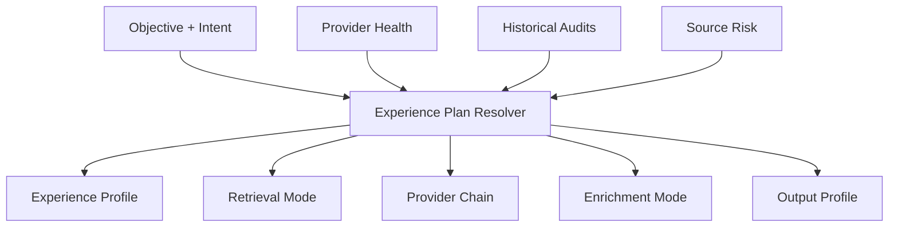

# Salva Runtime 使用者體驗與成熟度審計

> 更新時間：2026年5月9日
> 審計範圍：REST API / CLI / MCP 三端用戶流程

---

## 1. 這裡的 UX 是什麼

這裡的 UX 指的是 **user experience / 使用者體驗路徑**，不是 UI 界面。

重點是同一套 runtime 服務，不同使用者角色在不同任務下，應該看到不同的：

- preset
- mode
- provider 路徑
- enrichment 深度
- audit 方式
- export 形式

---

## 2. 核心業務能力

`Salva Runtime` 目前最核心的業務能力不是「搜尋」本身，而是：

- 把意圖變成可執行的 discovery plan
- 把多輪檢索變成可比較的 evidence flow
- 把 provider fallback 變成可觀測的韌性能力
- 把 enrich 變成可選的高價值附加層
- 把 run / telemetry / source attempts / plugin reports / snapshots 變成可回放資產

在這個基礎上，還有兩個更面向使用者體驗的層次：

- `mate`
  用來量化這次 voyage 省下多少時間、多少候選處理量、多少 token 與成本
- `pilot`
  用來引導下一步路線，輸出 next queries、mode switches、preferred domains 與 prompt patch

這兩層的價值是把 runtime 的內部能力翻成使用者看得懂的 ROI 與 route guidance。

`discover` 和 `job` 的 `meta` 也會常態帶這兩層的 feedback，讓使用者在每次 request 後就能直接看到結果，不必把 benchmark 當日常流程。

這些能力是對外產品化前最值得先打磨的地方。

---

## 3. 使用者體驗路徑

### 3.1 快速回答路徑

適合：

- 已知目標
- 只想快速拿到可用結果
- 不想理解 provider / round / plugin

建議預設：

- `quick_scan`
- `retrieval.mode = normal` 或 `resilient`
- `enrichment.mode = auto`
- `output_profile` 自動推斷

### 3.2 線索聚焦路徑

適合：

- BD 線索
- 角色 / 市場 / 產品定點探索
- 需要高精度與低噪音

建議預設：

- `lead_focus`
- `dive` 較高優先
- `output_profile = lead` 或 `crm_contact`

### 3.3 活動發現路徑

適合：

- event / expo / speaker / attendee
- 需要高召回
- 需要來源多樣性

建議預設：

- `event_discovery`
- `anchor + radar` 較高優先
- `output_profile = event`

### 3.4 公司研究路徑

適合：

- company profile
- partner / competitor / market scan
- 需要平衡精度與召回

建議預設：

- `company_research`
- `retrieval.mode = resilient`
- `output_profile = company_profile`

### 3.5 深度調查路徑

適合：

- 多來源交叉驗證
- OSINT / due diligence
- 需要 theHarvester / Amass / SpiderFoot / local LLM

建議預設：

- `deep_investigation`
- `retrieval.mode = wall_guarded`
- `enrichment.mode = selected` 或 `all`

### 3.6 平台整合路徑

適合：

- 其他專案或 agent 直接調用
- 需要 provider registry
- 需要版本化 contract
- 需要自訂 endpoint

建議預設：

- `platform_integrator`
- 保留 provider override
- 優先 snapshot / audit / export

---

## 4. 自適應切換原則

`Salva` 應該根據以下信號自動選擇路徑：

- objective
- intent 內容
- site_domains 是否存在
- provider 成功率
- noise rate
- qualified rate
- 是否高召回 / 高精度
- 是否需要可回放、可比較
- 是否需要深度 enrich

### 4.1 建議切換規則

1. 先選 experience profile
2. 再選 retrieval mode
3. 再選 provider chain
4. 再決定 enrichment 深度
5. 最後決定是否使用 local OMLx 做裁決



---

## 5. 成熟度審計維度

### 5.1 審計原則

每個能力都應該看這些面向：

- correctness
- coverage
- resilience
- latency
- cost
- UX clarity
- reproducibility
- observability
- extensibility

### 5.2 9 分標準

要到 9 分，至少要有：

- 明確契約
- 自動測試
- audit 報告
- snapshot / export
- 對比數據
- fallback 與 retry
- 文檔
- 可回放路徑

### 5.3 目前最需要補強的面向

- 對外 SDK / skill / MCP
- 安全治理
- benchmark 與圖表
- graph / hypergraph 準備
- 深度 enrich 的高價值目標篩選

### 5.4 benchmark 資料集

建議把 benchmark 視為一組可回放資料集，而不是臨時跑分。

每個 benchmark report 應該至少包含：

- run_id
- objective
- experience_profile
- qualified_rate
- avg_score
- noise_rate
- source_success_rate
- provider_kinds
- notes

這些資料要能直接拿去畫：

- profile 對比圖
- objective 對比圖
- provider 成功率圖
- noise / qualified 對比圖

`mate` 報告應該能直接引用 benchmark / audit 的數據，讓使用者看到：

- 這次省了多少
- 哪些模式最有效
- 哪個 provider / profile 最穩

`pilot` 應該直接依 audit 結果回傳：

- 下一個最合理的 retrieval mode
- 下一批 query 的建議
- 是否需要切換 enrichment 深度
- 是否應該先加 negative terms 或 preferred domains

對外工具應該提供：

- benchmark report
- benchmark export
- chart-ready JSON

---

## 6. 建議的下一步開發

1. 完成 experience plan resolver 的更細分 preset 與對外查詢入口
2. 持續擴充 local LLM provider 覆蓋面，讓更多 call site 可用 bounded prompts
3. 讓 objective-specific prompt routing 變成其他 enrich call site 的預設策略
2. 把 objective / profile 的 benchmark 資料集固定下來
3. 讓 snapshot export 直接生成可畫圖的資料
4. 做 `lead / event / company` 三條主要使用者體驗路徑的回歸測試
5. 再開始做對外分發與 landing page

---

## 7. 結論

真正要追求的是：

- 核心業務能不能穩定解題
- 使用者是否能快速走到正確路徑
- 系統是否能自動切換到更合理的模式
- 失敗時是否能清楚退化
- 結果是否可比較、可回放、可圖表化

當這些都達到高分，`Salva Runtime` 才算真正成熟。

---

## 8. 三端用戶流程審計（2026-05-09）

### 8.1 介面對照表

| 功能 | REST API | CLI | MCP |
|------|----------|-----|-----|
| 同步探索 | `/v1/discover` | `salva find` | `salva_discover` |
| 非同步作業 | `/v1/jobs` | `salva job create` | `salva_job_create` |
| 作業狀態 | `/v1/jobs/{job_id}` | `salva job status` | `salva_job_status` |
| 運行結果 | `/v1/runs/{run_id}` | `salva run show` | `salva_run_result` |
| 品質審計 | `/v1/audits/{run_id}` | `salva audit` | `salva_audit` |
| 下一步建議 | `/v1/pilot` | `salva pilot` | `salva_pilot` |
| 詞彙查詢 | `/v1/vocab` | `salva vocab list/show` | - |
| 供應商 | `/v1/providers` | - | - |
| 插件 | `/v1/plugins` | - | - |
| 語義搜索 | `/v1/semantic/query-families` | - | - |
| 拓璞探測 | `/v1/topology/probe` | - | - |
| 規劃器 | `/v1/planner` | - | - |

### 8.2 REST API 審計結果

**端點數量**：50+  
**認證**：✅ `X-Salva-Key` 全局注入  
**錯誤處理**：✅ 統一異常 Middleware  
**問題**：
- 路由未拆分（720 行單一檔案）- 已被修復，但可進一步 modularize
- 缺少 request validation 提示（如 `max_results` 範圍錯誤時的友好訊息）
- 缺少 rate limit 超限的具體說明

**評分**：7/10（功能完整，但長度需拆分）

### 8.3 CLI 審計結果

**命令數**：7 組  
```
salva find          # 同步探索
salva job status    # 作業狀態
salva job list      # 作業列表
salva run show      # 運行結果
salva audit         # 品質審計
salva pilot         # 下一步建議
salva vocab list    # 詞彙列表
salva vocab show    # 詞彙詳情
```

**問題**：
- ❌ 缺少 `salva discover` 命令（只有 `find`，命名不一致）
- ❌ 缺少 `salva plugins` / `salva providers` 查詢命令
- ❌ 缺少 `salva job cancel` 取消功能
- ⚠️ `--domain-hints` 參數需要手動 JSON 字串轉義，不夠友善
- ⚠️ 錯誤訊息有時過於技術化（如 SQLite 錯誤直接暴露）

**評分**：6/10（基本功能可用，但缺少取消與查詢命令）

### 8.4 MCP 審計結果

**工具數**：6 個

| Tool | 用途 | 限制 |
|------|------|------|
| `salva_discover` | 同步探索 | max_results ≤ 20 |
| `salva_job_create` | 創建非同步作業 | 需 worker |
| `salva_job_status` | 查詢作業狀態 | - |
| `salva_run_result` | 取得運行結果 | - |
| `salva_audit` | 品質審計 | - |
| `salva_pilot` | 下一步建議 | - |

**問題**：
- ⚠️ 缺少 `/v1/routes`、`/v1/presets` 查詢入口
- ⚠️ `domain_hints_json` 參數需傳 JSON 字串，agent 需自行序列化
- ⚠️ stdio 模式下無 auth 檢查（HTTP 模式需 SALVA_MCP_API_KEY）
- ❌ 缺少 `salva_vocab` 工具（MCP agent 無法查詢詞彙）

**評分**：7/10（工具覆蓋核心流程，但缺少詞彙查詢）

### 8.5 用戶流程斷點分析

```
[User Flow A: Quick Search]
CLI/MCP → discover → (error) → ???
  ↑ 缺少清晰的錯誤恢復指引

[User Flow B: Async Job]
CLI/MCP → job_create → poll status → (timeout) → ???
  ↑ 缺少 cancel 命令

[User Flow C: Deep Investigation]
discover → enable OSINT plugins → (no feedback) → ???
  ↑ plugins 執行狀態不透明
```

### 8.6 優先改進事項

| 優先級 | 項目 | 影響範圍 | 狀態 |
|--------|------|----------|------|
| P1 | 新增 `salva job cancel` | CLI / MCP | ✅ 已完成 |
| P1 | 新增 `salva vocab` 工具 | MCP | ✅ 已完成 |
| P2 | 統一 CLI 命名 (`find` → `discover`) | CLI | ✅ 已完成 |
| P2 | `--domain-hints` 改為接受檔案路徑 | CLI / MCP | ✅ 已完成 |
| P2 | 作業超時後提供取消選項 | All | ✅ 已完成 |
| P3 | 新增 `salva plugins` / `salva providers` | CLI | ✅ 已完成 |
| P3 | 統一錯誤訊息本地化 | All | ⏳ 待處理 |

### 8.7 跨介面一致性矩陣

| 功能 | REST | CLI | MCP | 一致性 |
|------|------|-----|-----|--------|
| discover API | ✅ | ✅ | ✅ | ✅ |
| job create | ✅ | ✅ | ✅ | ✅ |
| job status | ✅ | ✅ | ✅ | ✅ |
| job cancel | ✅ | ✅ | ✅ | ✅ |
| run result | ✅ | ✅ | ✅ | ✅ |
| audit | ✅ | ✅ | ✅ | ✅ |
| pilot | ✅ | ✅ | ✅ | ✅ |
| vocab | ✅ | ✅ | ✅ | ✅ |
| plugins | ✅ | ✅ | ✅ | ✅ |
| providers | ✅ | ✅ | ✅ | ✅ |
| topology | ✅ | ✅ | ✅ | ✅ |

---

## 9. 總結

本次審計確認了三端用戶流程的基本完整性：

- **REST API**：功能最完整，適合程式化整合
- **CLI**：基本可用，但缺少取消與查詢命令
- **MCP**：核心工具到位，但缺少詞彙與供應商查詢

**下一步**：依優先級實作改進事項，逐步消除斷點。
