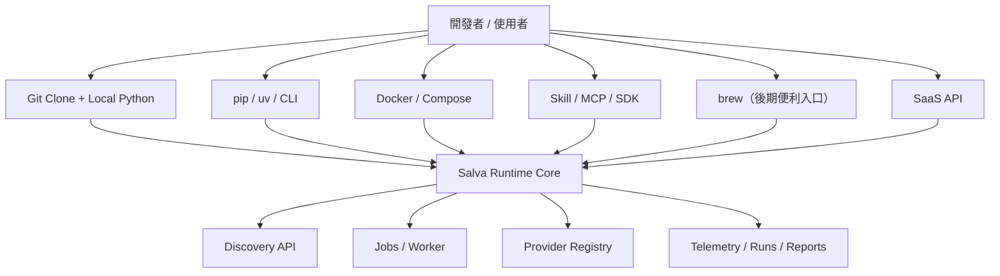

# Salva Runtime 封裝與分發路線圖

## 1. 目的

這份文檔說明 `Salva Runtime` 未來要如何被其他開發者與使用者安裝、啟動、封裝與分發。

核心原則是：

- 先把 runtime 做穩，再談分發形式
- 主路線維持本地可運行
- 分發層不要綁死單一雲服務
- `brew` 只作為後期便利入口，不作為架構基礎

---

## 2. 目前建議的分發順序

### 第一優先：本地開發 / 本地使用

最推薦的方式是：

1. `git clone`
2. 建立獨立 Python 虛擬環境
3. `pip install -e .[dev]`
4. 啟動 API 與 worker
5. 透過 REST API / skill wrapper / SDK 調用

這是目前最穩、最容易 debug、也最適合持續重構的方式。

### 第二優先：Python package / CLI

當核心 API 與 provider abstraction 穩定後，可以對外提供：

- `pip install salva-runtime`
- `salva-api`
- `salva-worker`
- `salva-discover`

這層適合開發者與自動化腳本。

### 第三優先：Docker / Compose

當你希望一鍵部署到本機、伺服器或 CI 環境時，再把 runtime 容器化：

- runtime service container
- worker container
- optional SearXNG / Whoogle / OSINT tooling

Docker 是部署層，不是核心架構層。

### 第四優先：Skill / MCP / SDK

對 agent 與其他應用來說，最佳出口是薄封裝：

- `SKILL.md`
- MCP tool adapter
- Python SDK
- minimal CLI

### 第五優先：brew

`brew` 只建議作為 macOS 用戶的便利安裝入口。

不建議把 `brew` 當成主路線，原因：

- 多 provider 與可選外部工具會讓 formula 維護複雜
- runtime 仍需要 Python 環境
- 你會更需要快速迭代，而不是先固定分發格式

### 第六優先：SaaS

SaaS 是最後一層，應該建立在穩定 runtime、auth、quota、observability、tenant-aware storage 之上。

---

## 3. 推薦架構

---

## 4. 對外分發的核心要求

如果要把 Salva 提供給其他開發者和使用者，至少需要這些能力：

- 固定 API contract
- schema versioning
- provider registry
- local-first fallback
- no-LLM path
- user-defined provider endpoints
- snapshot / export
- evaluation harness
- auth / quota / rate limit
- usage telemetry

---

## 5. 本地優先的理由

本地優先是因為：

- 你需要持續重構
- 你需要能看見 raw retrieval 與 telemetry
- 你需要能切換 provider
- 你需要能對抗性測試
- 你需要允許用戶接自己的 endpoint
- 你不想被單一託管平台綁住

本地優先不是排斥 SaaS，而是先把核心可驗證性做穩。

---

## 6. `brew` 的正確定位

`brew` 可以做，但它應該是：

- 安裝 `salva` 命令
- 管理最基本的啟動入口
- 探測環境與路徑
- 不承擔整套 runtime 邏輯

不應該讓 `brew` 承擔：

- provider 生命週期管理
- OSINT 工具完整安裝
- schema migration
- worker orchestration
- SaaS auth

這些東西維持在 Python runtime 與 Docker 層更合理。

---

## 7. 建議的落地順序

### Phase 1: 核心 runtime 穩定

- provider registry
- user-defined endpoint config
- no-LLM path
- local OMLx optional path
- telemetry 可對比

### Phase 2: 對外封裝

- CLI
- SDK
- skill wrapper
- MCP adapter

### Phase 3: 部署形式

- Docker
- Compose
- reverse proxy

### Phase 4: 對外服務

- auth
- quota
- rate limit
- usage analytics
- multi-tenant model

### Phase 5: macOS convenience

- brew formula
- launch command
- minimal install docs

### Phase 6: SaaS

- public API
- billing-friendly event model
- dashboard
- org-level usage telemetry

---

## 8. 需要持續保留的原則

1. 核心 runtime 不依賴 `brew`
2. 核心 runtime 不依賴 Supabase
3. 核心 runtime 不依賴 LLM
4. 用戶可以自定義 provider endpoint
5. 用戶可以關閉 LLM
6. 每個分發形態都必須能回到本地可 debug 的核心路徑

---

## 9. 下一步工作

優先順序建議：

1. provider registry 與自訂 endpoint 正規化
2. evaluation / audit harness
3. snapshot / export
4. skill / SDK 包裝
5. Docker / Compose profile
6. README 圖表化
7. landing page
8. brew 便利入口

