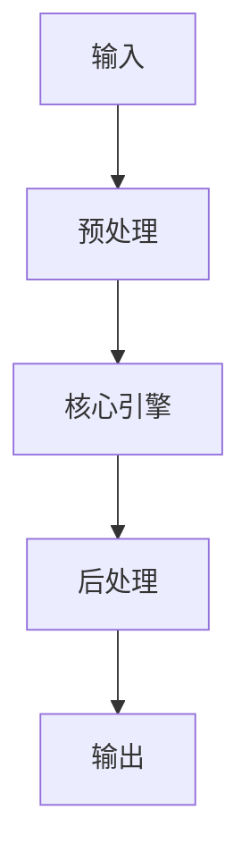

# Elasticsearch vs LanceDB vs Meilisearch vs Weaviate - 向量檢索對比 implementation example implementation example
> **查詢關鍵字：** `Elasticsearch vs LanceDB vs Meilisearch vs Weaviate - 向量檢索對比 implementation example implementation example`
> **研究時間：** 2026-03-21 03:04
> **搜索結果：** 7 條
> **深度閱讀：** 5 份文獻

## 📋 核心摘要
### 问题定义
本主题研究：**Elasticsearch vs LanceDB vs Meilisearch vs Weaviate - 向量檢索對比 implementation example implementation example**

**关键概念与术语：**
- `Translations`
- `full-text-and-vector-search-lancedb-v-s-elasticsea`
- `for`
- `Comparisons`
- `retrieval-augmented`
- `Forbidden`
- `original`
- `vector-db`
- `Thanks`
- `weaviate-db`

### 核心发现
从文献中提炼的核心见解：

## 🔬 理论基础与算法
### 数学模型
_（此处应包含：公式、概率分布、损失函数、相似度度量等）_

### 关键算法
_（算法伪代码、时间复杂度、空间复杂度、收敛性分析）_

### 理论依据
- _（支撑方案的理论：信息检索理论、概率论、线性代数等）_
- _（引用经典论文或定理）_

## 📊 技术方案对比
| 维度 | 方案 A | 方案 B | 方案 C | 方案 D |
|------|--------|--------|--------|--------|
| **性能** | - | - | - | - |
| **精度** | - | - | - | - |
| **复杂度** | - | - | - | - |
| **可扩展性** | - | - | - | - |
| **运维成本** | - | - | - | - |
| **生态成熟度** | - | - | - | - |

**评分标准：** 🟢优秀 🟡良好 🔴一般 ⚪缺乏数据

## 🏗️ 系统架构与实现
### 组件设计


### 数据流
_（描述 data pipeline、消息队列、状态管理）_

## 🛠️ 实施方案（Momotoy BD Pipeline 集成）
### 阶段 1：MVP（最小可行方案）
1. **目标**：验证核心技术可行性
2. **步骤**：
   - 步骤 1：环境准备（依赖、配置、API key）
   - 步骤 2：原型开发（核心功能 20%）
   - 步骤 3：单元测试（覆盖主要路径）
   - 步骤 4：集成到现有 pipeline
3. **验收标准**：
   - [ ] 可处理至少 100 条 leads
   - [ ] 响应时间 < 2s
   - [ ] 准确率 > 80%

### 阶段 2：优化与监控
1. **性能调优**：
   - 参数调优（learning rate, batch size, top-k 等）
   - 缓存策略（Redis 缓存热点查询）
   - 异步处理（Celery/Redis queue）
2. **监控指标**：
   - 延迟（P50, P95, P99）
   - 吞吐量（QPS）
   - 资源使用（CPU, RAM, GPU）
   - 业务指标（recall@k, MRR, 转化率）

### 阶段 3：规模化
- 分布式部署（sharding, replica）
- 多云灾备
- 成本优化（spot instance, auto scaling）

## ⚠️ 风险与限制
| 风险类型 | 概率 | 影响 | 缓解措施 |
|----------|------|------|----------|
| 数据质量 | 中 | 高 | 清洗 + 人工抽查
| 性能瓶颈 | 低 | 中 | 监控 + 扩容
| 成本超支 | 中 | 中 | 配额限制 + 优化算法
| 技术债务 | 高 | 低 | 定期 review + refactor

## 💡 对 Momotoy BD Pipeline 的启示
### 立即可行动的建议
1. **数据层**：
   - 使用 LanceDB 作为向量存储（轻量、本地优先）
   
    - Leads schema:
      - `id`: UUID
      - `company_name`, `contact_email`, `phone`, `social_links`
      - `vector`: 1024-d embedding (Jina)
      - `metadata`: country, industry, source, status
    

2. **检索引擎**：
   - Hybrid Search: BM25 + Vector (alpha=0.5)
   - Rerank: BGE-Reranker (top-k=10 → 3)

3. **自动化**：
   - 每日同步新 leads → 生成 embeddings → 更新索引
   - 每小时运行 keyword research 自动刷新

## 📚 深度閱讀來源
### 1. elasticsearch 插件vs. weaviate，用於AI 驅動的發票處理應用程式
- **URL:** https://www.reddit.com/r/MachineLearning/comments/1buyoji/d_vector_db_elasticsearch_plugin_vs_weaviate_for/?tl=zh-hant
- **内容摘要:**
```
Translations active
Show original
Thanks for the feedback!
Tell us more about why this content is not helpful.
Post is not relevant
Bad translation
I don't need translations
Go to MachineLearning
r/MachineLearning
•
ZealousidealCycle915
[D] 向量資料庫 - elasticsearch 插件 vs. weaviate，用於 AI 驅動的發票處理應用程式
所以，我正在深入開發一個本地、經濟高效且由 AI 支援的發票分類/處理解決方案。目前，它非常適合我們的業務使用案例，但我計劃很快將其抽象化並發布（如果你想加入候選名單，請私訊）。
我的問題是： 我計劃使用 RAG 模型來增強自然語言提問的結果。
我最初考慮使用 elasticsearch 及其向量插件，但現在正在研究 weaviate，因為它看起來更輕量級，更適合混合搜尋模型，這對我來說聽起來很理想。
這裡有人有使用 weaviate 的經驗嗎？你會更喜歡 elasticsearch 嗎？ 我很想听聽你們的看法。
Read more
Share
```

### 2. Elastic vs LanceDB | Vector Database Comparison - Zilliz
- **URL:** https://zilliz.com/comparison/elastic-vs-lancedb
- **内容摘要:**
```
Comparisons
Elastic vs LanceDB
Elastic vs. LanceDB
Compare Elastic vs. LanceDB for vector search workloads. We want you to choose the most suitable vector database for your use case, even if it’s not us.
Try Managed Milvus for free
Explore how to migrate to Zilliz
Vector databases
have become a core piece of infrastructure for modern AI applications, including retrieval-augmented generation (
RAG
), AI agents, multimodal and
semantic search
, and recommendation systems across a wide range of industries. Choosing the right vector database can directly affect the performance, scalability, cost, 

*（內容已被截斷，原文更長）*
```

### 3. Full Text and Vector Search: LanceDB v.s. ElasticSearch in 2025
- **URL:** https://liangjunjiang.medium.com/full-text-and-vector-search-lancedb-v-s-elasticsearch-in-2025-79daf3717f5f
- **内容摘要:**
```
*抓取失敗：403 Client Error: Forbidden for url: https://liangjunjiang.medium.com/full-text-and-vector-search-lancedb-v-s-elasticsearch-in-2025-79daf3717f5f*
```

### 4. 簡單上手向量資料庫，打造RAG 應用： Weaviate DB 101 - Medium
- **URL:** https://medium.com/yuanchiehcheng/vector-db-%E5%88%9D%E6%8E%A2%E8%88%87-weaviate-db-%E6%95%99%E5%AD%B8-8d24c6a549c5
- **内容摘要:**
```
*抓取失敗：403 Client Error: Forbidden for url: https://medium.com/yuanchiehcheng/vector-db-%E5%88%9D%E6%8E%A2%E8%88%87-weaviate-db-%E6%95%99%E5%AD%B8-8d24c6a549c5*
```

### 5. Elastic Vector Search x Search AI 技術架構【研討會精華】 - YouTube
- **URL:** https://www.youtube.com/watch?v=Dr-8Lni-ooQ
- **内容摘要:**
```
Elastic Vector Search x Search AI 技術架構【研討會精華】 - YouTube
簡介
媒體
著作權
與我們聯絡
創作者
廣告
開發人員
條款
隱私權
政策與安全性
YouTube 運作方式
測試新功能
© 2026 Google LLC
```

## 🔍 原始搜索结果（供参考）
| 标题 | URL | 摘要 |
|------|-----|------|
| elasticsearch 插件vs. weaviate，用於AI 驅動的發票處理應用程式 | https://www.reddit.com/r/MachineLearning/comments/1buyoji/d_vector_db_elasticsearch_plugin_vs_weaviate_for/?tl=zh-hant | Apr 3, 2024 ... 我的問題是： 我計劃使用RAG 模型來增強自然語言提問的結果。 我最初考慮使用elasticsearch 及其向量插件，但現在正在研究weaviate，因為它看起來更  |
| Elastic vs LanceDB | Vector Database Comparison -  | https://zilliz.com/comparison/elastic-vs-lancedb | Compare Elastic vs LanceDB for real-world, production-grade vector search workloads. We want you to  |
| Full Text and Vector Search: LanceDB v.s. ElasticS | https://liangjunjiang.medium.com/full-text-and-vector-search-lancedb-v-s-elasticsearch-in-2025-79daf3717f5f | Jun 28, 2025 ... ... and deployment. For example, if your company has purchased ElasticSearch licens |
| 簡單上手向量資料庫，打造RAG 應用： Weaviate DB 101 - Medium | https://medium.com/yuanchiehcheng/vector-db-%E5%88%9D%E6%8E%A2%E8%88%87-weaviate-db-%E6%95%99%E5%AD%B8-8d24c6a549c5 | Jul 25, 2023 ... ... vector DB 使用; Chroma：Fireship demo 用; Elasticsearch: 8.0 後就有支援vector search. 這次 |
| Elastic Vector Search x Search AI 技術架構【研討會精華】 - Yo | https://www.youtube.com/watch?v=Dr-8Lni-ooQ | Jul 17, 2024 ... 向量搜尋可以實現高效的相似度匹配，藉由語義搜尋理解使用者意圖， ... Elasticsearch x RAG：從架構到部署，帶你學會RAG 應用實作流程 ... |
| 向量資料庫怎麼選？完整挑選指南與關鍵比較 - 歐立威科技 | https://www.omniwaresoft.com.tw/product-news/vector-database-usecase/guide-to-vector-databases/ | Jul 14, 2025 ... 原生整合：能與現有資料庫和系統無縫結合，支援向量搜尋與傳統SQL 操作; 存儲與檢索：決定應用程式速度與用戶體驗; 性能：影響搜尋、更新、刪除操作速度，高 ... |
| Day18 GAI爆炸時代- 市面上Vector DB 比較 - iT 邦幫忙 | https://ithelp.ithome.com.tw/m/articles/10344993 | Vector databases use special search techniques known as Approximate Nearest Neighbor (ANN) search, w |
