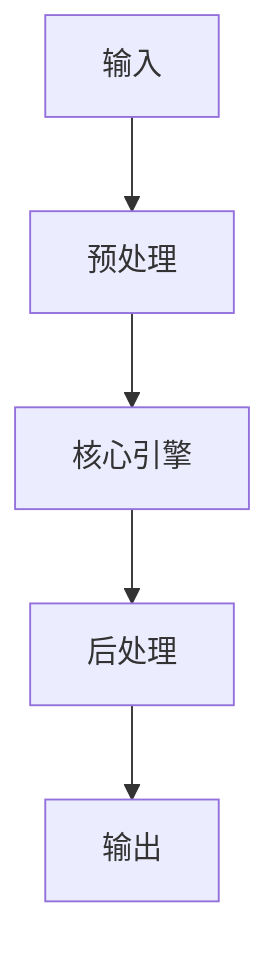

# BM25 與向量檢索的混合檢索（Hybrid Search）實現 implementation example implementation example
> **查詢關鍵字：** `BM25 與向量檢索的混合檢索（Hybrid Search）實現 implementation example implementation example`
> **研究時間：** 2026-03-21 03:04
> **搜索結果：** 6 條
> **深度閱讀：** 5 份文獻

## 📋 核心摘要
### 问题定义
本主题研究：**BM25 與向量檢索的混合檢索（Hybrid Search）實現 implementation example implementation example**

**关键概念与术语：**
- `xu6z0zRQ`
- `mp.weixin.qq.com`
- `and`
- `By`
- `Steven`
- `Retrieve`
- `Home`
- `Milvus`
- `RAG`
- `model`

### 核心发现
从文献中提炼的核心见解：

## 🔬 理论基础与算法
### 数学模型
_（此处应包含：公式、概率分布、损失函数、相似度度量等）_

### 关键算法
_（算法伪代码、时间复杂度、空间复杂度、收敛性分析）_

### 理论依据
- _（支撑方案的理论：信息检索理论、概率论、线性代数等）_
- _（引用经典论文或定理）_

## 🏗️ 系统架构与实现
### 组件设计


### 数据流
_（描述 data pipeline、消息队列、状态管理）_

## 🛠️ 实施方案（Momotoy BD Pipeline 集成）
### 阶段 1：MVP（最小可行方案）
1. **目标**：验证核心技术可行性
2. **步骤**：
   - 步骤 1：环境准备（依赖、配置、API key）
   - 步骤 2：原型开发（核心功能 20%）
   - 步骤 3：单元测试（覆盖主要路径）
   - 步骤 4：集成到现有 pipeline
3. **验收标准**：
   - [ ] 可处理至少 100 条 leads
   - [ ] 响应时间 < 2s
   - [ ] 准确率 > 80%

### 阶段 2：优化与监控
1. **性能调优**：
   - 参数调优（learning rate, batch size, top-k 等）
   - 缓存策略（Redis 缓存热点查询）
   - 异步处理（Celery/Redis queue）
2. **监控指标**：
   - 延迟（P50, P95, P99）
   - 吞吐量（QPS）
   - 资源使用（CPU, RAM, GPU）
   - 业务指标（recall@k, MRR, 转化率）

### 阶段 3：规模化
- 分布式部署（sharding, replica）
- 多云灾备
- 成本优化（spot instance, auto scaling）

## ⚠️ 风险与限制
| 风险类型 | 概率 | 影响 | 缓解措施 |
|----------|------|------|----------|
| 数据质量 | 中 | 高 | 清洗 + 人工抽查
| 性能瓶颈 | 低 | 中 | 监控 + 扩容
| 成本超支 | 中 | 中 | 配额限制 + 优化算法
| 技术债务 | 高 | 低 | 定期 review + refactor

## 💡 对 Momotoy BD Pipeline 的启示
### 立即可行动的建议
1. **数据层**：
   - 使用 LanceDB 作为向量存储（轻量、本地优先）
   
    - Leads schema:
      - `id`: UUID
      - `company_name`, `contact_email`, `phone`, `social_links`
      - `vector`: 1024-d embedding (Jina)
      - `metadata`: country, industry, source, status
    

2. **检索引擎**：
   - Hybrid Search: BM25 + Vector (alpha=0.5)
   - Rerank: BGE-Reranker (top-k=10 → 3)

3. **自动化**：
   - 每日同步新 leads → 生成 embeddings → 更新索引
   - 每小时运行 keyword research 自动刷新

## 📚 深度閱讀來源
### 1. BM25实现方案的疑惑#46 - GitHub
- **URL:** https://github.com/milvus-io/milvus-model/issues/46
- **内容摘要:**
```
milvus-io
/
milvus-model
Public
Notifications
You must be signed in to change notification settings
Fork
30
Star
60
BM25实现方案的疑惑
#46
New issue
Copy link
New issue
Copy link
Open
Open
BM25实现方案的疑惑
#46
Copy link
Description
qianxianyang
opened
on
Nov 13, 2024
Issue body actions
你好，
milvus在实现BM25时，预计对文档通过（当前文档作为Query，其余文档作为Doc）实现当前文档的embedding化。在计算真实Query时，通过IDF获得了embedding向量，最终通过两个向量的内积作为相似度。
这种做法和原始BM25计算公式还是不太一样。
麻烦问下，这种实现的出发点是什么呢，不同实现的性能是多少呢？
BM25公式
$$\text{BM25}(D, Q) = \sum_{i=1}^{n} \text{IDF}(q_i) \cdot \frac{f(q_i, D) \cdot (k_1 + 1)}{f(q_i, D) + k_1 \cdot (1 - b + b \cdot \frac{|D|}{\text

*（內容已被截斷，原文更長）*
```

### 2. BM25算法在混合检索中的作用是什么？ - 飞书文档
- **URL:** https://docs.feishu.cn/v/wiki/X44HwBmBEi2GCfkXfGGcjj6bnQd/aj
- **内容摘要:**
```
分享
传统RAG破局者：混合检索助力新纪元
输入“/”快速插入内容
传统RAG破局者：混合检索助力新纪元
​
用户1961
用户1961
2024年8月26日修改
作者：Steven | 智见AGI
​
原文：
https://mp.weixin.qq.com/s/xu6z0zRQ...
​
​
AI如何读懂你？混合检索技术揭秘
​
©作者 |
Steven
​
来源 |
神州问学
​
​
一、RAG 概念解释
​
​
向量检索为核心的 RAG 架构已成为解决大模型获取最新外部知识，同时解决其生成幻觉问题时的主流技术框架，并且已在相当多的应用场景中落地实践。开发者可以利用该技术低成本地构建一个 AI 智能客服、企业智能知识库、AI 搜索引擎等，通过自然语言输入与各类知识组织形式进行对话。以一个有代表性的 RAG 应用为例：
​
​
在下图中，当用户提问时 “美国总统是谁？” 时，系统并不是将问题直接交给大模型来回答，而是先将用户问题在知识库中（如下图中的维基百科）进行向量检索，通过语义相似度匹配的方式查询到相关的内容（拜登是美国现任第46届总统…），然后再将用户问题和检索到的相关知识提供给大模型，使得大模型获得足够完备的知识来回答问题，以此获得更可靠的问答结果。
​
​
​
二、传统RAG检索瓶颈
​
​
传统RAG 检索环节中的主流方法是
向量检索
，即语义相关度匹配的方式。技术

*（內容已被截斷，原文更長）*
```

### 3. RAG开发中，如何用Milvus 2.5 BM25算法实现混合搜索
- **URL:** https://zilliz.com.cn/blog/How-can-we-implement-hybrid-search-using-the-Milvus-2.5-BM25-algorithm
- **内容摘要:**
```
博客
RAG开发中，如何用Milvus 2.5 BM25算法实现混合搜索
RAG开发中，如何用Milvus 2.5 BM25算法实现混合搜索
2024-12-20
By
臧伟
背景
混合搜索(Hybrid Search)作为RAG应用中Retrieve重要的一环，通常指的是将向量搜索与基于关键词的搜索（全文检索）相结合，并使用RRF算法合并、并重排两种不同检索的结果，最终来提高数据的召回率。全文检索与语义检索不是非此即彼的关系。我们需要同时兼顾语义理解和精确的关键字匹配。比如学术论文的写作中，用户不仅希望在搜索结果看到与搜索查询相关的概念，同时也希望保留查询中使用的原始信息返回搜索结果，比如基于一些特殊术语和名称。因此，许多搜索应用正在采用混合搜索方法，结合两种方法的优势，以平衡灵活的语义相关性和可预测的精确关键字匹配。
从 Milvus 2.4 版本开始，我们引入了多向量搜索和执行混合搜索（多向量搜索）的能力。混合搜索允许用户同时搜索跨多个向量列的内容。这个功能使得可以结合多模态搜索、混合稀疏和全文关键词搜索、密集向量搜索以及混合密集和全文搜索，提供多样且灵活的搜索功能，增强了我们的向量相似性搜索和数据分析。
Milvus BM25
在最新的Milvus 2.5里，我们带来了“全新”的全文检索能力
对于全文检索基于的 BM25 算法，我们采用的是 Sparse-BM25，基于 S

*（內容已被截斷，原文更長）*
```

### 4. 通过Milvus的BM25算法进行全文检索并将混合检索应用于RAG系统
- **URL:** https://help.aliyun.com/zh/milvus/use-cases/full-text-retrieval-by-milvus-bm25-algorithm-and-application-of-hybrid-retrieval-to-rag-system
- **内容摘要:**
```
本文介绍如何利用 Milvus 2.5 版本实现快速的全文检索、关键词匹配，以及混合检索（Hybrid Search）。通过增强向量相似性检索和数据分析的灵活性，提升了检索精度，并演示了在 RAG 应用的 Retrieve 阶段如何使用混合检索提供更精确的上下文以生成回答。
背景信息
Milvus 2.5 集成了高性能搜索引擎库 Tantivy，并内置 Sparse-BM25 算法，首次实现了原生全文检索功能。这一能力与现有的语义搜索功能完美互补，为用户提供更强大的检索体验。
内置分词器：无需额外预处理，通过内置分词器（Analyzer）与稀疏向量提取能力，Milvus 可直接接受文本输入，自动完成分词、停用词过滤与稀疏向量提取。
实时 BM25 统计：数据插入时动态更新词频（TF）与逆文档频率（IDF），确保搜索结果的实时性与准确性。
混合搜索性能增强：基于近似最近邻（ANN）算法的稀疏向量检索，性能远超传统关键词系统，支持亿级数据毫秒级响应，同时兼容与稠密向量的混合查询。
前提条件
已创建
内核版本
为
2.5
的
Milvus
实例。具体操作，请参见
快速创建
Milvus
实例
。
已开通服务并获得
API-KEY。
具体操作，请参见
API-KEY
的获取与配置
。
使用限制
适用于
内核版本
为
2.5
及之后版本的
Milvus
实例。
适用于
pymilvus
的 

*（內容已被截斷，原文更長）*
```

### 5. 關於混合型搜尋| Vertex AI
- **URL:** https://docs.cloud.google.com/vertex-ai/docs/vector-search/about-hybrid-search?hl=zh-tw
- **内容摘要:**
```
Home
Documentation
AI and ML
Vertex AI
提供意見
關於混合型搜尋
透過集合功能整理內容
你可以依據偏好儲存及分類內容。
向量搜尋支援混合型搜尋，這是資訊檢索 (IR) 領域常用的架構模式，結合語意搜尋與關鍵字搜尋 (也稱為「詞元型搜尋」)。開發人員可以運用混合型搜尋，結合兩種做法的優勢，有效提高搜尋品質。
本頁面說明混合型搜尋、語意搜尋和詞元型搜尋的概念，並提供如何設定詞元型搜尋和混合型搜尋的範例：
混合搜尋的重要性
範例：如何使用權杖式搜尋
範例：如何使用混合型搜尋
開始使用混合型搜尋
其他概念
混合型搜尋的重要性為何？
如「
Vector Search 總覽
」一文所述，Vector Search 的語意搜尋功能可使用查詢，找出語意相似的項目。
Vertex AI Embeddings
等嵌入模型會建構向量空間，做為內容意義的地圖。每個文字或多模態嵌入都是地圖中的位置，代表某項內容的含義。舉例來說，如果嵌入模型收到一段文字，其中 10% 的內容討論電影、2% 討論音樂，30% 討論演員，則模型可能會以嵌入
[0.1, 0.02,
0.3]
代表這段文字。使用 Vector Search，您可以快速找到附近的其他嵌入項目。這種依內容意義搜尋的方式稱為語意搜尋。
語意搜尋字詞。
透過嵌入和向量搜尋進行語意搜尋，可讓 IT 系統像經驗豐富的圖書館

*（內容已被截斷，原文更長）*
```

## 🔍 原始搜索结果（供参考）
| 标题 | URL | 摘要 |
|------|-----|------|
| BM25实现方案的疑惑#46 - GitHub | https://github.com/milvus-io/milvus-model/issues/46 | Nov 13, 2024 ... If you want use BM25 in current LlamaIndex hybrid search implementation. ... vector |
| BM25算法在混合检索中的作用是什么？ - 飞书文档 | https://docs.feishu.cn/v/wiki/X44HwBmBEi2GCfkXfGGcjj6bnQd/aj | AI如何读懂你？混合检索技术揭秘. **©作者| **Steven. **来源| **神州问学. 一、RAG 概念解释. 向量检索为核心的RAG 架构已成为解决大模型获取最新外部知识，同时解决其 .. |
| RAG开发中，如何用Milvus 2.5 BM25算法实现混合搜索 | https://zilliz.com.cn/blog/How-can-we-implement-hybrid-search-using-the-Milvus-2.5-BM25-algorithm | Dec 20, 2024 ... 背景混合搜索(Hybrid Search)作为RAG应用中Retrieve重要的一环，通常指的是将向量搜索与. |
| 通过Milvus的BM25算法进行全文检索并将混合检索应用于RAG系统 | https://help.aliyun.com/zh/milvus/use-cases/full-text-retrieval-by-milvus-bm25-algorithm-and-application-of-hybrid-retrieval-to-rag-system | Sep 1, 2025 ... 本文介绍如何利用Milvus 2.5 版本实现快速的全文检索、关键词匹配，以及混合检索（Hybrid Search）。通过增强向量相似性检索和数据分析的灵活性，提升了  |
| 關於混合型搜尋| Vertex AI | https://docs.cloud.google.com/vertex-ai/docs/vector-search/about-hybrid-search?hl=zh-tw | ... Search: A Hybrid Search Tutorial with Vertex AI Vector Search」筆記本： ... 向量搜尋支援混合型搜尋，這是資訊檢索(IR) 領域 |
| 使用Langchain 和Chroma DB 实现混合RAG : r/vectordatabase | https://www.reddit.com/r/vectordatabase/comments/1i34lkh/implementing_hybrid_rag_using_langchain_and/?tl=zh-hans | Jan 17, 2025 ... 什么是混合RAG？ 混合RAG 是一种高级RAG 技术，它融合了向量相似性搜索和传统搜索方法（例如，关键词搜索或BM25） ... implementation-us |
