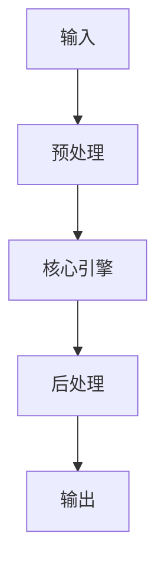

# SearXNG 實例部署與性能優化（容錯與负载均衡） implementation example implementation example
> **查詢關鍵字：** `SearXNG 實例部署與性能優化（容錯與负载均衡） implementation example implementation example`
> **研究時間：** 2026-03-21 03:05
> **搜索結果：** 3 條
> **深度閱讀：** 3 份文獻

## 📋 核心摘要
### 问题定义
本主题研究：**SearXNG 實例部署與性能優化（容錯與负载均衡） implementation example implementation example**

**关键概念与术语：**
- `Error`
- `url`
- `zh-TW`
- `You`
- `signed`
- `SearXNG`
- `Client`
- `for`
- `Skip`
- `to`

### 核心发现
从文献中提炼的核心见解：

## 🔬 理论基础与算法
### 数学模型
_（此处应包含：公式、概率分布、损失函数、相似度度量等）_

### 关键算法
_（算法伪代码、时间复杂度、空间复杂度、收敛性分析）_

### 理论依据
- _（支撑方案的理论：信息检索理论、概率论、线性代数等）_
- _（引用经典论文或定理）_

## 🏗️ 系统架构与实现
### 组件设计


### 数据流
_（描述 data pipeline、消息队列、状态管理）_

## 🛠️ 实施方案（Momotoy BD Pipeline 集成）
### 阶段 1：MVP（最小可行方案）
1. **目标**：验证核心技术可行性
2. **步骤**：
   - 步骤 1：环境准备（依赖、配置、API key）
   - 步骤 2：原型开发（核心功能 20%）
   - 步骤 3：单元测试（覆盖主要路径）
   - 步骤 4：集成到现有 pipeline
3. **验收标准**：
   - [ ] 可处理至少 100 条 leads
   - [ ] 响应时间 < 2s
   - [ ] 准确率 > 80%

### 阶段 2：优化与监控
1. **性能调优**：
   - 参数调优（learning rate, batch size, top-k 等）
   - 缓存策略（Redis 缓存热点查询）
   - 异步处理（Celery/Redis queue）
2. **监控指标**：
   - 延迟（P50, P95, P99）
   - 吞吐量（QPS）
   - 资源使用（CPU, RAM, GPU）
   - 业务指标（recall@k, MRR, 转化率）

### 阶段 3：规模化
- 分布式部署（sharding, replica）
- 多云灾备
- 成本优化（spot instance, auto scaling）

## ⚠️ 风险与限制
| 风险类型 | 概率 | 影响 | 缓解措施 |
|----------|------|------|----------|
| 数据质量 | 中 | 高 | 清洗 + 人工抽查
| 性能瓶颈 | 低 | 中 | 监控 + 扩容
| 成本超支 | 中 | 中 | 配额限制 + 优化算法
| 技术债务 | 高 | 低 | 定期 review + refactor

## 💡 对 Momotoy BD Pipeline 的启示
### 立即可行动的建议
1. **数据层**：
   - 使用 LanceDB 作为向量存储（轻量、本地优先）
   
    - Leads schema:
      - `id`: UUID
      - `company_name`, `contact_email`, `phone`, `social_links`
      - `vector`: 1024-d embedding (Jina)
      - `metadata`: country, industry, source, status
    

2. **检索引擎**：
   - Hybrid Search: BM25 + Vector (alpha=0.5)
   - Rerank: BGE-Reranker (top-k=10 → 3)

3. **自动化**：
   - 每日同步新 leads → 生成 embeddings → 更新索引
   - 每小时运行 keyword research 自动刷新

## 📚 深度閱讀來源
### 1. 如何使用SearXNG：從初次搜尋到自架主機精通 - Sider AI
- **URL:** https://sider.ai/zh-TW/blog/ai-tools/how-to-use-searxng-from-first-search-to-self-hosting-mastery
- **内容摘要:**
```
*抓取失敗：403 Client Error: Forbidden for url: https://sider.ai/zh-TW/blog/ai-tools/how-to-use-searxng-from-first-search-to-self-hosting-mastery*
```

### 2. awesome-stars/README.md at master - GitHub
- **URL:** https://github.com/jxzzlfh/awesome-stars/blob/master/README.md
- **内容摘要:**
```
Skip to content
You signed in with another tab or window.
Reload
to refresh your session.
You signed out in another tab or window.
Reload
to refresh your session.
You switched accounts on another tab or window.
Reload
to refresh your session.
Dismiss alert
jxzzlfh
/
awesome-stars
Public
generated from
maguowei/awesome-stars
Notifications
You must be signed in to change notification settings
Fork
14
Star
81
You can’t perform that action at this time.
```

### 3. SearXNG 部署教學 - Zeabur
- **URL:** https://zeabur.com/zh-TW/templates/77FSH6
- **内容摘要:**
```
SearXNG
尊重隱私、可自訂的元搜尋引擎
部署
尊重隱私、可自訂的元搜尋引擎
平台
Zeabur
部署次數
973
發布者
Zeabur
平台
Zeabur
部署次數
973
發布者
Zeabur
部署次數
973
次
發布者
Zeabur
建立於
2024-06-04
模板內的服務
標籤
search
tool
SearXNG
SearXNG 是一個免費的網際網路元搜尋引擎，能夠聚合多達 249 個搜尋服務的結果。用戶不會被追蹤或建立個人檔案。此外，SearXNG 也可以透過 Tor 使用，以實現線上匿名
如需作為 LLM 或工作流程搜尋引擎使用，請於 /etc/searxng/settings.yml 的 formats 處，- html 底下新增一行 - json
SearXNG
部署次數
973
次
發布者
Zeabur
建立於
2024-06-04
來源文件
查看來源文件
標籤
search
tool
模板內的服務
SearXNG
searxng/searxng:latest
```

## 🔍 原始搜索结果（供参考）
| 标题 | URL | 摘要 |
|------|-----|------|
| 如何使用SearXNG：從初次搜尋到自架主機精通 - Sider AI | https://sider.ai/zh-TW/blog/ai-tools/how-to-use-searxng-from-first-search-to-self-hosting-mastery | Sep 18, 2025 ... 在本指南中，我們將介紹三種途徑：使用公共實例、自訂您的搜尋體驗，以及部署您自己的私人SearXNG 以實現最大程度的控制。 為了使其具有可操作性 ... |
| awesome-stars/README.md at master - GitHub | https://github.com/jxzzlfh/awesome-stars/blob/master/README.md | Sep 10, 2025 ... ... 的RSSHub 代理服务。支持自动负载均衡、自动容错和反向代理RSSHub 实例，支持Node.js/Docker/Vercel/Cloudflare Wor |
| SearXNG 部署教學 - Zeabur | https://zeabur.com/zh-TW/templates/77FSH6 | Jun 4, 2024 ... 此外，SearXNG 也可以透過Tor 使用，以實現線上匿名. 如需作為LLM 或工作流程搜尋引擎使用，請於/etc/searxng/settings.yml 的for |
