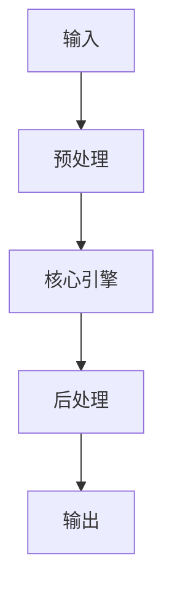

# Keyword Research 自動化：從 Google Keyword Planner 到開源替代 implementation example implementation example
> **查詢關鍵字：** `Keyword Research 自動化：從 Google Keyword Planner 到開源替代 implementation example implementation example`
> **研究時間：** 2026-03-21 03:05
> **搜索結果：** 8 條
> **深度閱讀：** 5 份文獻

## 📋 核心摘要
### 问题定义
本主题研究：**Keyword Research 自動化：從 Google Keyword Planner 到開源替代 implementation example implementation example**

**关键概念与术语：**
- `SEM`
- `Search`
- `research`
- `Ads`
- `Toggle`
- `SEO`
- `Keyword`
- `Google`
- `keyword`
- `AI`

### 核心发现
从文献中提炼的核心见解：

## 🔬 理论基础与算法
### 数学模型
_（此处应包含：公式、概率分布、损失函数、相似度度量等）_

### 关键算法
_（算法伪代码、时间复杂度、空间复杂度、收敛性分析）_

### 理论依据
- _（支撑方案的理论：信息检索理论、概率论、线性代数等）_
- _（引用经典论文或定理）_

## 🏗️ 系统架构与实现
### 组件设计


### 数据流
_（描述 data pipeline、消息队列、状态管理）_

## 🛠️ 实施方案（Momotoy BD Pipeline 集成）
### 阶段 1：MVP（最小可行方案）
1. **目标**：验证核心技术可行性
2. **步骤**：
   - 步骤 1：环境准备（依赖、配置、API key）
   - 步骤 2：原型开发（核心功能 20%）
   - 步骤 3：单元测试（覆盖主要路径）
   - 步骤 4：集成到现有 pipeline
3. **验收标准**：
   - [ ] 可处理至少 100 条 leads
   - [ ] 响应时间 < 2s
   - [ ] 准确率 > 80%

### 阶段 2：优化与监控
1. **性能调优**：
   - 参数调优（learning rate, batch size, top-k 等）
   - 缓存策略（Redis 缓存热点查询）
   - 异步处理（Celery/Redis queue）
2. **监控指标**：
   - 延迟（P50, P95, P99）
   - 吞吐量（QPS）
   - 资源使用（CPU, RAM, GPU）
   - 业务指标（recall@k, MRR, 转化率）

### 阶段 3：规模化
- 分布式部署（sharding, replica）
- 多云灾备
- 成本优化（spot instance, auto scaling）

## ⚠️ 风险与限制
| 风险类型 | 概率 | 影响 | 缓解措施 |
|----------|------|------|----------|
| 数据质量 | 中 | 高 | 清洗 + 人工抽查
| 性能瓶颈 | 低 | 中 | 监控 + 扩容
| 成本超支 | 中 | 中 | 配额限制 + 优化算法
| 技术债务 | 高 | 低 | 定期 review + refactor

## 💡 对 Momotoy BD Pipeline 的启示
### 立即可行动的建议
1. **数据层**：
   - 使用 LanceDB 作为向量存储（轻量、本地优先）
   
    - Leads schema:
      - `id`: UUID
      - `company_name`, `contact_email`, `phone`, `social_links`
      - `vector`: 1024-d embedding (Jina)
      - `metadata`: country, industry, source, status
    

2. **检索引擎**：
   - Hybrid Search: BM25 + Vector (alpha=0.5)
   - Rerank: BGE-Reranker (top-k=10 → 3)

3. **自动化**：
   - 每日同步新 leads → 生成 embeddings → 更新索引
   - 每小时运行 keyword research 自动刷新

## 📚 深度閱讀來源
### 1. 示範利用AI 自動化建立小工具：Keyword research 功能- HDcourse
- **URL:** https://www.hdcourse.com/ai/%E7%A4%BA%E7%AF%84%E5%88%A9%E7%94%A8-ai-%E8%87%AA%E5%8B%95%E5%8C%96%E5%BB%BA%E7%AB%8B%E5%B0%8F%E5%B7%A5%E5%85%B7%EF%BC%9Akeyword-research-%E5%8A%9F%E8%83%BD/
- **内容摘要:**
```
在如今的數位化時代，人工智慧 (AI) 和自動化已成為改變我們工作方式的重要工具。不僅可以節省大量的時間和人力，更能提高工作效率並達到更精準的結果。在這篇文章中，我將以超過10年的資深編輯經驗，展示如何利用 AI 和自動化技術，建立一個簡單的 Keyword research 小工具。
目錄
Toggle
緣起
當我們在進行網路行銷或是內容創作時，找尋適合的關鍵字(Keyword)是很重要的一環。一個適當的關鍵字可以讓你的內容更容易被搜索引擎找到，進一步提高你的網站流量。然而，進行 Keyword research 時，手動搜尋並整理關鍵字的過程可能會非常繁瑣且耗時。因此，我想利用 AI 和自動化的技術來簡化這個過程，並將這個過程包裝成一個小工具，讓大家可以更方便地進行 Keyword research。
建立過程
首先，我們需要一個表格來收集我們想要搜尋的關鍵字。這個表格可以是 Google 的表格，也可以是 WordPress 裡面的表格。在這裡，我選擇使用 Jot Form，因為它是一個免費的線上表單工具，而且已被 n8n 支援。
接著，我們需要將表格與 AI 連接。這裡我選擇使用 n8n，它是一個 API 流程管理工具，可以將不同的 API 串聯起來，並自動執行特定的工作流程。在這個案例中，我設定了一個工作流程，只要在表格中提交了新的關鍵字，n8n 就會自動觸發 OpenA

*（內容已被截斷，原文更長）*
```

### 2. Google 關鍵字規劃工具教學：5分鐘掌握免費關鍵字研究技巧
- **URL:** https://geniushub.cc/google-ads/google-keyword-planner-guide/
- **内容摘要:**
```
Google 關鍵字規劃工具教學：5分鐘掌握免費關鍵字研究技巧，提升Google Ads 和 SEO 效能
Google Ads教學
2026-02-13
2026-02-13
Google 關鍵字規劃工具是 Google 提供的免費關鍵字研究工具，提供的數據指標可用於 SEO 及關鍵字廣告投放。
目錄
關鍵要點
Google Ads內置免費工具
提供關鍵字實時數據及參考指標
註冊Google Ads帳戶即可使用
SEO 關鍵字研究可參考搜尋量、關鍵字清單
Google廣告關鍵字研究可參考搜尋量、CPC、競爭程度
Google 關鍵字規劃工具是什麼？
Google Keyword Planner
Google 關鍵字規劃工具（Google Keyword Planner） 是 Google Ads 內建的免費工具，可以用來找出人們在 Google 上實際搜尋字詞。
我們只要輸入產品名稱、服務或網站網址，它就會提供相關的關鍵字搜尋量、競爭程度、出價與其他關鍵字建議，可以了解市場需求、投放潛力以及人們的搜尋習慣。
關鍵字規劃工具的優勢
免費：只要註冊 Google Ads 帳號，不用投放廣告也能使用。
實時搜尋數據：資料直接來自 Google 搜尋引擎，比第三方工具更精準。
同時支援 SEO 與
關鍵字廣告
：可用來規劃內容主題，也能預估廣告關鍵字成本。
提供關鍵字靈感與建議：輸入一個

*（內容已被截斷，原文更長）*
```

### 3. Google Keyword Planner關鍵字規劃工具使用指南－SEO和廣告策略 ...
- **URL:** https://www.bondlink.com.tw/article-info/google-keyword-planner-tool-user-guide
- **内容摘要:**
```
Google Keyword Planner關鍵字規劃工具使用指南－SEO和廣告策略實用教學
在網路行業的競爭激烈中，了解如何使用
Google Keyword Planner關鍵字規劃工具
是一項至關重要的技能，不僅對於網站擁有者而言，對於任何進行網路行銷的專業人士也是必備的。邦立資訊網頁設計在十餘年的經驗中，透過探索深知這個工具對於SEO和廣告策略的重要性。我們將帶領您初探
Google Keyword Planner關鍵字規劃工具
使用指南，幫助使用者充分發揮這個工具的潛力。
1. 登入Google Ads帳戶
首先，您需要擁有一個有效的Google Ads帳戶。登入您的帳戶後，進入「工具與設定」，在「計劃」下找到「關鍵字規劃器」，或是直接透過此處點擊登入進去：
Google Keyword Planner關鍵字規劃工具
。
2. 瞭解基本功能
在
Google Keyword Planner關鍵字規劃工具
中，有兩個主要功能：「
發現新的關鍵字
」和「
獲得搜索量和預測
」。前者適用於尋找與您業務相關的新關鍵字，後者則提供了更多搜尋量和競爭度的詳細資訊。
關鍵字規劃工具基本功能
3. 使用「發現新的關鍵字」
在這個區域，您可以輸入與您業務相關的主題、網址或產品。Google Keyword Planner關鍵字規劃工具將提供與這些詞彙相關的潛在關鍵字和它們的搜索量。
發現新

*（內容已被截斷，原文更長）*
```

### 4. 5秒取得關鍵字搜尋量：輕鬆完成SEO 關鍵字研究的自動化流程
- **URL:** https://cms.ohya.co/n8n-ai-automation/get-keywords-from-google-with-n8n/
- **内容摘要:**
```
5秒取得關鍵字搜尋量：輕鬆完成 SEO 關鍵字研究的自動化流程
你是否正在規劃網站的 SEO 策略，但卻苦於找不到準確的關鍵字搜尋量數據？或者需要分析歷史趨勢來了解哪些關鍵字會在特定時期熱搜？這些看似繁瑣的工作，現在只需幾步操作即可輕鬆完成！
為什麼我們分享這個流程？
在進行 SEO 策劃時，以下問題是否經常困擾著你：
不清楚關鍵字的真實搜尋量
：手上的潛在關鍵字列表雖多，但不確定哪些值得優先投入。
缺乏歷史趨勢分析
：無法掌握關鍵字在不同季節的流行變化。
難以評估關鍵字的競爭力
：缺乏詳細數據來判斷內容創作的優先順序。
這個流程專為解決上述問題設計，能直接連接 Google Keyword Planner API，提供包括搜尋量、競爭度、歷史趨勢在內的多項數據，讓你的 SEO 策劃變得更高效！
還不認識n8n嗎？你可以先看這裡：
什麼是 n8n？2025年的趨勢AI工作流你還不知道嗎？
SEO關鍵字自動化流程的好處
這個流程為什麼適合你？
1. 節省時間，集中精力在策略制定
這個流程自動抓取每個關鍵字的搜尋數據，免去人工輸入與手動分析的繁瑣步驟。
2. 提供精準的數據支持
包括每月搜尋量、競爭度和歷史趨勢等詳細資料，幫助你選擇最具價值的關鍵字。
3. 容易設置，靈活應用
只需輸入最多 20 個關鍵字，流程即可啟動。同時支持自訂數據來源與輸出方式，例如 Airtable 或自建資料

*（內容已被截斷，原文更長）*
```

### 5. 14 組工具擊破「關鍵字研究」，打造你的關鍵字地圖 - 白話文商學院
- **URL:** https://frankchiu.io/seo-keyword-research-1/
- **内容摘要:**
```
「關鍵字」（keyword），是搜尋引擎的根本基礎，也是想做好搜尋引擎行銷（SEO＋SEM）的通用邏輯。
當你想要依靠 Search 這個渠道來獲得流量跟收益，就必須搞懂自己「要經營哪些關鍵字」——業界稱之為「關鍵字研究」（keyword research）。
而今天我想要與你分享關鍵字研究的建議指南，包含免費跟付費的關鍵字研究工具，幫助你找到適合品牌的關鍵字列表，邁向關鍵字布局跟內容行銷的第一步！
本文於 2025 年更新，已重新審視各段落是否符合當下趨勢，並更新 AI 相關資訊。
內容目錄
隱藏
為何我們需要關鍵字研究？
關鍵字研究四步驟
關鍵字研究中的注意事項
1. 相似關鍵字要一起整理
2. 先求有再求好
3. 工具不需要都精熟
14 個常見關鍵字研究工具
工具 1. Google Search（免費）
工具 2. 維基百科（免費）
工具 3. Answer The Public（免費／付費）
工具 4. Google Keyword Planner（免費／付費）
工具 5. Keyword Tool（免費／付費）
工具 6. Ahrefs（付費）
工具 7. Ahrefs Free Keyword Generator Tool（免費）
工具 8. ChatGPT、Gemini
工具 9. Google Trends（免費）
其他關鍵字研究的思路
第一方關鍵字研究工具
1.

*（內容已被截斷，原文更長）*
```

## 🔍 原始搜索结果（供参考）
| 标题 | URL | 摘要 |
|------|-----|------|
| 示範利用AI 自動化建立小工具：Keyword research 功能- HDcourse | https://www.hdcourse.com/ai/%E7%A4%BA%E7%AF%84%E5%88%A9%E7%94%A8-ai-%E8%87%AA%E5%8B%95%E5%8C%96%E5%BB%BA%E7%AB%8B%E5%B0%8F%E5%B7%A5%E5%85%B7%EF%BC%9Akeyword-research-%E5%8A%9F%E8%83%BD/ | 經過以上的設定後，我們已經成功建立了一個Keyword research 小工具。只需要簡單地在表格中輸入你想要搜尋的關鍵字，例如「學生津貼」，然後按下提交按鈕，系統就會自動進行 ... |
| Google 關鍵字規劃工具教學：5分鐘掌握免費關鍵字研究技巧 | https://geniushub.cc/google-ads/google-keyword-planner-guide/ | Google 關鍵字規劃工具是Google Ads 免費提供的關鍵字研究功能，包括多項關鍵字實用指標。本文將會為您介紹使用Google keyword planner 提升SEO及關鍵字廣告活動的 . |
| Google Keyword Planner關鍵字規劃工具使用指南－SEO和廣告策略 ... | https://www.bondlink.com.tw/article-info/google-keyword-planner-tool-user-guide | Nov 23, 2023 ... 首先，您需要擁有一個有效的Google Ads帳戶。登入您的帳戶後，進入「工具與設定」，在「計劃」下找到「關鍵字規劃器」，或是直接透過 ... |
| 5秒取得關鍵字搜尋量：輕鬆完成SEO 關鍵字研究的自動化流程 | https://cms.ohya.co/n8n-ai-automation/get-keywords-from-google-with-n8n/ | 在進行SEO 策劃時，以下問題是否經常困擾著你： ... 這個流程專為解決上述問題設計，能直接連接Google Keyword Planner API，提供包括搜尋量、競爭度、歷史趨勢在內的多項數據， |
| 14 組工具擊破「關鍵字研究」，打造你的關鍵字地圖 - 白話文商學院 | https://frankchiu.io/seo-keyword-research-1/ | 14 個常見關鍵字研究工具 · 工具1. Google Search（免費） · 工具2. 維基百科（免費） · 工具3. Answer The Public（免費／付費） · 工具4. Google |
| 開源軟體之商業經營模式研究 - 臺灣大學 | https://tdr.lib.ntu.edu.tw/bitstream/123456789/79255/1/U0001-1201202210344800.pdf | Google 能從. 付費購買軟體、音樂、書籍、電影中收到手續費，同時也確保了這些 ... 自動執行從創建到部署到監控的完整工作. 流程。提供各式最佳樣板，讓使用者不用 ... |
| 示範利用AI 自動化建立小工具：Keyword research 功能- YouTube | https://www.youtube.com/watch?v=eWM0_S6XzmY | Sep 14, 2023 ... AI 自動化工作坊- 公司流程自動化+ API + No code 這個工作坊的目的是讓你認識到如何利用AI 自動化公司流程，工作坊會用多個例子，讓你熟練這個AI 自 |
| 使用n8n自動化WordPress SEO文章生成：完整攻略，高效發布！ | https://richers.co/%E4%BD%BF%E7%94%A8n8n%E8%87%AA%E5%8B%95%E5%8C%96wordpress-seo%E6%96%87%E7%AB%A0%E7%94%9F%E6%88%90/ | May 2, 2025 ... n8n自動化能夠大幅縮短這個過程，將重複性的工作自動化，例如：. 關鍵字研究： 自動從Google Search Console等工具提取關鍵字數據。 ... Goog |
