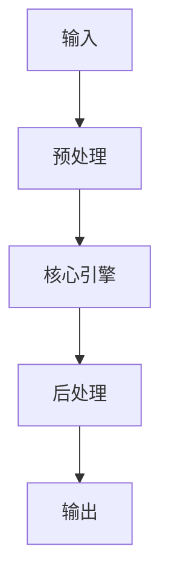

# AEO（AI Engine Optimization）- LLM 检索引擎優化策略 implementation example implementation example
> **查詢關鍵字：** `AEO（AI Engine Optimization）- LLM 检索引擎優化策略 implementation example implementation example`
> **研究時間：** 2026-03-21 03:05
> **搜索結果：** 5 條
> **深度閱讀：** 5 份文獻

## 📋 核心摘要
### 问题定义
本主题研究：**AEO（AI Engine Optimization）- LLM 检索引擎優化策略 implementation example implementation example**

**关键概念与术语：**
- `enable`
- `You`
- `JavaScript`
- `LLMO`
- `GEO`
- `to`
- `SEO`
- `need`
- `AIO`
- `AEO`

### 核心发现
从文献中提炼的核心见解：

## 🔬 理论基础与算法
### 数学模型
_（此处应包含：公式、概率分布、损失函数、相似度度量等）_

### 关键算法
_（算法伪代码、时间复杂度、空间复杂度、收敛性分析）_

### 理论依据
- _（支撑方案的理论：信息检索理论、概率论、线性代数等）_
- _（引用经典论文或定理）_

## 🏗️ 系统架构与实现
### 组件设计


### 数据流
_（描述 data pipeline、消息队列、状态管理）_

## 🛠️ 实施方案（Momotoy BD Pipeline 集成）
### 阶段 1：MVP（最小可行方案）
1. **目标**：验证核心技术可行性
2. **步骤**：
   - 步骤 1：环境准备（依赖、配置、API key）
   - 步骤 2：原型开发（核心功能 20%）
   - 步骤 3：单元测试（覆盖主要路径）
   - 步骤 4：集成到现有 pipeline
3. **验收标准**：
   - [ ] 可处理至少 100 条 leads
   - [ ] 响应时间 < 2s
   - [ ] 准确率 > 80%

### 阶段 2：优化与监控
1. **性能调优**：
   - 参数调优（learning rate, batch size, top-k 等）
   - 缓存策略（Redis 缓存热点查询）
   - 异步处理（Celery/Redis queue）
2. **监控指标**：
   - 延迟（P50, P95, P99）
   - 吞吐量（QPS）
   - 资源使用（CPU, RAM, GPU）
   - 业务指标（recall@k, MRR, 转化率）

### 阶段 3：规模化
- 分布式部署（sharding, replica）
- 多云灾备
- 成本优化（spot instance, auto scaling）

## ⚠️ 风险与限制
| 风险类型 | 概率 | 影响 | 缓解措施 |
|----------|------|------|----------|
| 数据质量 | 中 | 高 | 清洗 + 人工抽查
| 性能瓶颈 | 低 | 中 | 监控 + 扩容
| 成本超支 | 中 | 中 | 配额限制 + 优化算法
| 技术债务 | 高 | 低 | 定期 review + refactor

## 💡 对 Momotoy BD Pipeline 的启示
### 立即可行动的建议
1. **数据层**：
   - 使用 LanceDB 作为向量存储（轻量、本地优先）
   
    - Leads schema:
      - `id`: UUID
      - `company_name`, `contact_email`, `phone`, `social_links`
      - `vector`: 1024-d embedding (Jina)
      - `metadata`: country, industry, source, status
    

2. **检索引擎**：
   - Hybrid Search: BM25 + Vector (alpha=0.5)
   - Rerank: BGE-Reranker (top-k=10 → 3)

3. **自动化**：
   - 每日同步新 leads → 生成 embeddings → 更新索引
   - 每小时运行 keyword research 自动刷新

## 📚 深度閱讀來源
### 1. AI搜尋如何改變內容曝光？一次看懂SEO、AEO、GEO、LLMO差別
- **URL:** https://www.cwlearning.com.tw/posts/a901204a-0ebb-4710-82af-9d2f1648fa30
- **内容摘要:**
```
天下學習｜與頂尖最近的距離｜和你一起學習、一起成長
You need to enable JavaScript to run this app.
```

### 2. 【AI 搜尋優化】SEO、AEO、GEO、LLMO、AIEO的優化策略全解析
- **URL:** https://tzuhsiang.com/seo/ai-search-optimization/
- **内容摘要:**
```
你知道「AI SEO」到底有多重要嗎？在 AI 搜尋成為日常的現在，單靠傳統的 SEO 真的足夠嗎？SEO 是曝光的基礎，AEO 讓你的內容成為精準答案，而 GEO、LLMO 則提升內容被 AI 引用與推薦的機率，最後透過 AIEO 完整整合這些策略。本文將詳細解析 AI SEO 這個關鍵趨勢，教你如何從傳統 SEO 基礎出發，全面打造能被 AI 看見、引用且推薦的內容！
文章目錄
Toggle
傳統 SEO：數位行銷的基本功
現在大家查資料，不只是打開 Google 搜尋，更多人是選擇直接問 Siri、Alexa，甚至用 Gemini 或 ChatGPT 尋求答案，隨著這些 AI 工具越來越普及，我們獲取資訊的方式也在改變。
不過，在談 AEO、GEO、LLMO、AIEO 這些新型 SEO 概念之前，有一件事不能忘：
✅
傳統 SEO 依然是網站在網路上被看見的基礎。
為什麼 SEO 到現在還是最重要的基本功？
即使 AI 搜尋越來越普遍，像是 AEO、GEO、LLMO 等新概念陸續出現，傳統 SEO 還是穩穩地站在數位行銷的基礎位置上。
(
根據 Search Engine Journal 的研究
，在 AI 搜尋中，排名第一的網站有 25% 的機會被 AI 回答引用。)
原因一：只要搜尋框還在，SEO 就不會消失！
無論你用的是 Google、Bing、還是其他平台，只要還有

*（內容已被截斷，原文更長）*
```

### 3. 別只做SEO！行銷人必懂的AEO答案引擎優化8大重點，搶佔AI答案版位
- **URL:** https://www.hotspot.com.tw/articles-detail/aeo-answer-engine-optimization-guide/
- **内容摘要:**
```
首頁
文章專欄
回上頁
2025-10-02
SEO搜尋引擎最佳化
別只做SEO！行銷人必懂的AEO答案引擎優化8大重點，搶佔AI答案版位
分享：
AEO 是什麼？與 SEO、GEO、AIO 的核心差異
SEO (搜尋引擎最佳化)：一切數位能見度的基礎
AEO (答案引擎最佳化)：為「答案」而生的優化策略
GEO (生成引擎最佳化)：在 AI 生成內容中佔有一席之地
AIO (人工智慧最佳化)：用 AI 全面賦能優化工作
AEO、SEO、GEO、AIO 比較總表：一張圖看懂核心差異
AEO 怎麼做？3 大步驟從 SEO 到 GEO 一次到位
掌握 AEO 5 大操作面：打造 Google 首選的「答案資料庫」
AEO 操作面#1：第一段就搶佔精選摘要
AEO 操作面#2：多樣化答案格式
AEO 操作面#3：問題就是標題
AEO 操作面#4：全面涵蓋主題
AEO 操作面#5：挖掘長尾問題
掌握 AEO 3 大技術面：讓答案被 AI 快速看見與理解
AEO 技術面#1：結構化資料 (Schema Markup)
AEO 技術面#2：網站速度與行動裝置友善性
AEO 技術面#3：擴大引用存在感建立權威（站內、站外佈局）
AEO (答案引擎最佳化) 5大常見 FAQ
Q1: AEO 會完全取代 SEO 嗎？
Q2: 我的產業適合做 AEO 嗎？
Q3: 如何有效衡量 AEO 的成效？
Q4

*（內容已被截斷，原文更長）*
```

### 4. 企業必學！2026年4 大SEO趨勢：AI SEO、AEO、GEO - 戰國策集團
- **URL:** https://www.nss.com.tw/2025-seo-trends-ai-seo-aeo-geo-llmo-guide
- **内容摘要:**
```
企業必學！2026年 4 大SEO趨勢：AI SEO、AEO、GEO、LLMO 全面解析
戰國策戰勝學院
/
SEO行銷
進入2025，SEO早已不是單靠關鍵字就能上榜的時代了。你是不是也發現，AI搜尋結果、語意摘要、甚至地區化優化，全都悄悄影響著網站曝光？這篇文章要帶你一次搞懂AI SEO、AEO、GEO、LLMO等五大趨勢，從實戰角度拆解最新策略，讓你的品牌不只被找到，還能成為AI優先推薦的內容來源！
趨勢 1、AI SEO 正主導戰局：自動化工具與內容生成的雙面刃
近兩年，AI 工具像雨後春筍般冒出，從寫文案、抓關鍵字、分析競品到生成整篇網頁內容，AI SEO 幾乎改寫了整個內容行銷產業。不少企業靠它提升內容產量、降低人力成本，看似一舉數得，但背後也有潛藏風險。本段將從效率、工具選擇、品牌調性三方面，深入剖析 AI SEO 的應用關鍵，幫你避開陷阱、用對工具！
AI SEO 的效率優勢與風險並存
AI SEO 的最大優勢，就是「快又多」。無論是用 ChatGPT、Notion AI 還是 Jasper，你都能在短時間內生成大量文案、Meta 說明、甚至 FAQ 等 SEO 寫作格式。不過，也別高興得太早——大量生成的內容若缺乏原創性或結構鬆散，反而容易被 Google 判定為低品質內容。尤其 Google 強調 EEAT（專業度、權威性、可信度、經驗）後，純粹為產量而寫的 A

*（內容已被截斷，原文更長）*
```

### 5. SEO、AEO、GEO 三大策略讓AI Overview 引用你的內容
- **URL:** https://vocus.cc/article/6987612afd897800019ff69f
- **内容摘要:**
```
目錄
什麼是 SEO、AEO、GEO？
▋ SEO（搜尋引擎最佳化）：2026 年的基礎
▋ AEO（回答引擎最佳化）：讓 AI 選擇你的答案
▋ GEO（生成引擎最佳化）：讓 LLM 信任並引用你
▋ SEO、AEO、GEO 三者的整合策略
AI 如何決定引用哪些內容？
▋ LLM 選擇內容的五大關鍵信號
▋ 2026 年 AI 引用的最新數據與趨勢
FAQ Schema：2026 年 AEO 的核心武器
▋ 為什麼 FAQ 在 2026 年如此重要？
▋ 如何實施 FAQ Schema？
▋ 2026 年 FAQ 最佳實踐策略
2026 年內容創作者怎麼玩 SEO？
▋ AI 可讀性優先但不是 Chunking
▋ 針對 Google AI Overviews 的寫作公式
▋ 社群平台優化策略
▋ 內容長度與更新頻率
2026 年 SEO 與 AEO 常見問題
▋ 2026 年還需要做傳統 SEO 嗎？
▋ AI 生成的內容在 2026 年還能用嗎？
▋ 如何快速提升 AI 可見性？
▋ 跨平台存在為什麼這麼重要？
▋ 2026 年哪個平台的自然流量最好？
Steven Tseng
發佈於
Business
等
2
個房間
2026/02/07
更新
2026/02/07
發佈
閱讀
18
分鐘
2026 年的搜尋引擎優化已經進入全新階段，根據 Gartner 2025 年研究

*（內容已被截斷，原文更長）*
```

## 🔍 原始搜索结果（供参考）
| 标题                                        | URL                                                                              | 摘要                                                                                                   |
| ----------------------------------------- | -------------------------------------------------------------------------------- | ---------------------------------------------------------------------------------------------------- |
| AI搜尋如何改變內容曝光？一次看懂SEO、AEO、GEO、LLMO差別       | https://www.cwlearning.com.tw/posts/a901204a-0ebb-4710-82af-9d2f1648fa30         | 網頁的基礎建設. SEO（Search Engine Optimization） ＝搜尋引擎優化. SEO 是最 ... AI引用策略的答案引擎優化. AEO（Answer Engine Optimi |
| 【AI 搜尋優化】SEO、AEO、GEO、LLMO、AIEO的優化策略全解析    | https://tzuhsiang.com/seo/ai-search-optimization/                                | May 31, 2025 ... 你可能常聽到SEO 這個詞，它是Search Engine Optimization 的縮寫，也就是「搜尋引擎優化」。 這是網路行銷中歷史悠久、最實用的策略之一，重點 |
| 別只做SEO！行銷人必懂的AEO答案引擎優化8大重點，搶佔AI答案版位       | https://www.hotspot.com.tw/articles-detail/aeo-answer-engine-optimization-guide/ | Oct 2, 2025 ... 在進入AEO 前，先釐清常被混淆的縮寫：SEO、AEO、GEO、AIO。 SEO（Search Engine Optimization）： 為傳統搜尋引擎（Google |
| 企業必學！2026年4 大SEO趨勢：AI SEO、AEO、GEO - 戰國策集團 | https://www.nss.com.tw/2025-seo-trends-ai-seo-aeo-geo-llmo-guide                 | AEO（Answer Engine Optimization）, GEO（Generative Engine ... 每個段落開頭給出明確定義／結論句，像是：「GEO 是指針對生成式搜尋引擎所設計的內 |
| SEO、AEO、GEO 三大策略讓AI Overview 引用你的內容       | https://vocus.cc/article/6987612afd897800019ff69f                                | Feb 7, 2026 ... · GEO（生成引擎最佳化）：讓LLM 信任並引用你. GEO (Generative Engine Optimization) 是2025 年下半年開始爆發的最新優化 |
