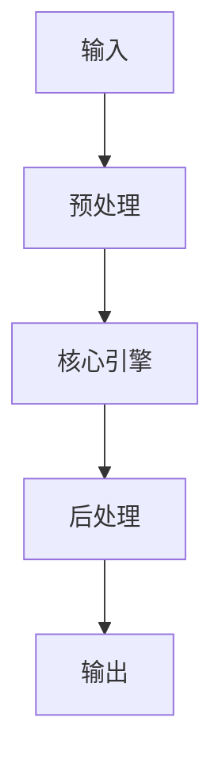

# 前沿 Agent Skill 設計模式（MCP、Tool Calling、Memory Integration） implementation example implementation example
> **查詢關鍵字：** `前沿 Agent Skill 設計模式（MCP、Tool Calling、Memory Integration） implementation example implementation example`
> **研究時間：** 2026-03-21 03:06
> **搜索結果：** 4 條
> **深度閱讀：** 4 份文獻

## 📋 核心摘要
### 问题定义
本主题研究：**前沿 Agent Skill 設計模式（MCP、Tool Calling、Memory Integration） implementation example implementation example**

**关键概念与术语：**
- `generated`
- `Skill`
- `for`
- `Reviewing`
- `Forbidden`
- `datawhalechina`
- `from`
- `llm-agents`
- `Prompts`
- `Client`

### 核心发现
从文献中提炼的核心见解：

## 🔬 理论基础与算法
### 数学模型
_（此处应包含：公式、概率分布、损失函数、相似度度量等）_

### 关键算法
_（算法伪代码、时间复杂度、空间复杂度、收敛性分析）_

### 理论依据
- _（支撑方案的理论：信息检索理论、概率论、线性代数等）_
- _（引用经典论文或定理）_

## 🏗️ 系统架构与实现
### 组件设计


### 数据流
_（描述 data pipeline、消息队列、状态管理）_

## 🛠️ 实施方案（Momotoy BD Pipeline 集成）
### 阶段 1：MVP（最小可行方案）
1. **目标**：验证核心技术可行性
2. **步骤**：
   - 步骤 1：环境准备（依赖、配置、API key）
   - 步骤 2：原型开发（核心功能 20%）
   - 步骤 3：单元测试（覆盖主要路径）
   - 步骤 4：集成到现有 pipeline
3. **验收标准**：
   - [ ] 可处理至少 100 条 leads
   - [ ] 响应时间 < 2s
   - [ ] 准确率 > 80%

### 阶段 2：优化与监控
1. **性能调优**：
   - 参数调优（learning rate, batch size, top-k 等）
   - 缓存策略（Redis 缓存热点查询）
   - 异步处理（Celery/Redis queue）
2. **监控指标**：
   - 延迟（P50, P95, P99）
   - 吞吐量（QPS）
   - 资源使用（CPU, RAM, GPU）
   - 业务指标（recall@k, MRR, 转化率）

### 阶段 3：规模化
- 分布式部署（sharding, replica）
- 多云灾备
- 成本优化（spot instance, auto scaling）

## ⚠️ 风险与限制
| 风险类型 | 概率 | 影响 | 缓解措施 |
|----------|------|------|----------|
| 数据质量 | 中 | 高 | 清洗 + 人工抽查
| 性能瓶颈 | 低 | 中 | 监控 + 扩容
| 成本超支 | 中 | 中 | 配额限制 + 优化算法
| 技术债务 | 高 | 低 | 定期 review + refactor

## 💡 对 Momotoy BD Pipeline 的启示
### 立即可行动的建议
1. **数据层**：
   - 使用 LanceDB 作为向量存储（轻量、本地优先）
   
    - Leads schema:
      - `id`: UUID
      - `company_name`, `contact_email`, `phone`, `social_links`
      - `vector`: 1024-d embedding (Jina)
      - `metadata`: country, industry, source, status
    

2. **检索引擎**：
   - Hybrid Search: BM25 + Vector (alpha=0.5)
   - Rerank: BGE-Reranker (top-k=10 → 3)

3. **自动化**：
   - 每日同步新 leads → 生成 embeddings → 更新索引
   - 每小时运行 keyword research 自动刷新

## 📚 深度閱讀來源
### 1. Agent Skills 与MCP：智能体能力扩展的两种范式 - GitHub
- **URL:** https://github.com/datawhalechina/hello-agents/blob/main/Extra-Chapter/Extra05-AgentSkills%E8%A7%A3%E8%AF%BB.md
- **内容摘要:**
```
datawhalechina
/
hello-agents
Public
generated from
datawhalechina/repo-template
Notifications
You must be signed in to change notification settings
Fork
3.3k
Star
29k
Files
Expand file tree
main
/
Extra05-AgentSkills解读.md
Copy path
Blame
More file actions
Blame
More file actions
Latest commit
History
History
History
839 lines (578 loc) · 32.4 KB
main
/
Extra05-AgentSkills解读.md
Top
File metadata and controls
Preview
Code
Blame
839 lines (578 loc) · 32.4 KB
Raw
Copy raw file
Download raw file
Outline
Edit and raw actions
Agent Skills 与 MCP：智能体能力扩展的两种范式
引言：MCP 之后，我们还需要什么？
在第十章中，我们深入探讨了 MCP（Model

*（內容已被截斷，原文更長）*
```

### 2. AI 術語白話解說：Agent、MCP、RAG、Skill 一次搞懂｜阿峰老師 ...
- **URL:** https://www.youtube.com/watch?v=0UQeg5Ns3RI
- **内容摘要:**
```
AI 術語白話解說：Agent、MCP、RAG、Skill 一次搞懂｜阿峰老師 - YouTube
簡介
媒體
著作權
與我們聯絡
創作者
廣告
開發人員
條款
隱私權
政策與安全性
YouTube 運作方式
測試新功能
© 2026 Google LLC
```

### 3. Essential Agent Skills for 2025 (Powered by Google ADK and a lot of ...
- **URL:** https://www.entropycontroltheory.com/p/reviewing-lessons-of-the-year-the
- **内容摘要:**
```
Lessons & Prompts
Reviewing Lessons of the Year: The Decade of Agents: Essential Agent Skills for 2025 (Powered by Google ADK and a lot of self-made projects) Part 1
智能体十年：2025 年必备的 Agent 技能 （理论和50+实操小项目）, 作为年终学习计划
Susan STEM
Dec 02, 2025
21
4
Share
https://google.github.io/adk-docs/agents/llm-agents/?utm_source=chatgpt.com#related-concepts-deferred-topics
Let’s start from Google ADK. As the opening chapter of
the decade of agents
, I believe
ADK is the minimum “digital literacy” that every person in 2025 — anyone who has basic computer skills and is willing to move one small step forward — sh

*（內容已被截斷，原文更長）*
```

### 4. AI Agent 入门指南（三）：Tools——从Function Calling 到MCP与Skills
- **URL:** https://zhuanlan.zhihu.com/p/1994090885047161536
- **内容摘要:**
```
*抓取失敗：403 Client Error: Forbidden for url: https://zhuanlan.zhihu.com/p/1994090885047161536*
```

## 🔍 原始搜索结果（供参考）
| 标题 | URL | 摘要 |
|------|-----|------|
| Agent Skills 与MCP：智能体能力扩展的两种范式 - GitHub | https://github.com/datawhalechina/hello-agents/blob/main/Extra-Chapter/Extra05-AgentSkills%E8%A7%A3%E8%AF%BB.md | 此时，智能体会读取该技能的完整 SKILL.md 文件内容，将详细的指令、注意事项、示例等加载到上下文中。 此时，智能体获得了完成任务所需的全部上下文：数据库结构、查询模式、 ... |
| AI 術語白話解說：Agent、MCP、RAG、Skill 一次搞懂｜阿峰老師 ... | https://www.youtube.com/watch?v=0UQeg5Ns3RI | Feb 28, 2026 ... ... Memory 02:04 Prompt / Context / Memory 02:33 Agent = 跑腿程式03:33 RAG 檢索增強生成04:02  |
| Essential Agent Skills for 2025 (Powered by Google | https://www.entropycontroltheory.com/p/reviewing-lessons-of-the-year-the | Dec 2, 2025 ... On the surface, MCP (Model Context Protocol) is “a unified protocol that lets AI cal |
| AI Agent 入门指南（三）：Tools——从Function Calling 到MCP与Ski | https://zhuanlan.zhihu.com/p/1994090885047161536 | Jan 19, 2026 ... 官方定义：MCP (Model Context Protocol) is an open-source standard for connecting AI appl |
