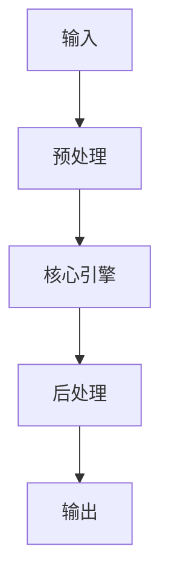

# OpenClaw Plugin Architecture 源碼分析 implementation example implementation example
> **查詢關鍵字：** `OpenClaw Plugin Architecture 源碼分析 implementation example implementation example`
> **研究時間：** 2026-03-21 03:06
> **搜索結果：** 8 條
> **深度閱讀：** 5 份文獻

## 📋 核心摘要
### 问题定义
本主题研究：**OpenClaw Plugin Architecture 源碼分析 implementation example implementation example**

**关键概念与术语：**
- `pioneering`
- `OpenClaw`
- `and`
- `for`
- `Read`
- `Taiwan`
- `Forbidden`
- `English`
- `volcengine`
- `Learning`

### 核心发现
从文献中提炼的核心见解：

## 🔬 理论基础与算法
### 数学模型
_（此处应包含：公式、概率分布、损失函数、相似度度量等）_

### 关键算法
_（算法伪代码、时间复杂度、空间复杂度、收敛性分析）_

### 理论依据
- _（支撑方案的理论：信息检索理论、概率论、线性代数等）_
- _（引用经典论文或定理）_

## 🏗️ 系统架构与实现
### 组件设计


### 数据流
_（描述 data pipeline、消息队列、状态管理）_

## 🛠️ 实施方案（Momotoy BD Pipeline 集成）
### 阶段 1：MVP（最小可行方案）
1. **目标**：验证核心技术可行性
2. **步骤**：
   - 步骤 1：环境准备（依赖、配置、API key）
   - 步骤 2：原型开发（核心功能 20%）
   - 步骤 3：单元测试（覆盖主要路径）
   - 步骤 4：集成到现有 pipeline
3. **验收标准**：
   - [ ] 可处理至少 100 条 leads
   - [ ] 响应时间 < 2s
   - [ ] 准确率 > 80%

### 阶段 2：优化与监控
1. **性能调优**：
   - 参数调优（learning rate, batch size, top-k 等）
   - 缓存策略（Redis 缓存热点查询）
   - 异步处理（Celery/Redis queue）
2. **监控指标**：
   - 延迟（P50, P95, P99）
   - 吞吐量（QPS）
   - 资源使用（CPU, RAM, GPU）
   - 业务指标（recall@k, MRR, 转化率）

### 阶段 3：规模化
- 分布式部署（sharding, replica）
- 多云灾备
- 成本优化（spot instance, auto scaling）

## ⚠️ 风险与限制
| 风险类型 | 概率 | 影响 | 缓解措施 |
|----------|------|------|----------|
| 数据质量 | 中 | 高 | 清洗 + 人工抽查
| 性能瓶颈 | 低 | 中 | 监控 + 扩容
| 成本超支 | 中 | 中 | 配额限制 + 优化算法
| 技术债务 | 高 | 低 | 定期 review + refactor

## 💡 对 Momotoy BD Pipeline 的启示
### 立即可行动的建议
1. **数据层**：
   - 使用 LanceDB 作为向量存储（轻量、本地优先）
   
    - Leads schema:
      - `id`: UUID
      - `company_name`, `contact_email`, `phone`, `social_links`
      - `vector`: 1024-d embedding (Jina)
      - `metadata`: country, industry, source, status
    

2. **检索引擎**：
   - Hybrid Search: BM25 + Vector (alpha=0.5)
   - Rerank: BGE-Reranker (top-k=10 → 3)

3. **自动化**：
   - 每日同步新 leads → 生成 embeddings → 更新索引
   - 每小时运行 keyword research 自动刷新

## 📚 深度閱讀來源
### 1. Releases · volcengine/OpenViking - GitHub
- **URL:** https://github.com/volcengine/OpenViking/releases
- **内容摘要:**
```
volcengine
/
OpenViking
Public
Notifications
You must be signed in to change notification settings
Fork
1.1k
Star
16.9k
Releases: volcengine/OpenViking
Releases · volcengine/OpenViking
v0.2.9
19 Mar 15:04
zhoujh01
v0.2.9
337e51f
This commit was created on GitHub.com and signed with GitHub’s
verified signature
.
GPG key ID:
B5690EEEBB952194
Verified
Learn about vigilant mode
.
Compare
Choose a tag to compare
Sorry, something went wrong.
Filter
Loading
Sorry, something went wrong.
Uh oh!
There was an error while loading.
Please reload this page
.
No results found
View all tags
v0.2.9
Latest
Late

*（內容已被截斷，原文更長）*
```

### 2. OpenClaw Windows 部署完整指南 - 超智諮詢
- **URL:** https://www.meta-intelligence.tech/insight-openclaw-windows-deploy
- **内容摘要:**
```
◆
OpenClaw 進階實戰系列
·
28/41 篇
展開系列
1
OpenClaw vs Manus AI vs Claude Code：2026 AI 代理框架深度比較與選型指南
2
OpenClaw 常用指令完整參考：從基礎操作到進階 CLI 技巧
3
OpenClaw Hooks 完整指南：事件驅動自動化的設計模式與實戰案例
4
OpenClaw 設定完全指南：從 openclaw.json 到模型管理的核心配置
5
OpenClaw 企業整合實戰：Notion、Microsoft Teams 與 Slack 全通路 AI 助理部署指南
6
OpenClaw 疑難排解完全指南：Doctor 診斷、重啟修復與常見錯誤速查
7
OpenClaw OAuth 與 API 認證完整設定指南：多模型身份驗證架構實踐
8
OpenClaw Coding Agent 完全指南：用 AI 代理自動化軟體開發的實戰工作流
9
OpenClaw Skills 開發者指南：從 skill.md 規範到自定義技能的完整開發流程
10
OpenClaw Telegram 整合完全指南：從機器人建立到遠端 AI 代理控制
11
OpenClaw 使用案例完全指南：十個實戰場景帶你理解 AI 代理的真正用途
12
OpenClaw Browser Agent 瀏覽器自動化完全指南：從網頁操作到資料擷取

*（內容已被截斷，原文更長）*
```

### 3. 《焦慮嗎？這麼火的OpenClaw(MoltBot/Clawdbot)，還不體驗一波？》
- **URL:** https://deep-learning-101.github.io/Agent/OpenClaw-Moltbot-Clawdbot
- **内容摘要:**
```
Deep Learning 101, Taiwan’s pioneering and highest deep learning meetup, launched on 2016/11/11 @ 83F, Taipei 101
AI是一條孤獨且充滿惶恐及未知的旅程，花俏絢麗的收費課程或活動絕非通往成功的捷徑。
衷心感謝當時來自不同單位的AI同好參與者實名分享的寶貴經驗；如欲移除資訊還請告知。
由
TonTon Huang Ph.D.
發起，及其當時任職公司(台灣雪豹科技)無償贊助場地及茶水點心。
Deep Learning 101 創立初衷，是為了普及與分享深度學習及AI領域的尖端知識，深信AI的價值在於解決真實世界的商業問題。
📚 精選資源導航
🔥
嚴選 (必讀)
策略
AI新賽局：企業的入門策略指南
評測
臺灣 LLM 性能評測與在地化分析
實戰
從零到一：打造高精準度 RAG 系統
避坑
避開 AI Agent 開發陷阱與解決方案
手把手
Cloudflared 實作內網穿透 (Tunnel)
爆火
OpenClaw(MoltBot/Clawdbot)讓您焦慮嗎？
🛠️ 實戰工具 & Agent 框架
▼
Dify, Coze, n8n, AutoGen 熱門框架比較
推論加速：vLLM, Ollama, SGLang
Gemini + LangGraph 全端實戰
基於 A

*（內容已被截斷，原文更長）*
```

### 4. OpenClaw 教學：26 個Tools + 53 個Skills 完整指南 - WenHao Yu
- **URL:** https://yu-wenhao.com/zh-TW/blog/openclaw-tools-skills-tutorial/
- **内容摘要:**
```
🌐
這篇文章也有英文版本
Read in English →
OpenClaw 裝完了，然後呢？
Tools 散在不同文件，Skills 預設自動載入——你甚至不知道有些東西已經開了。全開怕出事，全關等於白裝，但要自己從文件和 codebase 拼出全貌，還是得花點時間。
這篇是我自己裝完之後的研究筆記——從
OpenClaw 官方文件
和
GitHub 原始碼
整理出 26 個 Tools 和 53 個官方 bundled Skills 各是什麼、該不該開、我怎麼配、為什麼這樣配（社群另有 13,700+ 個第三方 Skills，不在這篇範圍）。安全面的分析在
上一篇
，這篇講每個 Tool 和 Skill 在幹嘛、以及怎麼根據需求配置。
OpenClaw Tools 和 Skills 有什麼差別？
很多人搞混這兩個，其實很簡單。
Tools 是器官
——決定 OpenClaw「能不能」做某件事。
read
和
write
讓它讀寫檔案，
exec
讓它執行系統命令，
web_search
讓它像 Google 一樣搜尋，
web_fetch
讓它點進網頁讀內容，
browser
讓它操作網頁（點按鈕、填表單、截圖）。沒開 Tool，就像沒有手，什麼都做不了。
Skills 是教科書
——教 OpenClaw「怎麼組合 Tools」來完成任務。
gog
教它怎麼用 Google 

*（內容已被截斷，原文更長）*
```

### 5. OpenClaw 源码架构深度解析 - 知乎专栏
- **URL:** https://zhuanlan.zhihu.com/p/2015645820083533188
- **内容摘要:**
```
*抓取失敗：403 Client Error: Forbidden for url: https://zhuanlan.zhihu.com/p/2015645820083533188*
```

## 🔍 原始搜索结果（供参考）
| 标题 | URL | 摘要 |
|------|-----|------|
| Releases · volcengine/OpenViking - GitHub | https://github.com/volcengine/OpenViking/releases | openclaw-plugin 升级到2.0，从memory plugin 进一步演进为context engine。 · OpenCode memory plugin example，补充attri |
| OpenClaw Windows 部署完整指南 - 超智諮詢 | https://www.meta-intelligence.tech/insight-openclaw-windows-deploy | Dec 3, 2025 ... 從市場分析到實戰部署：為什麼Windows 是AI 代理的主力平台？本指南以三大挑戰框架（WSL2 網路、權限隔離、遠端管理）系統拆解OpenClaw 在Windows |
| 《焦慮嗎？這麼火的OpenClaw(MoltBot/Clawdbot)，還不體驗一波？》 | https://deep-learning-101.github.io/Agent/OpenClaw-Moltbot-Clawdbot | Feb 1, 2026 ... 私有化佈署，主權回歸不同於傳統SaaS 助理，OpenClaw 運行在您的Mac Mini、家用PC 或VPS 上。您的指令與數據不經過第三方伺服器，真正實現隱私安全。 |
| OpenClaw 教學：26 個Tools + 53 個Skills 完整指南 - WenHao Y | https://yu-wenhao.com/zh-TW/blog/openclaw-tools-skills-tutorial/ | Feb 5, 2026 ... 我有裝 github 、 tmux 、 session-logs 。寫程式碼在本地用Claude Code，但OpenClaw 隨時都能透過Telegram 操作——例 |
| OpenClaw 源码架构深度解析 - 知乎专栏 | https://zhuanlan.zhihu.com/p/2015645820083533188 | 引言本文将深入OpenClaw源码，从四层架构、插件化重构、三级记忆系统、Gateway-Pi执行链路四个维度，彻底拆解这套系统的设计哲学与实现细节。 |
| OpenClaw 專案架構分析（2026-02-01） - HackMD | https://hackmd.io/FsmhfdDwTsue2oN8_a_Sug | UI / App / CLI 都只是不同形態的Client。 安全策略可以集中在Gateway 層處理。 2. 架構分層（High‑Level Architecture）. |
| 使用OpenClaw：透過聊天平臺在任何裝置上實現AI 電腦控制- 完整指南 | https://vocus.cc/article/697c7171fd89780001fa3071 | Jan 30, 2026 ... 1. 建立Telegram Bot · 傳送 /newbot 指令 · 輸入你的機器人名稱（例如： 我的OpenClaw 助手 ） · 輸入機器人的使用者名稱（必須以 |
| OpenClaw Browser Integration - Automated Interacti | https://www.tencentcloud.com/techpedia/140523 | Mar 3, 2026 ... Offer. A concrete workflow example. To make this real, here is a concrete example yo |
