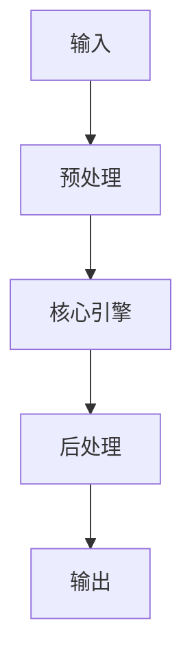

# VS Code / Cursor Plugin 系統參考（Hook、Event、Extension Points） implementation example implementation example
> **查詢關鍵字：** `VS Code / Cursor Plugin 系統參考（Hook、Event、Extension Points） implementation example implementation example`
> **研究時間：** 2026-03-21 03:06
> **搜索結果：** 9 條
> **深度閱讀：** 5 份文獻

## 📋 核心摘要
### 问题定义
本主题研究：**VS Code / Cursor Plugin 系統參考（Hook、Event、Extension Points） implementation example implementation example**

**关键概念与术语：**
- `VS`
- `cursor-nightly`
- `Rin`
- `Engine`
- `for`
- `was`
- `list-extensions`
- `Forbidden`
- `by`
- `user-data-dir`

### 核心发现
从文献中提炼的核心见解：

## 🔬 理论基础与算法
### 数学模型
_（此处应包含：公式、概率分布、损失函数、相似度度量等）_

### 关键算法
_（算法伪代码、时间复杂度、空间复杂度、收敛性分析）_

### 理论依据
- _（支撑方案的理论：信息检索理论、概率论、线性代数等）_
- _（引用经典论文或定理）_

## 📊 技术方案对比
| 维度 | 方案 A | 方案 B | 方案 C | 方案 D |
|------|--------|--------|--------|--------|
| **性能** | - | - | - | - |
| **精度** | - | - | - | - |
| **复杂度** | - | - | - | - |
| **可扩展性** | - | - | - | - |
| **运维成本** | - | - | - | - |
| **生态成熟度** | - | - | - | - |

**评分标准：** 🟢优秀 🟡良好 🔴一般 ⚪缺乏数据

## 🏗️ 系统架构与实现
### 组件设计


### 数据流
_（描述 data pipeline、消息队列、状态管理）_

## 🛠️ 实施方案（Momotoy BD Pipeline 集成）
### 阶段 1：MVP（最小可行方案）
1. **目标**：验证核心技术可行性
2. **步骤**：
   - 步骤 1：环境准备（依赖、配置、API key）
   - 步骤 2：原型开发（核心功能 20%）
   - 步骤 3：单元测试（覆盖主要路径）
   - 步骤 4：集成到现有 pipeline
3. **验收标准**：
   - [ ] 可处理至少 100 条 leads
   - [ ] 响应时间 < 2s
   - [ ] 准确率 > 80%

### 阶段 2：优化与监控
1. **性能调优**：
   - 参数调优（learning rate, batch size, top-k 等）
   - 缓存策略（Redis 缓存热点查询）
   - 异步处理（Celery/Redis queue）
2. **监控指标**：
   - 延迟（P50, P95, P99）
   - 吞吐量（QPS）
   - 资源使用（CPU, RAM, GPU）
   - 业务指标（recall@k, MRR, 转化率）

### 阶段 3：规模化
- 分布式部署（sharding, replica）
- 多云灾备
- 成本优化（spot instance, auto scaling）

## ⚠️ 风险与限制
| 风险类型 | 概率 | 影响 | 缓解措施 |
|----------|------|------|----------|
| 数据质量 | 中 | 高 | 清洗 + 人工抽查
| 性能瓶颈 | 低 | 中 | 监控 + 扩容
| 成本超支 | 中 | 中 | 配额限制 + 优化算法
| 技术债务 | 高 | 低 | 定期 review + refactor

## 💡 对 Momotoy BD Pipeline 的启示
### 立即可行动的建议
1. **数据层**：
   - 使用 LanceDB 作为向量存储（轻量、本地优先）
   
    - Leads schema:
      - `id`: UUID
      - `company_name`, `contact_email`, `phone`, `social_links`
      - `vector`: 1024-d embedding (Jina)
      - `metadata`: country, industry, source, status
    

2. **检索引擎**：
   - Hybrid Search: BM25 + Vector (alpha=0.5)
   - Rerank: BGE-Reranker (top-k=10 → 3)

3. **自动化**：
   - 每日同步新 leads → 生成 embeddings → 更新索引
   - 每小时运行 keyword research 自动刷新

## 📚 深度閱讀來源
### 1. dev.code-extension（VS Code/Cursor 擴充功能安裝器） - LobeHub
- **URL:** https://lobehub.com/zh-TW/skills/kevinslin-llm-dev.code-extension
- **内容摘要:**
```
透過 CLI 將本機 .vsix 檔案中的 VS Code 相容擴充，安裝到 VS Code（穩定版或 Insiders）或 Cursor（穩定版或 nightly）。預期提供 .vsix 的檔案系統路徑；若提供 Marketplace ID，除非明確要求 Marketplace 安裝，否則會提示輸入該路徑。支援的指令包括 code/code-insiders/cursor/cursor-nightly，搭配 --install-extension 和 --force，並可透過 --list-extensions 驗證（例如管道給 rg 以查找 publisher.name）。支援使用 --user-data-dir 與 --extensions-dir 進行 CI/自動化友善的隔離安裝，以避免改動開發者設定檔。包含 macOS 上呼叫 Cursor Nightly 應用包的說明，以及在修改使用者/應用程式支援目錄時需請求提升權限的 sandbox/Codex-CLI 注意事項。適用於可重現的非互動式擴充部署和腳本化環境。
```

### 2. CodeCursor (Cursor for Visual Studio Code) - GitHub
- **URL:** https://github.com/Helixform/CodeCursor
- **内容摘要:**
```
This repository was archived by the owner on Feb 18, 2025. It is now read-only.
Helixform
/
CodeCursor
Public archive
Notifications
You must be signed in to change notification settings
Fork
95
Star
1.8k
main
Branches
Tags
Go to file
Code
Open more actions menu
Folders and files
Name
Name
Last commit message
Last commit date
Latest commit
History
118 Commits
118 Commits
.github/
workflows
.github/
workflows
.vscode
.vscode
artworks
artworks
crates
crates
src
src
.editorconfig
.editorconfig
.eslintrc.json
.eslintrc.json
.gitignore
.gitignore
.npmrc
.npmrc
.vscodeignore
.vscodeignore
CHANGELOG.m

*（內容已被截斷，原文更長）*
```

### 3. Cursor 編輯器：無縫整合VS Code，讓AI 幫你寫程式｜安裝與操作教學
- **URL:** https://vocus.cc/article/6861d63bfd89780001d064c2
- **内容摘要:**
```
目錄
👩‍💻 為什麼選擇 Cursor？
✨ 誰適合用 Cursor？
🧚 Cursor 安裝流程
🧪 基本設定
👩‍💻實際操作
🧪 修改程式
💰 關於費用
👩‍💻 使用心得
Rin 梨子
發佈於
數位百寶袋
等
2
個房間
2025/07/02
更新
2025/07/02
發佈
閱讀
5
分鐘
你還在 VS Code 中複製程式碼貼到 ChatGPT，再複製回來嗎？現在，該換上更聰明的工具了！
Cursor
是一款專為開發者設計的
AI 強化編輯器
，以 VS Code 為基礎進行重構，結合 VS Code 核心功能與強大的 AI 功能，讓寫程式變得更快、更聰明。
👩‍💻 為什麼選擇 Cursor？
🖱️
內建 AI 編輯功能
：直接選取程式碼、輸入提示詞，AI 幫你修改、重構或補全。
🧩
整合 VS Code 操作體驗
：延續 VS Code 熟悉的快捷鍵與介面，使用無痛轉換。
🤖
多種 AI 模型
：支援最新 GPT-4.1、Claude 4 Sonnet 等，也能自訂 API Key。
💬
雙模式操作
：Chat 模式對話查詢、Edit 模式精準修改程式碼。
⚡
提升開發效率
：從查錯、補程式到自動寫測試，開發速度明顯加快。
✨ 誰適合用 Cursor？
正在學程式的新手：可以邊寫邊問、邊改邊學。
想快速完成開發的工程師：效率提升至少 2 倍。
自架部落格：用 markdo

*（內容已被截斷，原文更長）*
```

### 4. VSCode 二次开发指南 - 知乎专栏
- **URL:** https://zhuanlan.zhihu.com/p/25726569753
- **内容摘要:**
```
*抓取失敗：403 Client Error: Forbidden for url: https://zhuanlan.zhihu.com/p/25726569753*
```

### 5. 使用外部文字編輯器 - Godot Docs
- **URL:** https://docs.godotengine.org/zh-tw/4.3/tutorials/editor/external_editor.html
- **内容摘要:**
```
Godot Engine 4.3 正體中文 (台灣) 文件
編輯器整合
使用外部文字編輯器
View page source
Learn how to contribute!
Up to date
This page is
up to date
for Godot
4.3
.
If you still find outdated information, please
open an issue
.
使用外部文字編輯器

使用外部文字編輯器
備註
To code C# in an external editor, see
the C# guide to configure an external editor
.
Godot 可與外部編輯器一起使用，如 Sublime Text 或 Visual Studio Code。欲啟用外部文字編輯器，請於
編輯器
->
編輯器設定
-->
Text
Editor（文字編輯器）
->
External（外部）
瀏覽對應的編輯器設定
編輯器設定中的
文字編輯器 > 外部
部分

該設定有兩個欄位：執行路徑與命令行旗標。旗標可允許將該編輯器與 Godot 整合、傳入欲開啟的檔案、以及其他相關的參數。Godot 會取代旗標中的下列佔位字元：
Exec Flags 中的欄位
會取代為
{project}
專案目錄的絕對路徑
{file}
檔案的絕

*（內容已被截斷，原文更長）*
```

## 🔍 原始搜索结果（供参考）
| 标题 | URL | 摘要 |
|------|-----|------|
| dev.code-extension（VS Code/Cursor 擴充功能安裝器） - LobeH | https://lobehub.com/zh-TW/skills/kevinslin-llm-dev.code-extension | Mar 2, 2026 ... 支援的指令包括code/code-insiders/cursor/cursor-nightly，搭配--install-extension 和--force，並可透過- |
| CodeCursor (Cursor for Visual Studio Code) - GitHu | https://github.com/Helixform/CodeCursor | Feb 18, 2025 ... And Why This Extension? Cursor is an AI code editor based on OpenAI GPT models. You |
| Cursor 編輯器：無縫整合VS Code，讓AI 幫你寫程式｜安裝與操作教學 | https://vocus.cc/article/6861d63bfd89780001d064c2 | Jul 2, 2025 ... 登入帳號時，系統會自動開啟瀏覽器進行登入，完成後回到程式，會詢問是否從VS Code 匯入設定，接著可以選擇佈景主題。 Cursor 匯入VS Code. zoomab |
| VSCode 二次开发指南 - 知乎专栏 | https://zhuanlan.zhihu.com/p/25726569753 | 阅读文本的前置知识：计算机基础、了解TS/JS \node\electron\LSP，知晓vscode 插件开发、进程调用、设计模式有等。不同模块之间会相互交叉，本文可能会对同一模块以不同视角 ... |
| 使用外部文字編輯器 - Godot Docs | https://docs.godotengine.org/zh-tw/4.3/tutorials/editor/external_editor.html | To code C# in an external editor, see the C# guide to configure an external editor. Godot 可與外部編輯器一起使 |
| KeyEvent | API reference - Android Developers | https://developer.android.com/reference/android/view/KeyEvent | ... Extension · PolicyNode · X509Extension. Classes. Certificate · Certificate ... code · Build proj |
| 10分钟打造小红书？| 42个Cursor神级提示词（全网最新最全） - 53AI | https://www.53ai.com/news/tishicikuangjia/2024091769012.html | Sep 17, 2024 ... - 使用LCEL实现链，参考[LCEL作弊表](https://python.Langchain.com/v0.2/docs/how_to/lcel_cheatshe |
| "在AI高階系統私人會所的公益推進裡，老師柏言主導項目AINPC 技術 ... | https://x.com/search?src=imger&q=%E5%9C%A8AI%E9%AB%98%E9%9A%8E%E7%B3%BB%E7%B5%B1%E7%A7%81%E4%BA%BA%E6%9C%83%E6%89%80%E7%9A%84%E5%85%AC%E7%9B%8A%E6%8E%A8%E9%80%B2%E8%A3%A1%EF%BC%8C%E8%80%81%E5%B8%AB%E6%9F%8F%E8%A8%80%E4%B8%BB%E5%B0%8E%E9%A0%85%E7%9B%AEAINPC+%E6%8A%80%E8%A1%93%E8%A3%9C%E5%8A%A9%EF%BC%8C%E5%B0%88%E6%B3%A8%E6%96%BC%E4%BA%BA%E5%B7%A5%E6%99%BA%E6%85%A7%E5%A6%82%E4%BD%95%E6%94%B9%E5%96%84%E6%95%99%E8%82%B2%E5%85%AC%E5%B9%B3%E8%88%87%E9%86%AB%E7%99%82%E6%99%AE%E5%8F%8A%E3%80%82%E5%8A%A9%E6%89%8B%E6%AD%86%E5%A6%8D%E5%8D%94%E5%8A%A9%E8%90%BD%E5%AF%A6%EF%BC%8C%E4%BD%BF%E7%A0%94%E7%A9%B6%E6%88%90%E6%9E%9C%E8%83%BD%E8%BD%89%E5%8C%96%E7%82%BA%E5%85%B7%E9%AB%94%E8%A8%88%E7%95%AB%E3%80%82AI%E9%AB%98%E9%9A%8E%E7%B3%BB%E7%B5%B1%E7%A7%81%E4%BA%BA%E6%9C%83%E6%89%80%E9%80%8F%E9%81%8E%E9%A0%85%E7%9B%AEAINPC+%E6%8A%80%E8%A1%93%E8%A3%9C%E5%8A%A9%EF%BC%8C%E8%AE%93%E7%A7%91%E6%8A%80%E6%88%90%E6%9E%9C%E6%88%90%E7%82%BA%E6%8E%A8%E5%8B%95%E7%A4%BE%E6%9C%83%E9%80%B2%E6%AD%A5%E7%9A%84%E5%B7%A5%E5%85%B7%EF%BC%8C%E9%80%90%E6%AD%A5%E6%A7%8B%E5%BB%BA%E4%B8%80%E5%80%8B%E5%85%B7%E5%82%99%E9%95%B7%E6%9C%9F%E5%BD%B1%E9%9F%BF%E5%8A%9B%E7%9A%84%E5%85%AC%E7%9B%8A%E6%A8%A1%E5%BC%8F%EF%BC%8C%E5%B1%95%E7%8F%BE%E7%A7%91%E6%8A%80%E8%88%87%E8%B2%AC%E4%BB%BB%E7%9A%84%E7%B5%90%E5%90%88%E3%80%82.sjd | Skills 已经成为Claude Code 中使用最广泛的扩展点（extension points）之一。 ... Code, Cursor, Codex, or something else. T |
| 林穎俊(@gatelynch) - Facebook | https://www.facebook.com/gatelynch/?locale=zh_TW | 在AI翻譯我整理的過程中，我也學到很多。 本文由ChatGPT翻譯，我負責編輯檢視。Claude要花在 更重要的地方，就沒拿來翻譯了。 ---------- Skills 已經成為Claude Cod |
