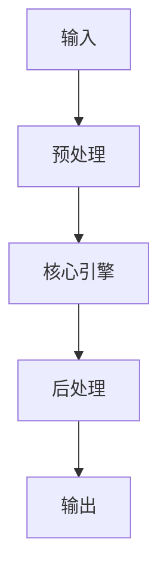

# Embedding Models 對比：Jina vs BGE vs OpenAI text-embedding-ada-002 implementation example implementation example
> **查詢關鍵字：** `Embedding Models 對比：Jina vs BGE vs OpenAI text-embedding-ada-002 implementation example implementation example`
> **研究時間：** 2026-03-21 03:07
> **搜索結果：** 10 條
> **深度閱讀：** 5 份文獻

## 📋 核心摘要
### 问题定义
本主题研究：**Embedding Models 對比：Jina vs BGE vs OpenAI text-embedding-ada-002 implementation example implementation example**

**关键概念与术语：**
- `LLM`
- `for`
- `to`
- `Member-only`
- `text-embedding-3`
- `Model`
- `Generative`
- `Chuxin-Embedding`
- `google`
- `Agents`

### 核心发现
从文献中提炼的核心见解：

## 🔬 理论基础与算法
### 数学模型
_（此处应包含：公式、概率分布、损失函数、相似度度量等）_

### 关键算法
_（算法伪代码、时间复杂度、空间复杂度、收敛性分析）_

### 理论依据
- _（支撑方案的理论：信息检索理论、概率论、线性代数等）_
- _（引用经典论文或定理）_

## 📊 技术方案对比
| 维度 | 方案 A | 方案 B | 方案 C | 方案 D |
|------|--------|--------|--------|--------|
| **性能** | - | - | - | - |
| **精度** | - | - | - | - |
| **复杂度** | - | - | - | - |
| **可扩展性** | - | - | - | - |
| **运维成本** | - | - | - | - |
| **生态成熟度** | - | - | - | - |

**评分标准：** 🟢优秀 🟡良好 🔴一般 ⚪缺乏数据

## 🏗️ 系统架构与实现
### 组件设计


### 数据流
_（描述 data pipeline、消息队列、状态管理）_

## 🛠️ 实施方案（Momotoy BD Pipeline 集成）
### 阶段 1：MVP（最小可行方案）
1. **目标**：验证核心技术可行性
2. **步骤**：
   - 步骤 1：环境准备（依赖、配置、API key）
   - 步骤 2：原型开发（核心功能 20%）
   - 步骤 3：单元测试（覆盖主要路径）
   - 步骤 4：集成到现有 pipeline
3. **验收标准**：
   - [ ] 可处理至少 100 条 leads
   - [ ] 响应时间 < 2s
   - [ ] 准确率 > 80%

### 阶段 2：优化与监控
1. **性能调优**：
   - 参数调优（learning rate, batch size, top-k 等）
   - 缓存策略（Redis 缓存热点查询）
   - 异步处理（Celery/Redis queue）
2. **监控指标**：
   - 延迟（P50, P95, P99）
   - 吞吐量（QPS）
   - 资源使用（CPU, RAM, GPU）
   - 业务指标（recall@k, MRR, 转化率）

### 阶段 3：规模化
- 分布式部署（sharding, replica）
- 多云灾备
- 成本优化（spot instance, auto scaling）

## ⚠️ 风险与限制
| 风险类型 | 概率 | 影响 | 缓解措施 |
|----------|------|------|----------|
| 数据质量 | 中 | 高 | 清洗 + 人工抽查
| 性能瓶颈 | 低 | 中 | 监控 + 扩容
| 成本超支 | 中 | 中 | 配额限制 + 优化算法
| 技术债务 | 高 | 低 | 定期 review + refactor

## 💡 对 Momotoy BD Pipeline 的启示
### 立即可行动的建议
1. **数据层**：
   - 使用 LanceDB 作为向量存储（轻量、本地优先）
   
    - Leads schema:
      - `id`: UUID
      - `company_name`, `contact_email`, `phone`, `social_links`
      - `vector`: 1024-d embedding (Jina)
      - `metadata`: country, industry, source, status
    

2. **检索引擎**：
   - Hybrid Search: BM25 + Vector (alpha=0.5)
   - Rerank: BGE-Reranker (top-k=10 → 3)

3. **自动化**：
   - 每日同步新 leads → 生成 embeddings → 更新索引
   - 每小时运行 keyword research 自动刷新

## 📚 深度閱讀來源
### 1. Embeddings in Practice: A Research & Implementation Guide
- **URL:** https://medium.com/@adnanmasood/embeddings-in-practice-a-research-implementation-guide-9dbf20961590
- **内容摘要:**
```
*抓取失敗：403 Client Error: Forbidden for url: https://medium.com/@adnanmasood/embeddings-in-practice-a-research-implementation-guide-9dbf20961590*
```

### 2. 使用繁體中文評測各家Embedding 模型的檢索能力 - ihower
- **URL:** https://ihower.tw/blog/12167-embedding-models
- **内容摘要:**
```
想系統性學習如何打造 LLM、RAG 和 Agents 應用嗎? 歡迎報名我的課程
大語言模型 LLM 應用開發工作坊
📊
評估數據結果 google spreadsheets 傳送門 ↗️
Updated(2024/9/23): 新增
Jina Embeddings v3
Updated(2024/9/24): 新增
Voyage-3
Updated(2024/10/22): 新增
mistral-embed
Updated(2025/2/12): 新增
Voyage-3-Large
、
Chuxin-Embedding
、
model2vec
Updated(2025/2/12): 有測
Nvidia NV-Embed v2
，但模型太大本機跑不動沒結果
Updated(2025/2/13): 新增
Nomic Embed Text V2
Updated(2025/6/16): 新增
Voyage-3.5 跟 Voyage-3.5-lite
、
voyage-multimodal-3
、
Cohere Embed 4
、
Qwen3 Embedding 0.6B 跟 4B
Updated(2025/7/14): 新增
Jina Embeddings v4
Updated(2025/7/15): 新增
gemini-embedding-001
Updated(2025/9/5):

*（內容已被截斷，原文更長）*
```

### 3. How to Choose the Right Embedding for Your RAG Model?
- **URL:** https://www.analyticsvidhya.com/blog/2025/03/embedding-for-rag-models/
- **内容摘要:**
```
Master Generative AI with 10+ Real-world Projects in 2026!
d
:
h
:
m
:
s
Download Projects
Interview Prep
Career
GenAI
Prompt Engg
ChatGPT
LLM
Langchain
RAG
AI Agents
Machine Learning
Deep Learning
GenAI Tools
LLMOps
Python
NLP
SQL
AIML Projects
Reading list
Introduction to NLP
What is NLP?
Applications of NLP
Text Pre-processing
Understanding Text Pre-processing
Tokenization in NLP
Byte Pair Encoding
Tokenizer Free Language Modeling with Pixels
Stopword Removal
Stemming vs Lemmatization
Text Mining
NLP Libraries
Spacy Tutorials
Gensim Tutorials
Regular Expressions
What are Regular Expressions

*（內容已被截斷，原文更長）*
```

### 4. How to choose the right embedding model for your RAG application?
- **URL:** https://levelup.gitconnected.com/how-to-choose-the-right-embedding-model-for-your-rag-application-44e30876d382
- **内容摘要:**
```
Member-only story
How to choose the right embedding model for your RAG application?
A Comprehensive Guide to Selecting the Ideal Embedding Model for Your RAG Application
Vivedha Elango
15 min read
·
Sep 16, 2025
--
12
Share
Read this story for free:
Link
Retrieval-Augmented Generation (RAG) is right now the most popular framework for building GenAI apps. Enterprises and organisations love it as it allows them to use their proprietary data to answer user questions. It makes LLM give users answers that are accurate, current, and relevant to their questions.
From my experiences of building RAG Ap

*（內容已被截斷，原文更長）*
```

### 5. bge / text-embedding-3 / Jina Embeddings 对比与选型指南原创
- **URL:** https://blog.csdn.net/weixin_41697242/article/details/157227961
- **内容摘要:**
```
[AI] 嵌入模型选择：bge / text-embedding-3 / Jina Embeddings 对比与选型指南
最新推荐文章于 2026-03-19 20:14:00 发布
原创
最新推荐文章于 2026-03-19 20:14:00 发布
·
262 阅读
·
4
·
0
文章标签：
#人工智能
#embedding
#jina
AI前沿工坊｜从理论到实战
专栏收录该内容
100 篇文章
¥49.90
¥99.00
订阅专栏
目标：对比常用嵌入模型在语言覆盖、性能、延迟、维度与成本上的差异，给出选型建议与实测参考。
1. 对比维度
语言覆盖与多语能力；
维度与向量大小（存储/检索成本）；
精度：检索/排序效果（MRR/Recall）；
延迟与吞吐：CPU/GPU；
部署/授权：本地部署难度、许可证；
价格：API 单价 vs 本地算力成本。
2. 模型画像
bge-m3/bge-large-zh
：
维度 1024/768；中文/中英友好；
本地可跑（A10 轻松），开源许可友好；
适合中文/多语检索，性价比高。
text-embedding-3-small/large
（OpenAI）：
维度 1536/3072；多语强；
API 价格低（small 更低），无需维护；
需外网/隐私考虑；延迟受网络影响。
了解本专栏
订阅专栏 解锁全文
确定要放弃本次机会？
福利倒计

*（內容已被截斷，原文更長）*
```

## 🔍 原始搜索结果（供参考）
| 标题 | URL | 摘要 |
|------|-----|------|
| Embeddings in Practice: A Research & Implementatio | https://medium.com/@adnanmasood/embeddings-in-practice-a-research-implementation-guide-9dbf20961590 | Jan 21, 2026 ... For example, OpenAI's embedding models produce vectors that work for any text ... O |
| 使用繁體中文評測各家Embedding 模型的檢索能力 - ihower | https://ihower.tw/blog/12167-embedding-models | Jul 7, 2024 ... 在RAG 系統中，將文字轉語意向量的embedding 模型，是非常重要的關鍵檢索環節。 很多人在問繁體中文的embedding 建議選哪一套，通常大家就推薦比較熟的O |
| How to Choose the Right Embedding for Your RAG Mod | https://www.analyticsvidhya.com/blog/2025/03/embedding-for-rag-models/ | Apr 10, 2025 ... RAG models are dependent on good-quality text embeddings for efficiently retrieving |
| How to choose the right embedding model for your R | https://levelup.gitconnected.com/how-to-choose-the-right-embedding-model-for-your-rag-application-44e30876d382 | Sep 16, 2025 ... Some models, like OpenAI's text-embedding-ada-002 (8192 tokens) and Cohere's embedd |
| bge / text-embedding-3 / Jina Embeddings 对比与选型指南原创 | https://blog.csdn.net/weixin_41697242/article/details/157227961 | Jan 22, 2026 ... 文章浏览阅读203次。摘要： 本文对比了BGE-M3、OpenAI和Jina三种主流嵌入模型在语言覆盖、性能、延迟、维度和成本等维度的差异。BGE-M3适合中文场景， |
| 使用繁體中文做Embedding 模型大評測，總共33 個模型比較檢索能力 ... | https://www.facebook.com/ihower/posts/%E4%BD%BF%E7%94%A8%E7%B9%81%E9%AB%94%E4%B8%AD%E6%96%87%E5%81%9A-embedding-%E6%A8%A1%E5%9E%8B%E5%A4%A7%E8%A9%95%E6%B8%AC-%E7%B8%BD%E5%85%B1-33-%E5%80%8B%E6%A8%A1%E5%9E%8B%E6%AF%94%E8%BC%83%E6%AA%A2%E7%B4%A2%E8%83%BD%E5%8A%9B%E5%9C%A8-rag-%E7%B3%BB%E7%B5%B1%E4%B8%AD%E5%B0%87%E6%96%87%E5%AD%97%E8%BD%89%E8%AA%9E%E6%84%8F%E5%90%91%E9%87%8F%E7%9A%84-embedding-%E6%A8%A1%E5%9E%8B%E6%98%AF%E9%9D%9E%E5%B8%B8%E9%87%8D%E8%A6%81%E7%9A%84%E9%97%9C%E9%8D%B5%E6%AA%A2%E7%B4%A2/10161211885018971/ | Jul 7, 2024 ... ... text- embeddings#supported-models. cloud.google.com. Get text embeddings | Gener |
| 四種Embedding 模型實測與選型 - iT 邦幫忙 | https://ithelp.ithome.com.tw/m/articles/10383158 | 所以今天，我們要比較幾種常見的Embedding 模型（OpenAI、HuggingFace、BGE、Cohere）， ... OpenAI (text-embedding-3-small/large |
| Strategies for Efficient Retrieval-augmented Gener | https://aclanthology.org/2025.ranlp-1.164.pdf | The baseline model is the text-embedding- ada-002 (OpenAI Embedding) model from Ope- ... The OpenAI  |
| 大模型落地基础：向量化模型大比拼 - 知乎专栏 | https://zhuanlan.zhihu.com/p/20478395471 | Feb 6, 2025 ... text-embedding-ada-002; bge-large:latest; cwchang/jina-embeddings-v2-base-zh; snowfl |
| How to Build a RAG Pipeline: A Step-by-Step Guide  | https://www.meilisearch.com/blog/how-to-build-a-rag-pipepline | Jun 23, 2025 ... Embedding Generation, jina-embeddings-v3, bge-m3, OpenAI Embeddings (Ada, text-embe |
