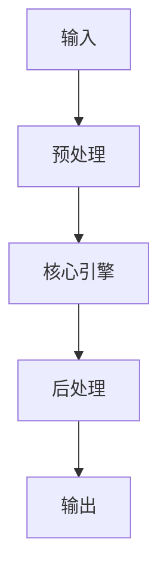

# Rerank Models：Cohere Rerank, BGE Reranker, Jina Reranker 效能測試 implementation example implementation example
> **查詢關鍵字：** `Rerank Models：Cohere Rerank, BGE Reranker, Jina Reranker 效能測試 implementation example implementation example`
> **研究時間：** 2026-03-21 03:07
> **搜索結果：** 9 條
> **深度閱讀：** 5 份文獻

## 📋 核心摘要
### 问题定义
本主题研究：**Rerank Models：Cohere Rerank, BGE Reranker, Jina Reranker 效能測試 implementation example implementation example**

**关键概念与术语：**
- `Cross-Encoder`
- `LLM`
- `Embedding`
- `Read`
- `Generative`
- `jina-reranker`
- `Agents`
- `host`
- `Bi-Encoder`
- `Re-Ranker`

### 核心发现
从文献中提炼的核心见解：

## 🔬 理论基础与算法
### 数学模型
_（此处应包含：公式、概率分布、损失函数、相似度度量等）_

### 关键算法
_（算法伪代码、时间复杂度、空间复杂度、收敛性分析）_

### 理论依据
- _（支撑方案的理论：信息检索理论、概率论、线性代数等）_
- _（引用经典论文或定理）_

## 🏗️ 系统架构与实现
### 组件设计


### 数据流
_（描述 data pipeline、消息队列、状态管理）_

## 🛠️ 实施方案（Momotoy BD Pipeline 集成）
### 阶段 1：MVP（最小可行方案）
1. **目标**：验证核心技术可行性
2. **步骤**：
   - 步骤 1：环境准备（依赖、配置、API key）
   - 步骤 2：原型开发（核心功能 20%）
   - 步骤 3：单元测试（覆盖主要路径）
   - 步骤 4：集成到现有 pipeline
3. **验收标准**：
   - [ ] 可处理至少 100 条 leads
   - [ ] 响应时间 < 2s
   - [ ] 准确率 > 80%

### 阶段 2：优化与监控
1. **性能调优**：
   - 参数调优（learning rate, batch size, top-k 等）
   - 缓存策略（Redis 缓存热点查询）
   - 异步处理（Celery/Redis queue）
2. **监控指标**：
   - 延迟（P50, P95, P99）
   - 吞吐量（QPS）
   - 资源使用（CPU, RAM, GPU）
   - 业务指标（recall@k, MRR, 转化率）

### 阶段 3：规模化
- 分布式部署（sharding, replica）
- 多云灾备
- 成本优化（spot instance, auto scaling）

## ⚠️ 风险与限制
| 风险类型 | 概率 | 影响 | 缓解措施 |
|----------|------|------|----------|
| 数据质量 | 中 | 高 | 清洗 + 人工抽查
| 性能瓶颈 | 低 | 中 | 监控 + 扩容
| 成本超支 | 中 | 中 | 配额限制 + 优化算法
| 技术债务 | 高 | 低 | 定期 review + refactor

## 💡 对 Momotoy BD Pipeline 的启示
### 立即可行动的建议
1. **数据层**：
   - 使用 LanceDB 作为向量存储（轻量、本地优先）
   
    - Leads schema:
      - `id`: UUID
      - `company_name`, `contact_email`, `phone`, `social_links`
      - `vector`: 1024-d embedding (Jina)
      - `metadata`: country, industry, source, status
    

2. **检索引擎**：
   - Hybrid Search: BM25 + Vector (alpha=0.5)
   - Rerank: BGE-Reranker (top-k=10 → 3)

3. **自动化**：
   - 每日同步新 leads → 生成 embeddings → 更新索引
   - 每小时运行 keyword research 自动刷新

## 📚 深度閱讀來源
### 1. 使用Jina Reranker 提升搜尋相關性與RAG 準確度
- **URL:** https://jina.ai/zh-TW/news/maximizing-search-relevancy-and-rag-accuracy-with-jina-reranker/
- **内容摘要:**
```
什麼是 Reranker？
開始使用 Jina Reranker
Jina Reranker 的頂級性能
即將登陸 AWS Marketplace
star
甄選
新聞稿
二月 29, 2024
使用 Jina Reranker 提升搜尋相關性與 RAG 準確度
使用 Jina Reranker 提升您的搜尋與 RAG 準確度。我們的新模型相較於簡單的向量搜尋，可將準確度和相關性提升 20%。立即免費試用！
Jina AI • 11 分鐘的讀取量
文本嵌入以其語義表示能力而著稱，與快速向量檢索相結合，是當今大型數據集文檔搜索的基石。然而，挑戰往往在於如何在這些檢索到的文檔中進行篩選，以準確符合用戶的搜索意圖，這是簡單餘弦相似度度量無法勝任的任務。
今天，我們很興奮地宣布推出
Jina Reranker
（
jina-reranker-v1-base-en
），這是一個專門解決相關性問題的尖端神經重排序模型。Jina Reranker 通過深入且具有上下文地理解搜索查詢詞，來
重新排序
檢索到的文檔，從而增強您的搜索和 RAG（檢索增強生成）系統。我們的評估表明，使用 Jina Reranker 的搜索系統有顯著改進，
命中率提高了 8%，平均倒數排名提高了 33%
！
Reranker API
輕鬆提升搜索相關性和 RAG 準確度
tag
什麼是 Reranker？
理解 rera

*（內容已被截斷，原文更長）*
```

### 2. 利用Cohere AI、BGE Re-Ranker 及Jina Reranker 实现精准结果重排 ...
- **URL:** https://bbs.huaweicloud.com/blogs/434222
- **内容摘要:**
```
冒泡提示
云社区
博客
专业级语义搜索优化：利用 Cohere AI、BGE Re-Ranker 及 Jina Reranker 实现精准结果重排
微信
微博
分享文章到微博
复制链接
复制链接到剪贴板
专业级语义搜索优化：利用 Cohere AI、BGE Re-Ranker 及 Jina Reranker 实现精准结果重排
举报
汀丶
发表于 2024/09/03 13:31:35
2024/09/03
【摘要】 专业级语义搜索优化：利用 Cohere AI、BGE Re-Ranker 及 Jina Reranker 实现精准结果重排
专业级语义搜索优化：利用 Cohere AI、BGE Re-Ranker 及 Jina Reranker 实现精准结果重排
1. 简介
1.1 RAG
在说重排工具之前，我们要先了解一下 RAG。
检索增强生成（RAG）是一种新兴的 AI 技术栈，通过为大型语言模型（LLM）提供额外的 “最新知识” 来增强其能力。
基本的 RAG 应用包括四个关键技术组成部分：
Embedding 模型
：用于将外部文档和用户查询转换成 Embedding 向量
向量数据库
：用于存储 Embedding 向量和执行向量相似性检索（检索出最相关的 Top-K 个信息）
提示词工程（Prompt engineering）
：用于将用户的问题和检索到的上下文组合成大模

*（內容已被截斷，原文更長）*
```

### 3. 2025年最佳RAG重排序模型盤點：Cohere、bge-reranker
- **URL:** https://www.wbolt.com/tw/top-rerankers-for-rag.html
- **内容摘要:**
```
*抓取失敗：HTTPSConnectionPool(host='www.wbolt.com', port=443): Read timed out. (read timeout=15)*
```

### 4. 使用繁體中文評測各家Reranker 模型的重排能力
- **URL:** https://ihower.tw/blog/12227-reranker
- **内容摘要:**
```
想系統性學習如何打造 LLM、RAG 和 Agents 應用嗎? 歡迎報名我的課程
大語言模型 LLM 應用開發工作坊
接續上一篇
Embedding 模型評測
，這次我們來看看搭配 Reranker (重排)模型，做成二階段檢索會是什麼情況。
圖片出處:
Boosting Your Search and RAG with Voyage’s Rerankers
什麼是二階段檢索?
Reranker 模型是另一種不一樣的模型(學名叫做 Cross-Encoder)，不同於 embedding 模型(學名叫做 Bi-Encoder) 輸入是文字，輸出是高維度向量。Reranker 模型的輸入是兩段文字，輸出一個相關性分數 0 到 1 之間，也就是我們會將用戶 query 跟每一份文件都去算相關性分數，然後根據分數排序。
Reranker 的執行速度較慢，成本較高，但在判斷相關性上面，比 embedding 模型更準確
因此當資料非常多、想要快又要準時，跟 embeddings 模型搭配，做成兩階段檢索，是前人做推薦引擎時就發明的招式。
第一階段: 從上萬上億筆資料中，用 Embedding 向量相似性，搜尋出前數十名到數百筆
第二階段: 從數十到幾百筆資料中，用 Reranker 進行精細的相關性排序
評測方法
我挑選了 4 個 embedding 模型，以及 10 個 Reranke

*（內容已被截斷，原文更長）*
```

### 5. 延續上次的繁體中文Embedding 模型評測，這次我繼續研究Reranker
- **URL:** https://www.facebook.com/groups/gaitech/posts/1183327612851452/
- **内容摘要:**
```
Generative AI 技術交流中心 | 延續上次的繁體中文 Embedding 模型評測，這次我繼續研究 Reranker 模型，做成兩階段檢索看看結果如何
```

## 🔍 原始搜索结果（供参考）
| 标题 | URL | 摘要 |
|------|-----|------|
| 使用Jina Reranker 提升搜尋相關性與RAG 準確度 | https://jina.ai/zh-TW/news/maximizing-search-relevancy-and-rag-accuracy-with-jina-reranker/ | Feb 29, 2024 ... 儘管與簡單的餘弦相似度相比，這種方法在計算上更為密集，但它實現了包含上下文、語義含義和查詢背後意圖的細緻比較，大大提高了搜索結果的相關性。 基於餘弦 ... |
| 利用Cohere AI、BGE Re-Ranker 及Jina Reranker 实现精准结果重排  | https://bbs.huaweicloud.com/blogs/434222 | Sep 3, 2024 ... ... Rerank 3 之后，每1000 次搜索，需要2 美元。 2.4 Cohere 使用. Cohere 为各种阅读和写作任务训练大型语言模型(LLMs)，例如摘 |
| 2025年最佳RAG重排序模型盤點：Cohere、bge-reranker | https://www.wbolt.com/tw/top-rerankers-for-rag.html | Jun 27, 2025 ... 檢索增強生成(RAG) 標誌著自然語言處理向前邁出了重要一步。它允許大型語言模型(LLM) 在建立響應之前檢查訓練資料之外的資訊，從而提高其效能。 |
| 使用繁體中文評測各家Reranker 模型的重排能力 | https://ihower.tw/blog/12227-reranker | Jul 14, 2024 ... 使用Reranker 進行二階段排序確實能顯著提升命中率。即使是較弱的Embedding 模型例如OpenAI small ，在首輪top-k 100 的情況下重排取 |
| 延續上次的繁體中文Embedding 模型評測，這次我繼續研究Reranker | https://www.facebook.com/groups/gaitech/posts/1183327612851452/ | Jul 14, 2024 ... ## 結論 Reranker 做的人比較少，有做中文的選擇又更少了，基本就 四家Voyage, Cohere, Jina 跟開源的bge 系列: - 性能: Voya |
| ［文字情緒識別］第11天：Rerank模型比較 | https://ithelp.ithome.com.tw/articles/10388000 | 目前市場上專為中文設計的ReRanker 模型選擇相對較少，主要為Voyage、Cohere、Jina 和開源的bge 系列。不支援中文的ReRanker 模型（如cross-encoder/ms-m |
| Dify 入門：無代碼AI 應用程式開發 - 高等資通訊技術實驗室 | https://aict.nkust.edu.tw/digitrans/?p=6891 | Jul 26, 2024 ... 供應商包括OpenAI、ZHIPU （ChatGLM）、Jina AI （Jina Embeddings 2）。 3. Rerank Models：增強LLM 中的搜 |
| NLP（八十三）RAG框架中的Rerank算法评估 - 知乎专栏 | https://zhuanlan.zhihu.com/p/675269272 | Dec 29, 2023 ... 市场上已有一些流行的重排序模型，例如Cohere rerank、bge-reranker 等，它们在不同的应用场景中表现出了优异的性能。 BGE-Reranker模型 |
| 檢索增強生成RAG LLM 資源懶人包| Leaderboard, Tools & Papers | https://deep-learning-101.github.io/RAG | 它們使用更複雜的模型（例如交叉編碼器Cross-Encoder，如 BAAI/bge-reranker-v2-m3 ）來重新排序或過濾這些文件，以提高其相關性。Cross-encoder 會將查詢與每 |
