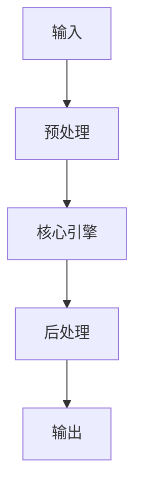

# Graph-based Retrieval：Neo4j + Embedding 路徑探索 implementation example implementation example
> **查詢關鍵字：** `Graph-based Retrieval：Neo4j + Embedding 路徑探索 implementation example implementation example`
> **研究時間：** 2026-03-21 03:07
> **搜索結果：** 3 條
> **深度閱讀：** 3 份文獻

## 📋 核心摘要
### 问题定义
本主题研究：**Graph-based Retrieval：Neo4j + Embedding 路徑探索 implementation example implementation example**

**关键概念与术语：**
- `Neo4j`
- `graph`
- `Understanding`
- `Graph`
- `Embedding`
- `embeddings`
- `Cypher`
- `GQL`
- `Data`
- `Science`

### 核心发现
从文献中提炼的核心见解：

## 🔬 理论基础与算法
### 数学模型
_（此处应包含：公式、概率分布、损失函数、相似度度量等）_

### 关键算法
_（算法伪代码、时间复杂度、空间复杂度、收敛性分析）_

### 理论依据
- _（支撑方案的理论：信息检索理论、概率论、线性代数等）_
- _（引用经典论文或定理）_

## 🏗️ 系统架构与实现
### 组件设计


### 数据流
_（描述 data pipeline、消息队列、状态管理）_

## 🛠️ 实施方案（Momotoy BD Pipeline 集成）
### 阶段 1：MVP（最小可行方案）
1. **目标**：验证核心技术可行性
2. **步骤**：
   - 步骤 1：环境准备（依赖、配置、API key）
   - 步骤 2：原型开发（核心功能 20%）
   - 步骤 3：单元测试（覆盖主要路径）
   - 步骤 4：集成到现有 pipeline
3. **验收标准**：
   - [ ] 可处理至少 100 条 leads
   - [ ] 响应时间 < 2s
   - [ ] 准确率 > 80%

### 阶段 2：优化与监控
1. **性能调优**：
   - 参数调优（learning rate, batch size, top-k 等）
   - 缓存策略（Redis 缓存热点查询）
   - 异步处理（Celery/Redis queue）
2. **监控指标**：
   - 延迟（P50, P95, P99）
   - 吞吐量（QPS）
   - 资源使用（CPU, RAM, GPU）
   - 业务指标（recall@k, MRR, 转化率）

### 阶段 3：规模化
- 分布式部署（sharding, replica）
- 多云灾备
- 成本优化（spot instance, auto scaling）

## ⚠️ 风险与限制
| 风险类型 | 概率 | 影响 | 缓解措施 |
|----------|------|------|----------|
| 数据质量 | 中 | 高 | 清洗 + 人工抽查
| 性能瓶颈 | 低 | 中 | 监控 + 扩容
| 成本超支 | 中 | 中 | 配额限制 + 优化算法
| 技术债务 | 高 | 低 | 定期 review + refactor

## 💡 对 Momotoy BD Pipeline 的启示
### 立即可行动的建议
1. **数据层**：
   - 使用 LanceDB 作为向量存储（轻量、本地优先）
   
    - Leads schema:
      - `id`: UUID
      - `company_name`, `contact_email`, `phone`, `social_links`
      - `vector`: 1024-d embedding (Jina)
      - `metadata`: country, industry, source, status
    

2. **检索引擎**：
   - Hybrid Search: BM25 + Vector (alpha=0.5)
   - Rerank: BGE-Reranker (top-k=10 → 3)

3. **自动化**：
   - 每日同步新 leads → 生成 embeddings → 更新索引
   - 每小时运行 keyword research 自动刷新

## 📚 深度閱讀來源
### 1. DeepWalk: Implementing Graph Embeddings in Neo4j
- **URL:** https://neo4j.com/blog/graph-data-science/deepwalk-implementing-graph-embeddings-in-neo4j/
- **内容摘要:**
```
Cypher & GQL
Graph Data Science
Machine Learning
DeepWalk: Implementing Graph Embeddings in Neo4j
Fahad Sultan
Artificial Intelligence Intern, Neo4j
September 12, 2019
11 min read
Almost a decade ago,
Neo4j
took off as a transactional graph database management platform. Just a year after its initial launch, a new, powerful query language called
Cypher
was introduced to allow expressive, efficient querying and other interactions with the graph data in Neo4j.
Today, Neo4j supports
graph analytics
including implementation of a wide variety of state-of-the-art
graph algorithms
with custom optimiza

*（內容已被截斷，原文更長）*
```

### 2. Understanding graph embeddings with Neo4j and Emblaze
- **URL:** https://towardsdatascience.com/understanding-graph-embeddings-with-neo4j-and-emblaze-7e2d6ef56b8c/
- **内容摘要:**
```
Data Science
Understanding graph embeddings with Neo4j and Emblaze
Visualize and compare graph embedding options with the Neo4j Graph Data Science library and the Emblaze widget for JupyterHub.
Nathan Smith
May 2, 2022
11 min read
Share
Graph embeddings can represent the rich network of relationships and properties in a graph as vectors. These embedding vectors are useful for comparing nodes, and they are also valuable inputs for machine learning algorithms.
Neo4j Graph Data Science
makes it possible to derive embeddings from a graph using only a few lines of Python code.
While it’s pretty sim

*（內容已被截斷，原文更長）*
```

### 3. Graph Embeddings in Neo4j - 昕力資訊TPIsoftware
- **URL:** https://www.tpisoftware.com/tpu/articleDetails/2650
- **内容摘要:**
```
當您輸入電子信箱、訂閱本公司之「電子報」時，我們會向您蒐集、處理、利用的個資為您的「電子信箱」以及「提交日期」，當您輸入電子信箱並送出時，即表示您同意我們使用您的個資，為保障您的權益，關於更多相關政策更新資訊，請務必閱讀我們的「
隱私權政策
」、「
使用條款
」及「
免責聲明
」。如您不同意本網站之「隱私權政策」、「使用條款」及「 免責聲明」，您可以隨時「
取消訂閱
」，謝謝您。
關閉
取消訂閱昕力資訊電子報
取消訂閱
關閉
關閉
是否確定取消註冊？將會永久刪除您在本站的帳號與資訊。
確定
取消
公告系統
×
目前無公告
Neo4j
Graph Embedding
Graph Data Science
Graph Embeddings in Neo4j
洪堂瑋 Tangwei Hung
2021/12/09 09:01:33
1
4661
Table Of Contents
Introduction
What's an embedding
Graph Embedding
Graph Embeddings in Neo4j
Fast Random Projections (FastRP)
Node2Vec
GraphSAGE
Graph Embeddings for News Recommendation dataset
Introduction
Graph Embedding Al

*（內容已被截斷，原文更長）*
```

## 🔍 原始搜索结果（供参考）
| 标题 | URL | 摘要 |
|------|-----|------|
| DeepWalk: Implementing Graph Embeddings in Neo4j | https://neo4j.com/blog/graph-data-science/deepwalk-implementing-graph-embeddings-in-neo4j/ | Sep 12, 2019 ... Discover tips and strategies for implementing graph embedding into a Neo4j graph da |
| Understanding graph embeddings with Neo4j and Embl | https://towardsdatascience.com/understanding-graph-embeddings-with-neo4j-and-emblaze-7e2d6ef56b8c/ | May 2, 2022 ... These embedding vectors are useful for comparing nodes, and they are also valuable i |
| Graph Embeddings in Neo4j - 昕力資訊TPIsoftware | https://www.tpisoftware.com/tpu/articleDetails/2650 | Dec 9, 2021 ... Graph Embedding Algorithm 是Neo4j 中的亮點。 這些算法用於將圖形的拓撲和特徵轉換為唯一表示每個節點的固定長度向量（或嵌入）。 |
