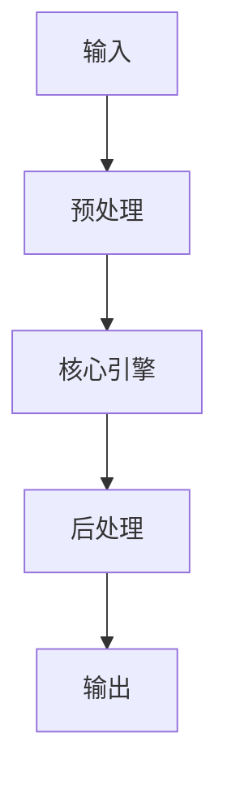

# RAG Framework 對比：LangChain vs LlamaIndex vs Vercel AI SDK implementation example implementation example
> **查詢關鍵字：** `RAG Framework 對比：LangChain vs LlamaIndex vs Vercel AI SDK implementation example implementation example`
> **研究時間：** 2026-03-21 03:08
> **搜索結果：** 10 條
> **深度閱讀：** 5 份文獻

## 📋 核心摘要
### 问题定义
本主题研究：**RAG Framework 對比：LangChain vs LlamaIndex vs Vercel AI SDK implementation example implementation example**

**关键概念与术语：**
- `data-heavy`
- `for`
- `to`
- `UI`
- `Naive`
- `ai-tools`
- `framework`
- `Quick`
- `Forbidden`
- `built-in`

### 核心发现
从文献中提炼的核心见解：

## 🔬 理论基础与算法
### 数学模型
_（此处应包含：公式、概率分布、损失函数、相似度度量等）_

### 关键算法
_（算法伪代码、时间复杂度、空间复杂度、收敛性分析）_

### 理论依据
- _（支撑方案的理论：信息检索理论、概率论、线性代数等）_
- _（引用经典论文或定理）_

## 📊 技术方案对比
| 维度 | 方案 A | 方案 B | 方案 C | 方案 D |
|------|--------|--------|--------|--------|
| **性能** | - | - | - | - |
| **精度** | - | - | - | - |
| **复杂度** | - | - | - | - |
| **可扩展性** | - | - | - | - |
| **运维成本** | - | - | - | - |
| **生态成熟度** | - | - | - | - |

**评分标准：** 🟢优秀 🟡良好 🔴一般 ⚪缺乏数据

## 🏗️ 系统架构与实现
### 组件设计


### 数据流
_（描述 data pipeline、消息队列、状态管理）_

## 🛠️ 实施方案（Momotoy BD Pipeline 集成）
### 阶段 1：MVP（最小可行方案）
1. **目标**：验证核心技术可行性
2. **步骤**：
   - 步骤 1：环境准备（依赖、配置、API key）
   - 步骤 2：原型开发（核心功能 20%）
   - 步骤 3：单元测试（覆盖主要路径）
   - 步骤 4：集成到现有 pipeline
3. **验收标准**：
   - [ ] 可处理至少 100 条 leads
   - [ ] 响应时间 < 2s
   - [ ] 准确率 > 80%

### 阶段 2：优化与监控
1. **性能调优**：
   - 参数调优（learning rate, batch size, top-k 等）
   - 缓存策略（Redis 缓存热点查询）
   - 异步处理（Celery/Redis queue）
2. **监控指标**：
   - 延迟（P50, P95, P99）
   - 吞吐量（QPS）
   - 资源使用（CPU, RAM, GPU）
   - 业务指标（recall@k, MRR, 转化率）

### 阶段 3：规模化
- 分布式部署（sharding, replica）
- 多云灾备
- 成本优化（spot instance, auto scaling）

## ⚠️ 风险与限制
| 风险类型 | 概率 | 影响 | 缓解措施 |
|----------|------|------|----------|
| 数据质量 | 中 | 高 | 清洗 + 人工抽查
| 性能瓶颈 | 低 | 中 | 监控 + 扩容
| 成本超支 | 中 | 中 | 配额限制 + 优化算法
| 技术债务 | 高 | 低 | 定期 review + refactor

## 💡 对 Momotoy BD Pipeline 的启示
### 立即可行动的建议
1. **数据层**：
   - 使用 LanceDB 作为向量存储（轻量、本地优先）
   
    - Leads schema:
      - `id`: UUID
      - `company_name`, `contact_email`, `phone`, `social_links`
      - `vector`: 1024-d embedding (Jina)
      - `metadata`: country, industry, source, status
    

2. **检索引擎**：
   - Hybrid Search: BM25 + Vector (alpha=0.5)
   - Rerank: BGE-Reranker (top-k=10 → 3)

3. **自动化**：
   - 每日同步新 leads → 生成 embeddings → 更新索引
   - 每小时运行 keyword research 自动刷新

## 📚 深度閱讀來源
### 1. LlamaIndex vs LangChain：哪個RAG 框架適合您的2025 年技術堆疊？
- **URL:** https://sider.ai/zh-TW/blog/ai-tools/llamaindex-vs-langchain-which-rag-framework-fits-your-2025-stack
- **内容摘要:**
```
*抓取失敗：403 Client Error: Forbidden for url: https://sider.ai/zh-TW/blog/ai-tools/llamaindex-vs-langchain-which-rag-framework-fits-your-2025-stack*
```

### 2. LangChain 與LlamaIndex 比較- RAG 多輪對話 - YWC 科技筆記
- **URL:** https://ywctech.net/ml-ai/langchain-vs-llamaindex-rag-chat/
- **内容摘要:**
```
目錄
這會是一系列的文章，從不同情境 use case 的實作去比較 LangChain 跟 LlamaIndex 的異同與優缺點，最後再總結
Naive RAG
Conversational RAG
(這篇)
Simple agent / tool use
人類半規範的 Agentic flow
總結 (敬請期待)
比較版本: LangChain 0.2.0 vs LlamaIndex 0.10.35
前一篇
只考慮單次的一問一答。如果問第二個問題，AI 就像失憶：例如接著問「解釋更清楚一點」或「上一個問題怎麼解釋給小學生聽？」，LLM 不會知道你在問什麼，因為他不記得前一次的問答
在多輪對話中要用 RAG 有兩個挑戰
怎麼記得
每一輪的問與答？
已經有多輪的問題跟答案了，那接下來面對使用者最新的問題，我要
怎麼詢問
資料庫？（單獨拿最新的問題？把所有的問題接起來？）
無論什麼框架，我採取
“condense + context”
(或
question contextualization
意思一樣)
把歷史問答 + 新進來的問題用 LLM 「濃縮」成
一個
問題
拿濃縮過的問題，在資料庫中搜尋出相關資料，視作知識
把知識 + 歷史問答 + 新進來的問題交給 LLM 生成回答
Condense + Context 流程三步驟
對於第一步讓我舉個例子。假設使用者跟 AI 有第一次問

*（內容已被截斷，原文更長）*
```

### 3. 7 Best UI Frameworks for AI Agents (2026 Guide) - Fast.io
- **URL:** https://fast.io/resources/best-ui-frameworks-ai-agents/
- **内容摘要:**
```
Quick Comparison: Top 7 UI Frameworks for AI Agents
Python-based UI libraries dominate early-stage agent projects, largely because most AI/ML tooling is Python-first. JavaScript frameworks are catching up for production deployments, particularly where React Server Components and type safety matter. Here's how the leading frameworks compare:
For Python Developers:
Chainlit
: Best for conversational AI with built-in observability
Streamlit
: Best for data-heavy agents with dashboards
Gradio
: Best for rapid prototyping and demos
For JavaScript/TypeScript Developers:
Vercel AI SDK
: Best for prod

*（內容已被截斷，原文更長）*
```

### 4. How to build AI agents with MCP: 12 framework comparison (2025)
- **URL:** https://clickhouse.com/blog/how-to-build-ai-agents-mcp-12-frameworks
- **内容摘要:**
```
->
Scroll to top
Back
Blog
/
Community
Copy page
Copied!
More actions
View as Markdown
Open this page in Markdown
Open in ChatGPT
Ask questions about this page
Open in Claude
Ask questions about this page
Open in v0
Ask questions about this page
How to build AI agents with MCP: 12 framework comparison (2025)
Al Brown
and
Mark Needham
Oct 13, 2025 · 36 minutes read
TL;DR
Building AI agents with MCP? There are now (at least)
12 major agent SDKs
with MCP support.
Each framework has different strengths:
Claude Agent SDK
for security-first production,
OpenAI Agents SDK
for delegation patterns,
Crew

*（內容已被截斷，原文更長）*
```

### 5. LangChain V.S LlamaIndex - KevinLuo - Medium
- **URL:** https://kilong31442.medium.com/langchain-v-s-llamaindex-2fcfcbb36a47
- **内容摘要:**
```
*抓取失敗：403 Client Error: Forbidden for url: https://kilong31442.medium.com/langchain-v-s-llamaindex-2fcfcbb36a47*
```

## 🔍 原始搜索结果（供参考）
| 标题 | URL | 摘要 |
|------|-----|------|
| LlamaIndex vs LangChain：哪個RAG 框架適合您的2025 年技術堆疊？ | https://sider.ai/zh-TW/blog/ai-tools/llamaindex-vs-langchain-which-rag-framework-fits-your-2025-stack | Sep 23, 2025 ... 獨立指南和供應商匯總通常總結了這種區別：LlamaIndex 傾向於以檢索為中心，而LangChain 則優先考慮通用LLM 工具和模組化。2025 年RAG 工具的 |
| LangChain 與LlamaIndex 比較- RAG 多輪對話 - YWC 科技筆記 | https://ywctech.net/ml-ai/langchain-vs-llamaindex-rag-chat/ | May 30, 2024 ... 總結(敬請期待). 比較版本: LangChain 0.2.0 vs LlamaIndex 0.10.35. 前一篇只考慮單次的一問一答。如果問第二個問題，AI 就像 |
| 7 Best UI Frameworks for AI Agents (2026 Guide) -  | https://fast.io/resources/best-ui-frameworks-ai-agents/ | Compare top UI frameworks for building AI agent interfaces. Expert analysis of Chainlit, Streamlit,  |
| How to build AI agents with MCP: 12 framework comp | https://clickhouse.com/blog/how-to-build-ai-agents-mcp-12-frameworks | Oct 13, 2025 ... Compare 12 AI agent frameworks with MCP support. Complete guide with code examples  |
| LangChain V.S LlamaIndex - KevinLuo - Medium | https://kilong31442.medium.com/langchain-v-s-llamaindex-2fcfcbb36a47 | Mar 9, 2024 ... 以下是一些重要特點：. 高級API：LangChain 將大部分複雜性進行抽象，並提供高級API來與LLM一起工作。例如，您可以輕鬆連接 ... |
| LlamaIndex vs LangChain - iT 邦幫忙 | https://ithelp.ithome.com.tw/m/articles/10349425 | 資料索引化：LlamaIndex能夠將各類資料（如文本、表格和API響應）轉換為可供語言模型查詢的索引，這樣用戶可以更快速地檢索所需信息。 多樣化的資料源支持：該工具支持多種資料 ... |
| 10 best LLM evaluation tools with superior integra | https://www.braintrust.dev/articles/best-llm-evaluation-tools-integrations-2025 | Sep 19, 2025 ... Framework support: LangChain, LlamaIndex, LiteLLM, Vercel AI SDK ... For example, V |
| Top 8 LLM Observability Tools: Complete Guide for  | https://langwatch.ai/blog/top-10-llm-observability-tools-complete-guide-for-2025 | Jan 30, 2026 ... Platforms should support popular frameworks like LangChain, LlamaIndex, Vercel AI S |
| How to build a production-ready RAG that can take  | https://composio.dev/content/production-grade-actionable-rag-architecture | Jan 5, 2026 ... It must enable AI agents to perform tasks (write). This connectivity layer requires  |
| Agent 開發知識庫- ihower's Notes | https://ihower.tw/notes/agent-guideline | dev/ai-agents Vercel AI SDK 範例. https://x.com/Alwurts/status ... AI Agents vs. Agentic AI: A Concept |
