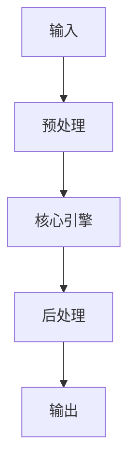

# Agent Patterns：ReAct, Plan-and-Execute, Reflexion 最新實現 implementation example
> **查詢關鍵字：** `Agent Patterns：ReAct, Plan-and-Execute, Reflexion 最新實現 implementation example`
> **研究時間：** 2026-03-21 03:08
> **搜索結果：** 9 條
> **深度閱讀：** 5 份文獻

## 📋 核心摘要
### 问题定义
本主题研究：**Agent Patterns：ReAct, Plan-and-Execute, Reflexion 最新實現 implementation example**

**关键概念与术语：**
- `System`
- `Pattern`
- `for`
- `mainak-saha`
- `Agents`
- `host`
- `Systems`
- `Forbidden`
- `Max`
- `Client`

### 核心发现
从文献中提炼的核心见解：

## 🔬 理论基础与算法
### 数学模型
_（此处应包含：公式、概率分布、损失函数、相似度度量等）_

### 关键算法
_（算法伪代码、时间复杂度、空间复杂度、收敛性分析）_

### 理论依据
- _（支撑方案的理论：信息检索理论、概率论、线性代数等）_
- _（引用经典论文或定理）_

## 🏗️ 系统架构与实现
### 组件设计


### 数据流
_（描述 data pipeline、消息队列、状态管理）_

## 🛠️ 实施方案（Momotoy BD Pipeline 集成）
### 阶段 1：MVP（最小可行方案）
1. **目标**：验证核心技术可行性
2. **步骤**：
   - 步骤 1：环境准备（依赖、配置、API key）
   - 步骤 2：原型开发（核心功能 20%）
   - 步骤 3：单元测试（覆盖主要路径）
   - 步骤 4：集成到现有 pipeline
3. **验收标准**：
   - [ ] 可处理至少 100 条 leads
   - [ ] 响应时间 < 2s
   - [ ] 准确率 > 80%

### 阶段 2：优化与监控
1. **性能调优**：
   - 参数调优（learning rate, batch size, top-k 等）
   - 缓存策略（Redis 缓存热点查询）
   - 异步处理（Celery/Redis queue）
2. **监控指标**：
   - 延迟（P50, P95, P99）
   - 吞吐量（QPS）
   - 资源使用（CPU, RAM, GPU）
   - 业务指标（recall@k, MRR, 转化率）

### 阶段 3：规模化
- 分布式部署（sharding, replica）
- 多云灾备
- 成本优化（spot instance, auto scaling）

## ⚠️ 风险与限制
| 风险类型 | 概率 | 影响 | 缓解措施 |
|----------|------|------|----------|
| 数据质量 | 中 | 高 | 清洗 + 人工抽查
| 性能瓶颈 | 低 | 中 | 监控 + 扩容
| 成本超支 | 中 | 中 | 配额限制 + 优化算法
| 技术债务 | 高 | 低 | 定期 review + refactor

## 💡 对 Momotoy BD Pipeline 的启示
### 立即可行动的建议
1. **数据层**：
   - 使用 LanceDB 作为向量存储（轻量、本地优先）
   
    - Leads schema:
      - `id`: UUID
      - `company_name`, `contact_email`, `phone`, `social_links`
      - `vector`: 1024-d embedding (Jina)
      - `metadata`: country, industry, source, status
    

2. **检索引擎**：
   - Hybrid Search: BM25 + Vector (alpha=0.5)
   - Rerank: BGE-Reranker (top-k=10 → 3)

3. **自动化**：
   - 每日同步新 leads → 生成 embeddings → 更新索引
   - 每小时运行 keyword research 自动刷新

## 📚 深度閱讀來源
### 1. Agentic AI Patterns : Demystifying ReAct, Reflexion and Auto-GPT
- **URL:** https://mainak-saha.medium.com/agentic-ai-patterns-demystifying-react-reflexion-and-auto-gpt-93dcec305611
- **内容摘要:**
```
*抓取失敗：403 Client Error: Forbidden for url: https://mainak-saha.medium.com/agentic-ai-patterns-demystifying-react-reflexion-and-auto-gpt-93dcec305611*
```

### 2. 任务规划：提升AI Agents性能的关键 - 飞书文档
- **URL:** https://docs.feishu.cn/v/wiki/TWK1wwuoMinbF0klHysc74Bbnrc/a2
- **内容摘要:**
```
*抓取失敗：HTTPSConnectionPool(host='docs.feishu.cn', port=443): Max retries exceeded with url: /v/wiki/TWK1wwuoMinbF0klHysc74Bbnrc/a2 (Caused by NameResolutionError("HTTPSConnection(host='docs.feishu.cn', port=443): Failed to resolve 'docs.feishu.cn' ([Errno 8] nodename nor servname provided, or not known)"))*
```

### 3. Implementing ReAct Agentic Pattern From Scratch
- **URL:** https://www.dailydoseofds.com/ai-agents-crash-course-part-10-with-implementation/
- **内容摘要:**
```
AI Agents Course
Agentic Systems 101: Fundamentals, Building Blocks, and How to Build Them (Part A)
Agentic Systems 101: Fundamentals, Building Blocks, and How to Build Them (Part B)
Building Flows in Agentic Systems (Part A)
Building Flows in Agentic Systems (Part B)
Advanced Techniques to Build Robust Agentic Systems (Part A)
Advanced Techniques to Build Robust Agentic Systems (Part B)
A Practical Deep Dive Into Knowledge for Agentic Systems
A Practical Deep Dive Into Memory for Agentic Systems (Part A)
A Practical Deep Dive Into Memory for Agentic Systems (Part B)
Implementing ReAct Agentic

*（內容已被截斷，原文更長）*
```

### 4. 【Day 15】- Agentic Design Pattern: Planning - 賦予AI 自主規劃能力
- **URL:** https://ithelp.ithome.com.tw/articles/10348600
- **内容摘要:**
```
2024 iThome 鐵人賽
DAY
15
0
生成式 AI
2024 年用 LangGraph 從零開始實現 Agentic AI System
系列 第
15
篇
【Day 15】- Agentic Design Pattern: Planning - 賦予 AI 自主規劃能力
16th鐵人賽
llm
agent
agentic system
langchain
hengshiousheu
2024-09-13 00:11:17
5089 瀏覽
分享至
摘要
這篇文章主要介紹了 Agentic Design Pattern 中的 Planning 模式，它賦予 AI 自主規劃的能力，讓 AI 能夠處理那些難以預先定義固定步驟的複雜任務。文章分為兩個主要部分：第一部分介紹了 Planning 模式的運作原理，以及如何使用技術實現它。第二部分介紹了 Plan-and-Solve 論文，它提出了一種新的提示方法，讓大型語言模型能夠明確地為解決給定問題制定計劃，並生成中間推理過程。文章詳細說明了 Plan-and-Solve 提示的步驟和效果，以及如何使用 LangChain 和 LangGraph 來實現它。
總體而言，這篇文章探討了 Planning 模式在賦予 AI 自主規劃能力方面的作用，以及 Plan-and-Solve 論文在促進這種能力發展方面的貢獻。它旨在為讀者提供對

*（內容已被截斷，原文更長）*
```

### 5. AI Agent模式全景图：从ReAct到Multi-Agent的演进之路 - 知乎专栏
- **URL:** https://zhuanlan.zhihu.com/p/1968071452067620000
- **内容摘要:**
```
*抓取失敗：403 Client Error: Forbidden for url: https://zhuanlan.zhihu.com/p/1968071452067620000*
```

## 🔍 原始搜索结果（供参考）
| 标题 | URL | 摘要 |
|------|-----|------|
| Agentic AI Patterns : Demystifying ReAct, Reflexio | https://mainak-saha.medium.com/agentic-ai-patterns-demystifying-react-reflexion-and-auto-gpt-93dcec305611 | Feb 20, 2025 ... ReAct (Reason + Act), Reflexion, and Auto-GPT. While all three are iterative patter |
| 任务规划：提升AI Agents性能的关键 - 飞书文档 | https://docs.feishu.cn/v/wiki/TWK1wwuoMinbF0klHysc74Bbnrc/a2 | ReAct** *是Auto-GPT 实现的基础组件之一，由Google Research Brain Team 在 ... Reflexion 是在今年6 月发布的最新论文*Reflexion: L |
| Implementing ReAct Agentic Pattern From Scratch | https://www.dailydoseofds.com/ai-agents-crash-course-part-10-with-implementation/ | Apr 13, 2025 ... ReAct (short for Reasoning and Acting) is a paradigm for AI agent design where an a |
| 【Day 15】- Agentic Design Pattern: Planning - 賦予AI  | https://ithelp.ithome.com.tw/articles/10348600 | 為了應對更為複雜的任務，「Plan-and-Execute Agent」應運而生。這種新型代理將規劃與執行階段分離，實現了更為精準和可靠的操作模式。 2.2 創新解決方案：PS 提示 ... |
| AI Agent模式全景图：从ReAct到Multi-Agent的演进之路 - 知乎专栏 | https://zhuanlan.zhihu.com/p/1968071452067620000 | Nov 1, 2025 ... ... Agent以来，各种使用的角度来总结下不同Agent的优劣势，主要是ReAct，Plan-excute，Reflection ... 提供了标准的Plan-Ex |
| AI大模型：图解Agent的九种设计模式（ReAct 模式 - CSDN博客 | https://blog.csdn.net/m0_59614665/article/details/141260381 | Aug 16, 2024 ... AI大模型：图解Agent的九种设计模式（ReAct 模式、Plan and Solve 模式、LLMCompiler、Basic Reflection. ... 最 |
| AI Agents才是未来？来自OpenAI应用研究主管的万字长文 - 稀土掘金 | https://juejin.cn/post/7256759718810206266 | Jul 17, 2023 ... OpenAI应用研究主管LilianWeng撰写了一篇万字长文，其中还有部分章节是ChatGPT帮她起草的。她提出Agent = LLM（大型语言模型）+ 记忆+ 规 |
| llm范式和多agent架构（ReAct、Plan-and-Execute） - 博客园 | https://www.cnblogs.com/pass-ion/p/19360735 | Dec 17, 2025 ... 这种“边想边做”的机制在LLM 中尚未被充分建模。 提出一种统一的框架ReAct，使LLM 能交错生成推理轨迹和动作，实现“边推理边行动”，提升任务解决 ... |
| 循环产生智能：从Agent到大模型的递归认知机制研究 - UniFuncs | https://unifuncs.com/s/L1MY90TD | 本研究揭示了智能正从前向推理范式转向递归循环驱动的自进化模式。MIT CSAIL提出的Recursive Language Models在处理10M+ tokens时实现F1分数从低于0.1%到23. |
