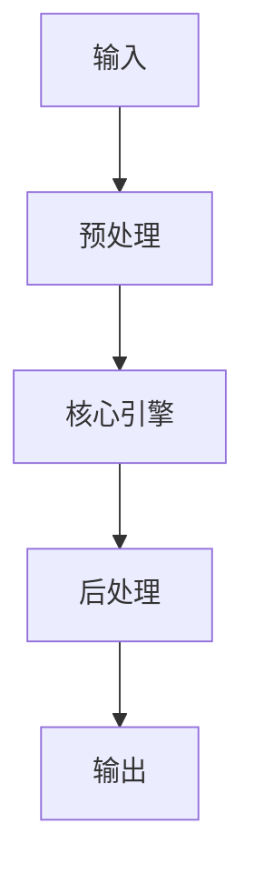

# Momotoy BD Pipeline 可參考的開源項目（列出 Top 10 並分析架構） detailed guide
> **查詢關鍵字：** `Momotoy BD Pipeline 可參考的開源項目（列出 Top 10 並分析架構） detailed guide`
> **研究時間：** 2026-03-21 03:33
> **搜索結果：** 4 條
> **深度閱讀：** 4 份文獻

## 📋 核心摘要
### 问题定义
本主题研究：**Momotoy BD Pipeline 可參考的開源項目（列出 Top 10 並分析架構） detailed guide**

**关键概念与术语：**
- `Steps`
- `Awesome-MCP-ZH`
- `Found`
- `yzfly`
- `You`
- `Notifications`
- `to`
- `Pipelines`
- `Public`
- `Error`

### 核心发现
从文献中提炼的核心见解：

## 🔬 理论基础与算法
### 数学模型
_（此处应包含：公式、概率分布、损失函数、相似度度量等）_

### 关键算法
_（算法伪代码、时间复杂度、空间复杂度、收敛性分析）_

### 理论依据
- _（支撑方案的理论：信息检索理论、概率论、线性代数等）_
- _（引用经典论文或定理）_

## 🏗️ 系统架构与实现
### 组件设计


### 数据流
_（描述 data pipeline、消息队列、状态管理）_

## 🛠️ 实施方案（Momotoy BD Pipeline 集成）
### 阶段 1：MVP（最小可行方案）
1. **目标**：验证核心技术可行性
2. **步骤**：
   - 步骤 1：环境准备（依赖、配置、API key）
   - 步骤 2：原型开发（核心功能 20%）
   - 步骤 3：单元测试（覆盖主要路径）
   - 步骤 4：集成到现有 pipeline
3. **验收标准**：
   - [ ] 可处理至少 100 条 leads
   - [ ] 响应时间 < 2s
   - [ ] 准确率 > 80%

### 阶段 2：优化与监控
1. **性能调优**：
   - 参数调优（learning rate, batch size, top-k 等）
   - 缓存策略（Redis 缓存热点查询）
   - 异步处理（Celery/Redis queue）
2. **监控指标**：
   - 延迟（P50, P95, P99）
   - 吞吐量（QPS）
   - 资源使用（CPU, RAM, GPU）
   - 业务指标（recall@k, MRR, 转化率）

### 阶段 3：规模化
- 分布式部署（sharding, replica）
- 多云灾备
- 成本优化（spot instance, auto scaling）

## ⚠️ 风险与限制
| 风险类型 | 概率 | 影响 | 缓解措施 |
|----------|------|------|----------|
| 数据质量 | 中 | 高 | 清洗 + 人工抽查
| 性能瓶颈 | 低 | 中 | 监控 + 扩容
| 成本超支 | 中 | 中 | 配额限制 + 优化算法
| 技术债务 | 高 | 低 | 定期 review + refactor

## 💡 对 Momotoy BD Pipeline 的启示
### 立即可行动的建议
1. **数据层**：
   - 使用 LanceDB 作为向量存储（轻量、本地优先）
   
    - Leads schema:
      - `id`: UUID
      - `company_name`, `contact_email`, `phone`, `social_links`
      - `vector`: 1024-d embedding (Jina)
      - `metadata`: country, industry, source, status
    

2. **检索引擎**：
   - Hybrid Search: BM25 + Vector (alpha=0.5)
   - Rerank: BGE-Reranker (top-k=10 → 3)

3. **自动化**：
   - 每日同步新 leads → 生成 embeddings → 更新索引
   - 每小时运行 keyword research 自动刷新

## 📚 深度閱讀來源
### 1. Pipeline Steps and Algorithms - BD Rhapsody™ Sequence Analysis Pipeline 3.0
- **URL:** https://bd-rhapsody-bioinfo-docs.genomics.bd.com/steps/top_steps.html
- **内容摘要:**
```
Pipeline Steps and Algorithms
Introduction
This section provides an in-depth description of each step in the BD Rhapsody™ Sequence Analysis Pipeline. The main
portion of these steps decribe the WTA mRNA, Targeted mRNA, AbSeq, and Sample Tag processing steps. For details on the
steps of the
TCR and BCR analysis
or
ATAC-Seq analysis
, see their
dedicated pages.
The BD Rhapsody™ assays are used to create sequencing libraries from single-cell multiomic experiments.  For the WTA
mRNA, Targeted mRNA, AbSeq, Sample Tag, TCR and BCR libraries, the analysis pipeline works with paired-end FASTQ R1 and
R

*（內容已被截斷，原文更長）*
```

### 2. Guide to SageMaker Pipelines. A detailed guide, offering step-by-step… | by Bhujith Madav Velmurugan | Level Up Coding
- **URL:** https://levelup.gitconnected.com/guide-to-sagemaker-pipelines-c2760391ef45?gi=a13d9b6f1ea5
- **内容摘要:**
```
Guide to SageMaker Pipelines
Bhujith Madav Velmurugan
15 min read
·
May 5, 2024
--
Listen
Share
Press enter or click to view image in full size
Photo by
William Bout
on
Unsplash
In the previous article of the series, we learned how to deploy our models as a SageMaker Endpoint and expose the endpoint as a REST API. In that article, I mentioned that in the next article, we would explore SageMaker Pipelines.
Why do we need SageMaker Pipelines?
Introduction
Most machine learning models don’t make it to production.
If your model reaches the deployment stage, congratulations. Is our job finished? No

*（內容已被截斷，原文更長）*
```

### 3. GitHub Top 100的Android開源庫 - 人人焦點
- **URL:** https://ppfocus.com/0/encdf3660.html
- **内容摘要:**
```
*抓取失敗：404 Client Error: Not Found for url: https://ppfocus.com/0/encdf3660.html*
```

### 4. GitHub - yzfly/Awesome-MCP-ZH: MCP 资源精选， MCP指南，Claude MCP，MCP Servers, MCP Clients
- **URL:** https://github.com/yzfly/Awesome-MCP-ZH
- **内容摘要:**
```
yzfly
/
Awesome-MCP-ZH
Public
Notifications
You must be signed in to change notification settings
Fork
445
Star
6.6k
main
Branches
Tags
Go to file
Code
Open more actions menu
Folders and files
Name
Name
Last commit message
Last commit date
Latest commit
History
112 Commits
112 Commits
.gitignore
.gitignore
LICENSE
LICENSE
README.md
README.md
image.png
image.png
View all files
Repository files navigation
Awesome-MCP-ZH
欢迎来到
Awesome-MCP-ZH
，一个专为中文用户打造的 MCP（模型上下文协议）资源合集！
这里有 MCP 的基础介绍、玩法、客户端、服务器和社区资源，帮你快速上手这个 AI 界的“万能插头”。
作者：云中江树 （微信公众号：云中江树）
如果国内的朋友想免费快速的体验MCP能力，推荐 Cherry Studio（客户端） + 阿里 Qwen (

*（內容已被截斷，原文更長）*
```

## 🔍 原始搜索结果（供参考）
| 标题 | URL | 摘要 |
|------|-----|------|
| Pipeline Steps and Algorithms - BD Rhapsody™ Seque | https://bd-rhapsody-bioinfo-docs.genomics.bd.com/steps/top_steps.html | This section provides an in-depth description of each step in the BD Rhapsody™ Sequence Analysis Pip |
| Guide to SageMaker Pipelines. A detailed guide, of | https://levelup.gitconnected.com/guide-to-sagemaker-pipelines-c2760391ef45?gi=a13d9b6f1ea5 | Guide to SageMaker Pipelines In the previous article of the series, we learned how to deploy our mod |
| GitHub Top 100的Android開源庫 - 人人焦點 | https://ppfocus.com/0/encdf3660.html | Otto 是 Square 公司出的一個事件庫 (pub/sub 模式), 用來簡化應用程式組件之間的通訊, otto 修改自 Google 的 Guava 庫, 專門為 Android 平臺進行了優 |
| GitHub - yzfly/Awesome-MCP-ZH: MCP 资源精选， MCP指南，Cla | https://github.com/yzfly/Awesome-MCP-ZH | MCP 资源精选， MCP指南，Claude MCP，MCP Servers, MCP Clients - yzfly/Awesome-MCP-ZH |
