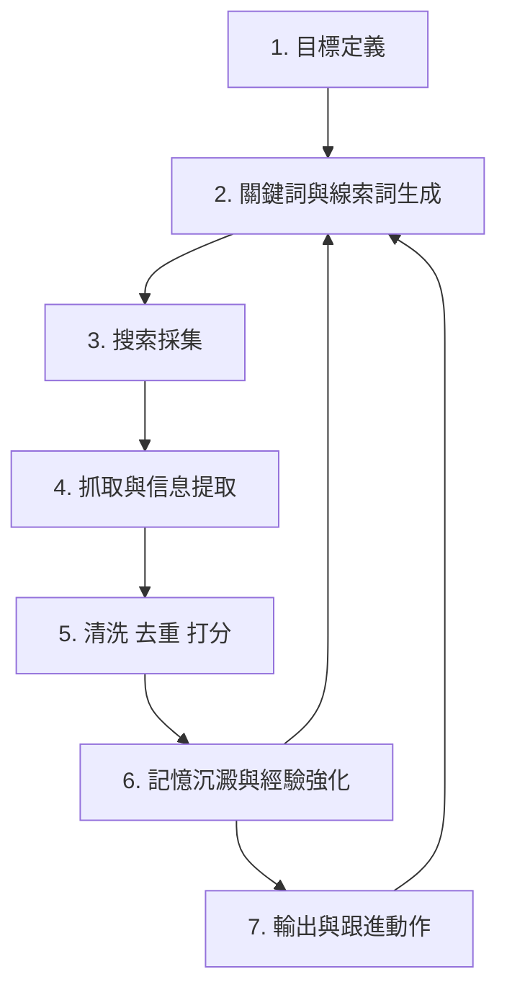
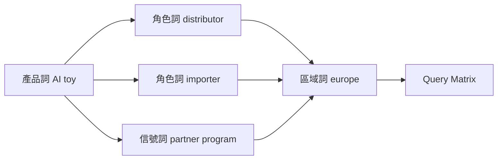
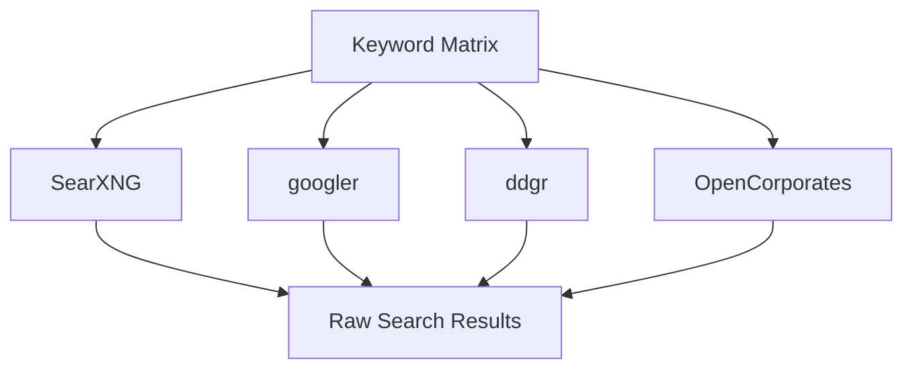
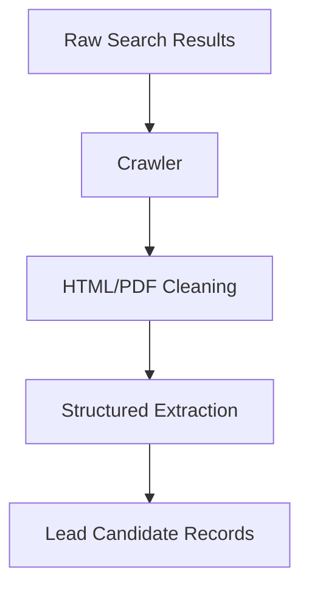
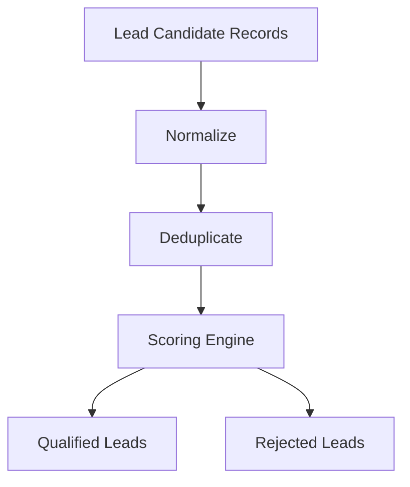
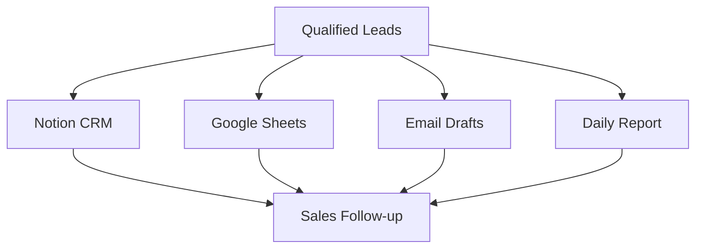
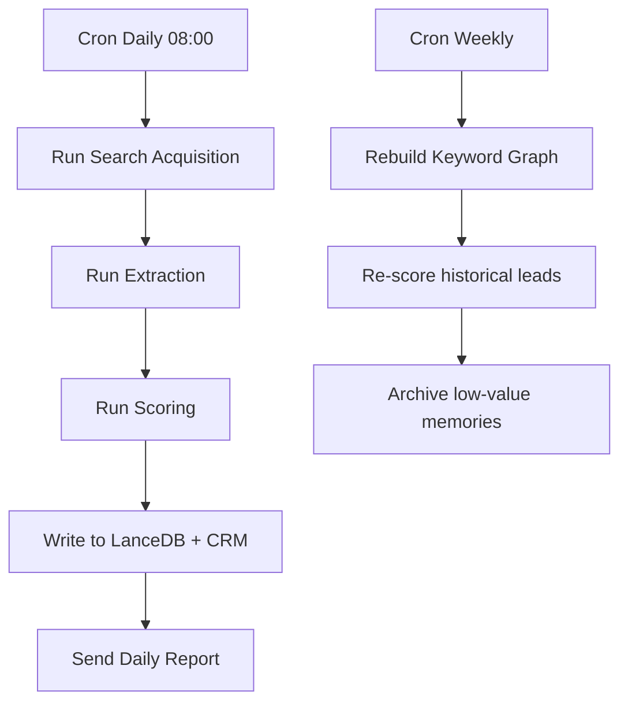
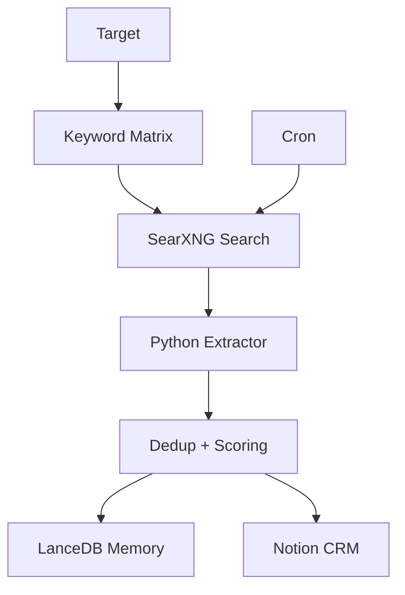

> 目標：建立一套可持續運行、可積累經驗、可自動輸出可跟進客戶線索的 BD Leads 系統。

>   

> 核心原則：

- > 搜索與提取分層
    
- > 結構化資料與語義記憶分層
    
- > Python 負責流程編排與資料處理
    
- > Cron 負責定時觸發
    
- > Jina 負責語義能力與重排/嵌入相關環節
    
- > LanceDB 負責向量記憶與混合檢索
    

---

## **一、整體架構總覽**

---

## **二、7 個流程詳解**

  

## **1. 目標定義（Target Definition）**

  

這一層決定系統到底在找什麼，避免搜索範圍失控。

  

### **目標輸入**

- 行業：例如 AI 玩具、潮玩、IP 授權、玩具分銷
    
- 區域：例如歐洲、拉美、日本、台灣
    
- 角色：例如 distributor、importer、wholesaler、channel partner
    
- 公司類型：線下零售、進口商、經銷商、品牌代理
    
- 有效線索標準：必須有網站、LinkedIn、Email、實體渠道等
    

  

### **輸出**

- lead profile
    
- 搜索約束條件
    
- 評分基準
    

  

### **適合用 Python 的地方**

- 將使用者輸入標準化成 JSON
    
- 生成目標配置檔（YAML / JSON）
    

  

### **適合用 Cron 的地方**

- 通常不需要單獨定時
    
- 只在需要按週/月切換市場時做週期性刷新
    

  

### **Jina 參與位置**

- 可選：用 Jina embeddings 將目標描述向量化，作為後續語義匹配基準
    

  

### **LanceDB 參與位置**

- 存放歷史 target profile
    
- 讓系統回憶過去相近市場和 lead 任務
    

---

## **2. 關鍵詞與線索詞生成（Keyword & Signal Generation）**

  

這一層負責把業務目標轉成可搜索語言，是整個系統的搜索核心。

  

### **關鍵詞類型**

  

#### **基礎角色詞**

- distributor
    
- importer
    
- wholesaler
    
- reseller
    
- retailer
    
- channel partner
    

  

#### **線索詞**

- looking for distributor
    
- become a distributor
    
- partner program
    
- wholesale inquiry
    
- official distributor
    
- exhibitor list
    
- dealer network
    

  

#### **區域詞**

- europe
    
- germany
    
- spain
    
- taiwan
    
- latin america
    

  

#### **產品詞**

- AI toy
    
- plush toy
    
- designer toy
    
- smart toy
    
- collectible toy
    

  

### **模式對應**

- **Dive**：精準 operator 搜索
    
- **Anchor**：多輪高關聯詞組合
    
- **Pirate**：非常規抓取與深挖
    
- **Radar**：同義詞、近義詞、語義擴展
    

  

### **輸出**

- keyword graph
    
- signal matrix
    
- query templates
    

  

### **適合用 Python 的地方**

- 關鍵詞共現統計
    
- 詞權重調整
    
- 生成 query matrix
    

  

### **適合用 Cron 的地方**

- 每天/每週刷新高表現關鍵詞
    
- 按搜索命中率更新權重
    

  

### **Jina 參與位置**

- 用 Jina embeddings 找相近詞、近義詞、垂直高關聯詞
    
- 用 Jina rerank 對候選詞組排序
    

  

### **LanceDB 參與位置**

- 存 keyword graph 的歷史高表現詞組
    
- 記錄哪些 query 曾帶來高質量 leads
    

  

### **Mermaid：Keyword Graph**

---

## **3. 搜索採集（Search Acquisition）**

  

這一層只負責找來源，不做深入分析。

  

### **搜索來源**

  

#### **搜索引擎**

- SearXNG
    
- googler
    
- ddgr
    

  

#### **結構化來源**

- OpenCorporates
    
- trade fair exhibitor list
    
- distributor list
    
- company directories
    

  

#### **社群與公開頁面**

- LinkedIn 搜索頁
    
- Reddit
    
- X / 新聞頁 / 行業站
    

  

### **目標輸出**

- URL
    
- company name
    
- PDF 名錄
    
- LinkedIn 頁
    
- 資料頁入口
    

  

### **適合用 Python 的地方**

- 調用搜索 API
    
- 並行搜索
    
- 統一 SERP 結果格式
    

  

### **適合用 Cron 的地方**

- 每天定時搜索新名單
    
- 每週掃描新展會名單與新增公司目錄
    

  

### **Jina 參與位置**

- 可用 Jina Reader / 結構化讀取能力清洗搜索結果頁內容
    
- 可對 SERP snippets 做語義重排
    

  

### **LanceDB 參與位置**

- 存歷史搜索結果與搜索任務快照
    
- 防止重複搜到同一批老結果
    

  

### **Mermaid：搜索採集**

---

## **4. 抓取與信息提取（Crawling & Extraction）**

  

這一層把搜索結果變成可用資料。

  

### **提取字段**

- company
    
- website
    
- country
    
- contact page
    
- email
    
- linkedin
    
- source_url
    
- timestamp
    
- snippet
    
- page_type
    

  

### **提取頁面類型**

- about
    
- contact
    
- distributors
    
- partner program
    
- team
    
- exhibitions
    

  

### **適合用 Python 的地方**

- requests / httpx / Playwright / trafilatura / BeautifulSoup
    
- HTML 清洗
    
- PDF 解析
    
- Email / domain / company name 抽取
    

  

### **適合用 Cron 的地方**

- 定時重抓重要頁面
    
- 定期刷新歷史 leads 的 contact 頁與 about 頁
    

  

### **Jina 參與位置**

- 用 Jina Reader 類能力抽取正文
    
- 對抓下來的頁面段落做語義切片與篩選
    

  

### **LanceDB 參與位置**

- 存放抓取頁面的語義片段
    
- 供後續 recall 與相似頁面檢索
    

  

### **Mermaid：抓取與提取**

---

## **5. 清洗、去重、打分（Cleaning, Dedup, Scoring）**

  

這一層決定最後是不是可用 lead。

  

### **去重維度**

- domain
    
- company name
    
- LinkedIn URL
    
- email
    

  

### **清洗內容**

- 無效站
    
- 聚合垃圾頁
    
- 與目標市場無關
    
- 無實際聯繫資訊的空頁
    

  

### **打分維度**

- 行業匹配度
    
- 地區匹配度
    
- 渠道信號強度
    
- 聯繫方式完整度
    
- 來源可信度
    
- 最近活躍度
    

  

### **輸出**

- lead_score
    
- qualified lead
    
- rejected lead reason
    

  

### **適合用 Python 的地方**

- 正則抽取與標準化
    
- 模糊去重
    
- scoring function
    
- domain 聚合
    

  

### **適合用 Cron 的地方**

- 週期性重評分
    
- 歷史 lead 刷新分數
    

  

### **Jina 參與位置**

- 用 rerank / embedding 對 lead 候選結果做語義排序
    
- 幫助辨別高質量 lead 與噪音頁面
    

  

### **LanceDB 參與位置**

- 存已驗證過的 lead pattern
    
- 根據相似歷史成功案例做相似度加權
    

  

### **Mermaid：清洗打分**

---

## **6. 記憶沉澱與經驗強化（Memory & Reinforcement）**

  

這一層決定系統會不會越跑越準。

  

### **記憶分層**

  

#### **結構化記憶**

- lead 表
    
- company 表
    
- query 表
    
- market 表
    

  

#### **語義記憶**

- 高質量 query
    
- 成功 lead 模式
    
- 常見國家/角色/信號詞共現模式
    
- 有效網站模板
    

  

### **核心作用**

- 避免重複工作
    
- 提升 query 命中率
    
- 增強對垂直 niche 的理解
    

  

### **適合用 Python 的地方**

- 記憶寫入與召回
    
- keyword graph 強化
    
- Lead → Query 反饋閉環
    

  

### **適合用 Cron 的地方**

- 定時做記憶壓縮
    
- 定時做 lead pattern 聚類
    
- 定時淘汰低價值記憶
    

  

### **Jina 參與位置**

- 用 embeddings 生成語義向量
    
- 用 rerank 改善 recall 質量
    

  

### **LanceDB 參與位置**

- 這一層的核心資料庫
    
- 存語義記憶、query 經驗、lead pattern
    
- 支援 hybrid retrieval（vector + BM25）
    

  

### **Mermaid：記憶閉環**

---

## **7. 輸出與跟進動作（Output & Activation）**

  

這一層把結果變成真正業務動作。

  

### **輸出等級**

  

#### **Raw Leads**

- 原始抓取結果
    

  

#### **Ranked Leads**

- 去重後、打分後結果
    

  

#### **Actionable Leads**

- 可直接聯繫的 leads
    

  

### **對接位置**

- Notion CRM
    
- Google Sheets
    
- Airtable
    
- 郵件草稿系統
    
- Slack / Discord 通知
    
- OpenClaw 任務系統
    

  

### **適合用 Python 的地方**

- 寫入 CRM
    
- 生成郵件草稿
    
- 匯出 CSV / JSON
    
- 生成每日報告
    

  

### **適合用 Cron 的地方**

- 每日 lead digest
    
- 每週市場掃描報告
    
- 每日自動寫入 CRM
    

  

### **Jina 參與位置**

- 可對 lead summary 做摘要重寫
    
- 可對郵件草稿上下文做語義濃縮
    

  

### **LanceDB 參與位置**

- 在輸出前召回歷史互動記錄
    
- 幫助生成更有上下文的 follow-up 建議
    

  

### **Mermaid：輸出與業務動作**

---

## **三、Jina 與 LanceDB 的角色總結**

  

### **Jina 更適合做什麼**

- embeddings
    
- rerank
    
- 語義擴詞
    
- 搜索結果重排
    
- 內容抽取後的語義切片
    

  

### **LanceDB 更適合做什麼**

- 長期語義記憶
    
- query 經驗沉澱
    
- lead pattern similarity
    
- hybrid retrieval
    
- agent 記憶召回
    

  

### **一句話理解**

- **Jina = 語義理解與排序能力**
    
- **LanceDB = 記憶儲存與召回能力**
    

---

## **四、Python 與 Cron 的分工建議**

  

### **Python 負責**

- 所有資料處理
    
- 搜索 API 調用
    
- 抓取與清洗
    
- 打分與去重
    
- 寫入 LanceDB / CRM
    
- 報告生成
    

  

### **Cron 負責**

- 定時觸發工作流
    
- 每日/每週刷新 leads
    
- 重跑高價值市場
    
- 記憶壓縮與歷史資料重評分
    

  

### **建議節奏**

---

## **五、推薦的最小可用版本（MVP）**

  

如果先做 MVP，建議保留以下最小組件：

- 目標定義
    
- 關鍵詞生成
    
- SearXNG 搜索
    
- Python 抓取提取
    
- 基本去重打分
    
- LanceDB 記憶
    
- Notion / Sheet 輸出
    
- Cron 每日跑一次
    

  

### **MVP 流程**

---

## **六、最終建議**

  

對你的自動化 BD Leads 系統，最合適的是：

- **7 流程作為內部技術架構**
    
- **4 模塊作為對外產品表達**
    
- **Jina 用於語義能力**
    
- **LanceDB 用於記憶與混合檢索**
    
- **Python 作為主執行層**
    
- **Cron 作為調度層**
    

  

### **對外可簡化表述為 4 模塊**

1. Discovery
    
2. Extraction
    
3. Qualification
    
4. Activation
    

  

但內部實作仍建議按本文的 7 流程落地。

---

_End._