**Keyword Graph（關鍵詞圖）**是一種將搜尋詞彙與語義關係結構化的方式，本質上是把「關鍵詞集合」轉為「圖結構」。其理論來源主要來自 **資訊檢索（IR）、知識圖譜、語義網路、圖論與搜尋引擎優化（SEO）** 等領域。

  

以下從 **理論基礎 → 基本架構 → 建模方法 → 在 BD leads 系統中的實作** 依序說明。

---

# **一、Keyword Graph 的理論基礎**

  

## **1. Information Retrieval（資訊檢索）**

  

關鍵詞圖最早的思想來自 IR 的 **query expansion** 和 **term association**。

  

核心思想：

- 一個搜尋詞會與其他詞 **共同出現**
    
- 共同出現越多 → 關聯越強
    

  

典型方法：

- **TF-IDF**
    
- **BM25**
    
- **co-occurrence matrix**
    

  

簡化表示：

```
term_i  ↔  term_j
weight = P(term_j | term_i)
```

例如：

```
toy distributor
→ importer
→ wholesaler
→ reseller
```

---

## **2. Semantic Network（語義網路）**

  

語言學中的 **語義網路模型**：

```
concept nodes
+ 
semantic relations
```

例如：

```
AI Toy
 ├ distributor
 ├ importer
 ├ wholesaler
 └ retailer
```

這和 **WordNet / ConceptNet** 的結構類似。

---

## **3. Knowledge Graph（知識圖譜）**

  

Google Knowledge Graph 的基本形式：

```
entity — relation — entity
```

Keyword graph 可以視為 **輕量版知識圖譜**：

```
keyword — related_to — keyword
```

例如：

```
toy distributor → trade fair
toy distributor → toy wholesaler
toy distributor → toy importer
```

---

## **4. Graph Theory（圖論）**

  

Keyword Graph 在數學上就是：

```
G = (V, E)
```

其中：

```
V = keywords
E = relations
```

常見算法：

- PageRank
    
- HITS
    
- Community Detection
    
- Graph Embedding
    

  

這些算法可用於：

- 找核心關鍵詞
    
- 找關鍵詞群
    
- 找長尾關鍵詞
    

---

## **5. Search Engine SEO 理論**

  

SEO 裡有一個概念叫：

  

**Topic Cluster**

  

結構：

```
pillar keyword
  ↳ supporting keywords
```

例如：

```
toy distributor
  ↳ toy importer
  ↳ toy wholesaler
  ↳ toy supplier
```

這其實就是 **keyword graph 的樹狀簡化版本**。

---

# **二、Keyword Graph 的基本架構**

  

一般分為 **四層**：

```
Product Layer
Intent Layer
Role Layer
Context Layer
```

示例：

```
AI toy
   │
   ├ distributor
   │   ├ europe
   │   ├ germany
   │   └ spain
   │
   ├ importer
   │
   └ wholesaler
```

---

## **節點類型**

  

### **1. Product nodes**

```
AI toy
plush toy
designer toy
smart toy
```

---

### **2. Role nodes**

```
distributor
importer
wholesaler
retailer
channel partner
```

---

### **3. Intent nodes**

```
become distributor
looking for distributor
partner program
official distributor
```

---

### **4. Context nodes**

```
europe
germany
spain
trade fair
toy exhibition
```

---

# **三、Keyword Graph 的邊（Edge）**

  

常見關係：

|**relation**|**含義**|
|---|---|
|co-occurrence|同時出現|
|semantic similarity|語義相似|
|intent relation|同一意圖|
|hierarchy|上下位|

例如：

```
toy distributor
  ├ co-occurrence → toy importer
  ├ semantic → toy wholesaler
  ├ intent → looking for distributor
  └ context → europe
```

---

# **四、Keyword Graph 的構建方法**

  

## **方法1：共現矩陣**

```
P(term_j | term_i)
```

例如：

```
toy distributor

共同出現：
importer
wholesaler
supplier
```

建立 adjacency matrix：

```
      importer wholesaler supplier
toy     0.7      0.6        0.4
```

---

## **方法2：Embedding 相似度**

  

利用 embedding：

```
similarity = cosine(vec_i, vec_j)
```

如果：

```
similarity > threshold
```

就建立邊。

  

例如：

```
toy distributor ↔ toy wholesaler
```

---

## **方法3：語義擴展**

  

利用 LLM / embedding：

```
toy distributor
```

擴展：

```
toy importer
toy wholesaler
toy supplier
toy reseller
```

---

# **五、Keyword Graph 在 BD Leads 系統中的作用**

  

主要用於：

  

### **1. Query generation**

  

例如：

```
AI toy distributor europe
plush toy importer germany
designer toy wholesaler spain
```

這些 query 是由 graph 生成。

---

### **2. Search diversification**

  

避免只用一種 query。

  

例如：

```
toy distributor
toy importer
toy wholesaler
toy supplier
```

都可能找到不同公司。

---

### **3. Lead scoring**

  

如果某個網站包含：

```
toy distributor
wholesale
import
```

則 **關鍵詞匹配度更高**。

---

### **4. Query optimization**

  

系統可以自動學習：

```
哪些 query 找到的 leads 最多
```

然後提升權重。

---

# **六、Keyword Graph 的 Mermaid 結構示例**

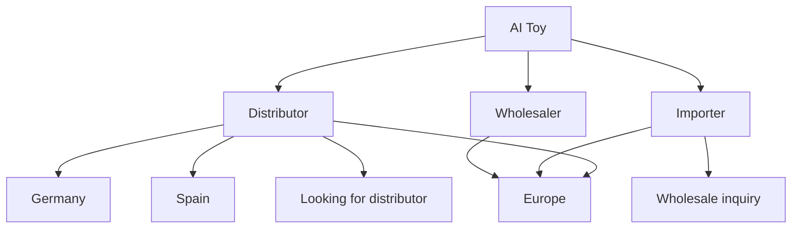

---

# **七、在 LanceDB 中的實作**

  

Keyword graph 可以存成：

```
node table
edge table
```

node：

```
id
keyword
type
embedding
```

edge：

```
source
target
relation
weight
```

然後：

```
query embedding
↓
graph traversal
↓
expand keywords
```

---

# **八、進階模型**

  

高階 Keyword Graph 可以使用：

  

### **Graph Embedding**

  

例如：

- node2vec
    
- DeepWalk
    

  

可以得到：

```
keyword embedding
```

比普通 embedding 更適合搜尋。

---

# **九、最簡單實作架構**

  

實際系統通常用：

```
Keyword Graph
      ↓
Query Generator
      ↓
Search
      ↓
Crawler
      ↓
Lead extraction
```

---

# **十、核心結論**

  

Keyword Graph 本質是：

```
語義網路 + 搜尋 query 擴展
```

理論來源：

1. Information Retrieval
    
2. Knowledge Graph
    
3. Graph Theory
    
4. Semantic Network
    
5. SEO Topic Cluster
    

  

用途：

```
生成搜索詞
擴展搜索範圍
提高lead發現率
```


## **1）单一关键词 → 扩展 → 加权 → 循环强化 → 核心关键词 → 关键线索**


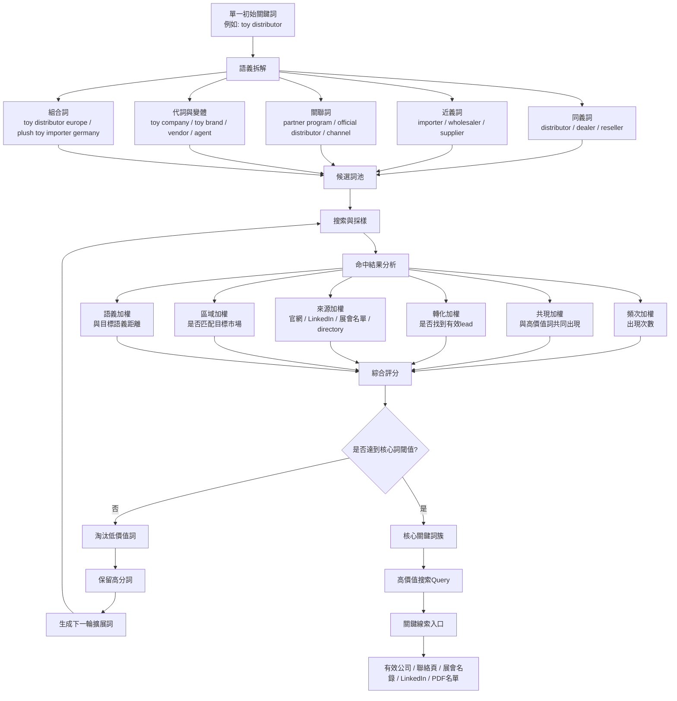

---

## **2）循环强化逻辑：每一轮如何增强拓展能力**


```mermaid
flowchart LR
    A[第1輪<br/>單一詞] --> B[擴展詞池]
    B --> C[搜索驗證]
    C --> D[加權評分]
    D --> E[留下高分詞]

    E --> F[第2輪<br/>高分詞再擴展]
    F --> G[更垂直的組合詞]
    G --> H[搜索驗證]
    H --> I[再次加權]

    I --> J[第3輪<br/>核心詞簇形成]
    J --> K[更高命中率 Query]
    K --> L[更集中線索]
    L --> M[核心市場詞 / 核心角色詞 / 核心信號詞]

    M --> N[持續寫回 Keyword Graph]
    N --> O[未來任務直接調用高表現詞]
```


---

## **3）加权证明有效：为什么每次循环会更强**


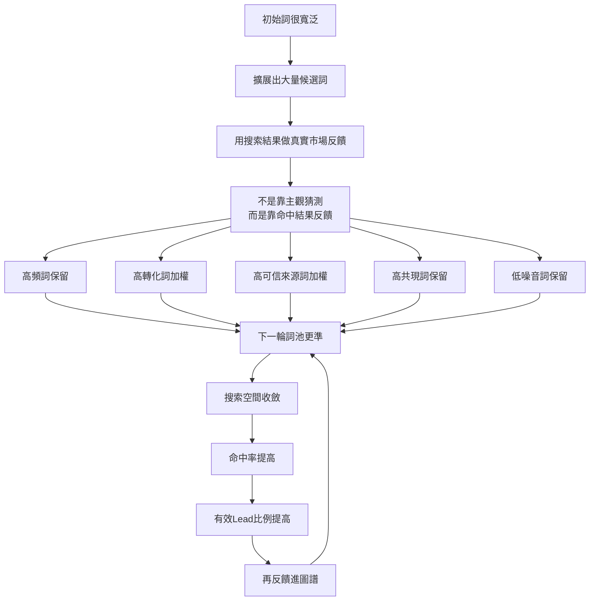


---

## **4）线索搜集全流程：搜集 → 去噪 → 清洗 → enrich → 验证 → 完整成果**


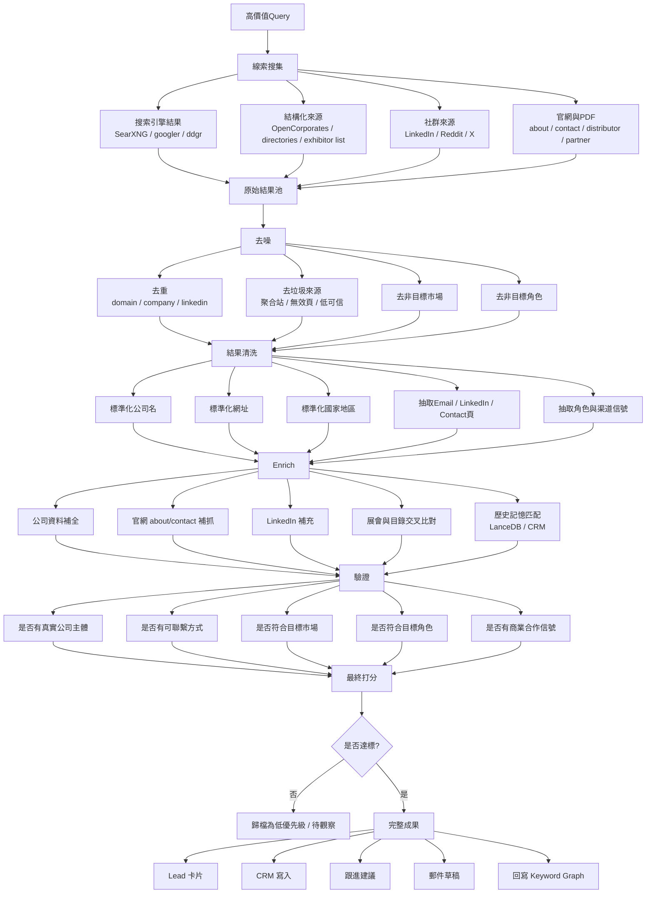


---

## **5）把两套流程接起来：从关键词图到完整 lead 成果**


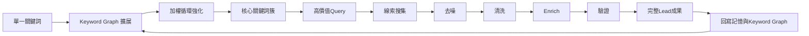


---

## **6）如果你想在文档里再落到“可执行字段”，建议加这组评分维度**

  

你可以在图下面再配一段说明：

```
綜合評分 = 
0.25 * 頻次分
+ 0.20 * 共現分
+ 0.20 * 轉化分
+ 0.15 * 來源可信度
+ 0.10 * 區域匹配度
+ 0.10 * 語義相似度
```

Lead 最终评分也可以类似：

```
Lead Score =
0.25 * 公司匹配度
+ 0.20 * 聯繫完整度
+ 0.20 * 渠道信號強度
+ 0.15 * 市場匹配度
+ 0.10 * 來源可信度
+ 0.10 * 最近活躍度
```

# **一、Query Refinement（查詢精煉）**

  

最直接的概念就是 **Query Refinement / Query Reformulation**。

  

核心思想：

```
第一次搜索 → 觀察結果 → 調整 query → 再搜索
```

每一次循環：

- 增加精準詞
    
- 排除噪音詞
    
- 收斂結果
    

  

典型流程：

```
initial query
↓
analyze results
↓
add constraints
↓
exclude noise
↓
re-run search
```

例子：

```
toy distributor

→ toy distributor europe
→ toy distributor europe -retail
→ toy distributor europe -retail -amazon
→ "toy distributor" europe importer
```

---

# **二、Boolean Retrieval（布林檢索）**

  

搜尋引擎最早的理論之一。

  

核心：

```
AND
OR
NOT
```

例如：

```
toy AND distributor
toy AND (distributor OR importer)
toy distributor NOT retail
```

Google 其實在背後仍然使用類似邏輯。

---

# **三、Search Operators（進階搜尋運算符）**

  

這就是你說的「**進階搜尋運算符**」。

  

常見：

|**operator**|**作用**|
|---|---|
|site:|限定網站|
|intitle:|限定標題|
|inurl:|限定網址|
|filetype:|限定文件|
|“”|精確短語|

- | 排除詞 |
    

  

例子：

```
toy distributor europe site:linkedin.com
"toy distributor" europe -retail -shop
toy importer germany filetype:pdf
```

---

# **四、Iterative Query Expansion（迭代式查詢擴展）**

  

與 Keyword Graph 結合的理論。

  

流程：

```
keyword
↓
search
↓
extract new terms
↓
expand query
↓
search again
```

例如：

```
toy distributor
↓
results show "wholesale toy supplier"
↓
next query
toy wholesale supplier europe
```

這種方法在：

- academic IR
    
- 搜索引擎
    
- OSINT
    

  

都很常見。

---

# **五、Relevance Feedback（相關性回饋）**

  

資訊檢索裡很重要的概念。

  

流程：

```
query
↓
results
↓
標記哪些相關
↓
系統調整 query
```

數學形式：

```
new query =
original query
+ α * relevant terms
- β * irrelevant terms
```

這就是：

  

**Rocchio Algorithm**

---

# **六、Noise Filtering（噪音過濾）**

  

當搜尋結果包含很多垃圾資訊時。

  

方法：

```
negative keywords
domain filtering
content scoring
```

例如：

```
toy distributor europe
-retail
-shop
-amazon
-ebay
```

---

# **七、OSINT 中的 Dorking**

  

在調查領域叫：

  

**Google Dorking**

  

例如：

```
"toy distributor" europe filetype:pdf
site:linkedin.com "toy distributor"
intitle:"toy distributor"
```

---

# **八、這整套方法在工程上叫**

  

### **Search Query Optimization**

  

或者：

```
Query Optimization
Search Refinement
Iterative Search
```

---

# **九、可以用 Mermaid 表達這個流程**

````
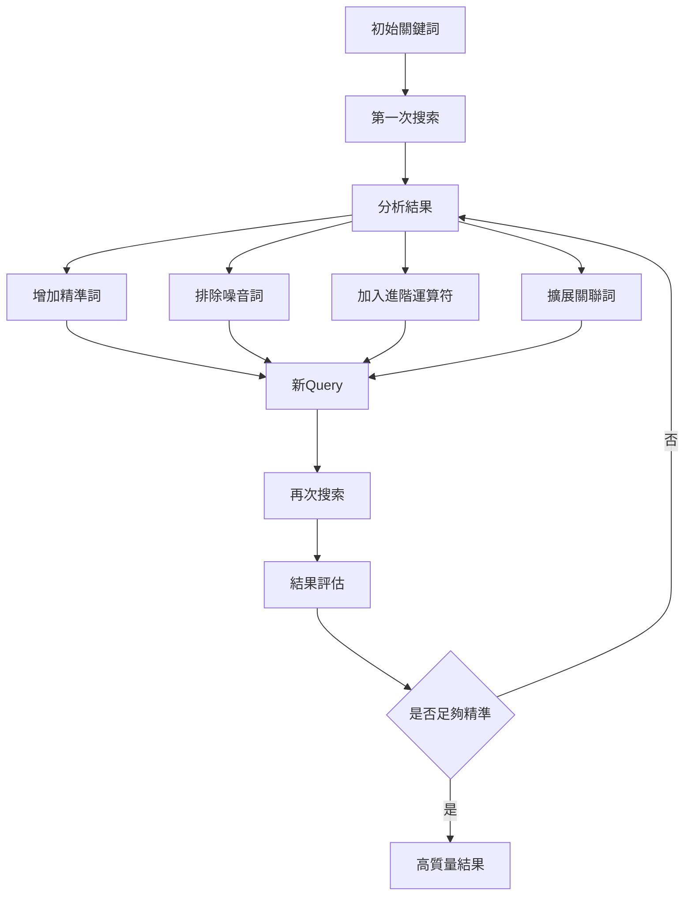
````

---

# **十、加入 Operator 的版本**

````
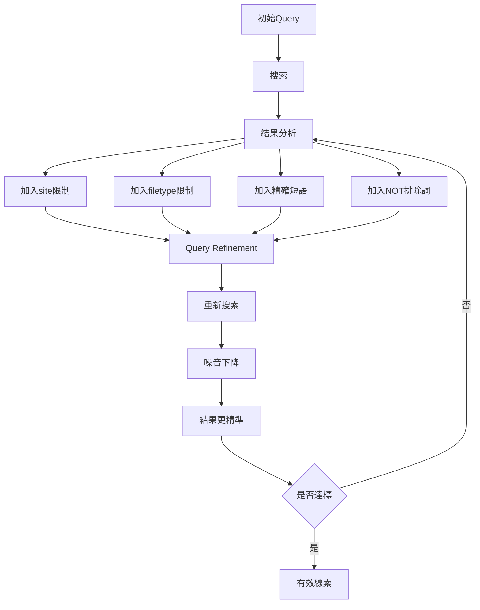
````

---

# **十一、與你的 BD leads 系統結合**

  

這個流程應該在：

```
Keyword Graph
↓
Query Generator
↓
Query Optimization
↓
Search
```

結構：

```
keyword graph
↓
query
↓
operator refinement
↓
search
↓
lead discovery
```

---

# **十二、總結**

  

你描述的這套其實是這些理論的組合：

|**概念**|**說明**|
|---|---|
|Query Refinement|查詢精煉|
|Boolean Retrieval|布林檢索|
|Search Operators|進階運算符|
|Iterative Search|迭代搜尋|
|Relevance Feedback|相關性回饋|
|Noise Filtering|噪音過濾|
|Google Dorking|OSINT 搜索|

本質是一種：

```
Iterative Search Optimization
```

---
下面给出 **两张“窄版、LLM友好”的 Mermaid 流程图**。

特点：

- **纵向（TD）结构**，适合 Obsidian 窄屏
    
- 每个节点 **短文本**，避免过宽
    
- **分阶段**，方便 LLM 执行与审计
    
- 包含：
    
    - Keyword 扩展与循环加权
        
    - Query 运算符优化
        
    - Lead 采集与清洗流程
        
    

  

直接复制到 Obsidian 即可。

---

# **1）Keyword 扩展 + 循环强化（窄版）**


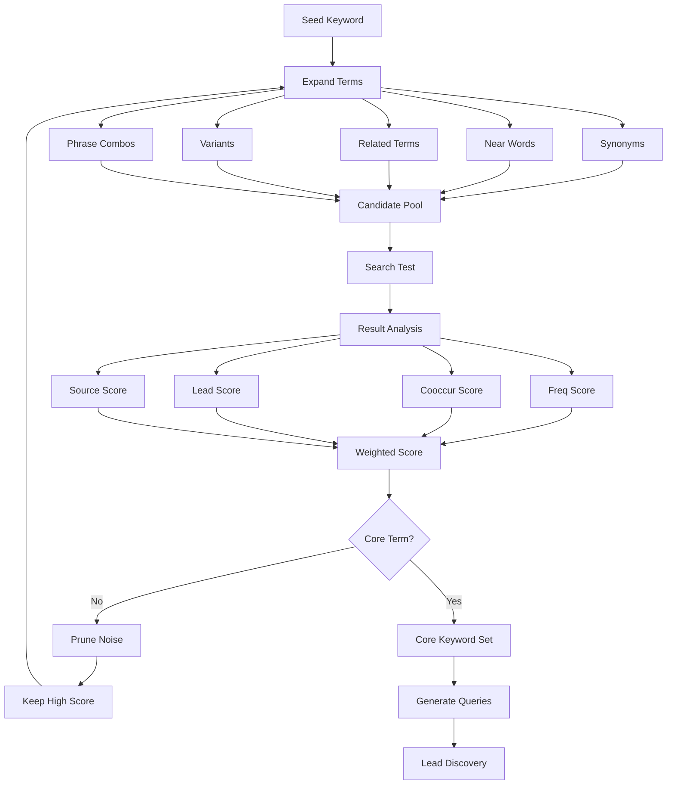


---

# **2）Query Refinement（進階搜尋運算符）**


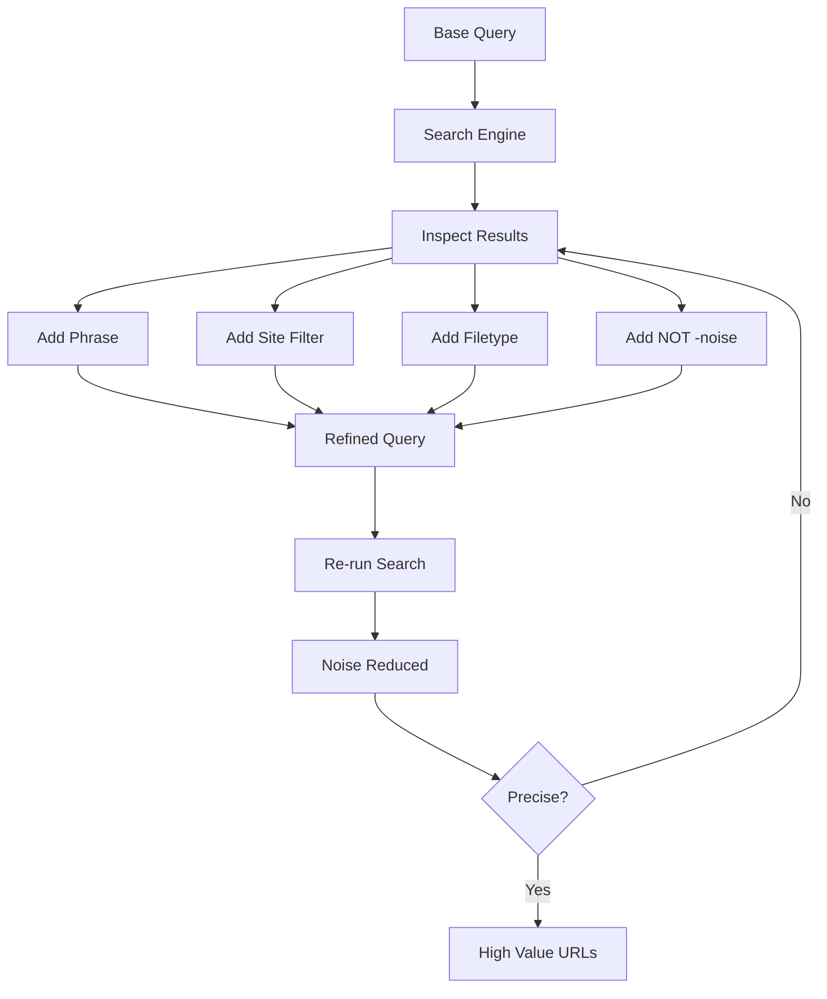


---

# **3）Lead 搜集 → 去噪 → Enrich → 驗證（窄版）**


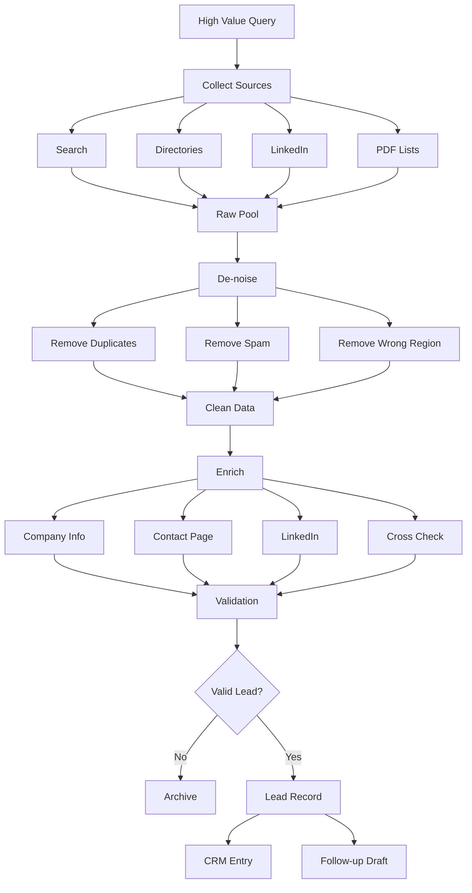


---

# **4）完整管线（超窄版总览）**

  

如果你想在文档最上面放一个 **整体流程图**：


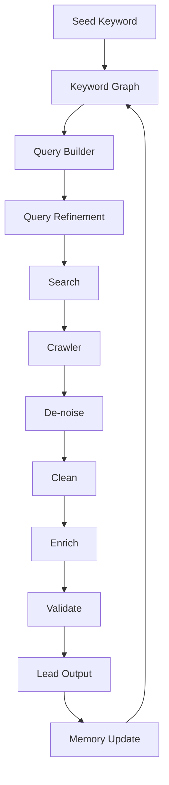


---

# **5）為什麼這種結構對 LLM 更友好**

  

原因有三個：

  

### **1. 每一步都是單一職責**

  

例如：

```
Expand Terms
Search Test
Result Analysis
```

LLM 更容易拆任務。

---

### **2. 循環點明確**

```
Score → Prune → Expand
```

這是典型 **Relevance Feedback Loop**。

---

### **3. 圖寬控制**

  

所有節點都：

```
<20 characters
```

Obsidian 不會撐爆。

---

# **6）如果要再升級一層（推薦）**

  

未來你可以把整套系統拆成 **四個 agent**：

```
Keyword Agent
Search Agent
Extraction Agent
Validation Agent
```

然後：

```
LanceDB → memory
Jina → embeddings
OpenClaw → orchestration
```

整個就會變成一個 **可自我強化的 BD discovery system**。

---
